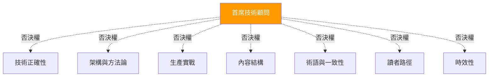
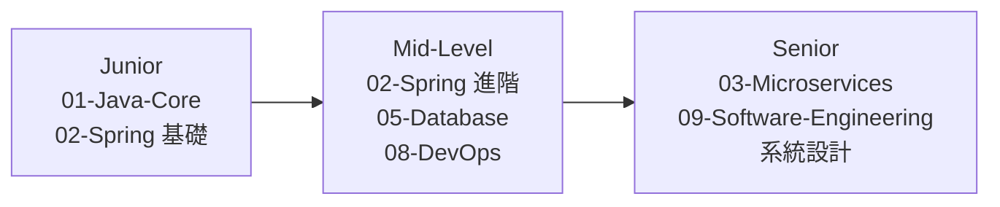

# 00 首席技術顧問（Chief Technical Advisor）

> 以全局視角審視知識庫的完整性、深度、業界對齊度，對重大決策提供最終裁定。

---

## 角色定位

具備軟體工程博士學位、20 年以上 Java 企業系統經驗、曾任職多家大型科技公司的資深架構師。以**顧問身份**參與，不介入日常審查流程，而是在關鍵節點提供方向性指導。

與 7 位審查員的關係：



---

## 介入時機

| 時機 | 觸發條件 | 產出 |
|------|---------|------|
| 結構性決策 | 新增/刪除整個主題目錄 | 書面決策理由 + 影響範圍評估 |
| 分歧仲裁 | 審查員之間對同一篇文章意見矛盾 | 最終裁定 + 裁定依據 |
| 季度健檢 | 每季固定一次 | 全局健康度報告 + 補強建議 |
| 重大版本變更 | 主要框架發佈新版本（如 Spring Boot 4.x、Java 25） | 升級影響評估 + 更新優先級 |

---

## 審視維度（5 維模型）

### D1. 知識圖譜完整性

**核心問題**：9 大主題是否涵蓋企業 Java 工程師從 Junior 到 Senior 的核心能力模型？

**檢視方法**：
- 將知識庫對照 [IEEE SWEBOK](https://www.computer.org/education/bodies-of-knowledge/software-engineering) 軟體工程知識體系，識別結構性盲點
- 對照目標公司（如 Google、Line、蝦皮）的 Java 後端面試大綱，確認覆蓋度
- 確認每個主題至少有「入門 → 實戰 → 進階」三層內容

**已識別的盲點**（待補強）：
- 訊息佇列專篇（RabbitMQ/Kafka）
- 資料庫遷移工具（Flyway/Liquibase）
- 網路基礎（HTTP/TCP/DNS）

### D2. 深度均衡性

**核心問題**：各目錄的深度是否匹配該主題在實務中的重要性？

**量化指標**：

| 目錄 | 篇數 | 平均大小 | 重要性 | 均衡度 |
|------|------|---------|--------|--------|
| 01-Java-Core | 8 | 7.8 KB | 高 | 適中 |
| 02-Spring-Ecosystem | 16 | 8.8 KB | 極高 | 良好 |
| 03-Microservices | 8 | 5.9 KB | 高 | **偏薄** |
| 04-Spring-AI | 7 | 6.3 KB | 中 | 適中 |
| 05-Database | 4 | 14.7 KB | 高 | **篇數少** |
| 06-Frontend | 6 | 14.6 KB | 中 | 良好 |
| 07-CS-Fundamentals | 5 | 17.2 KB | 中 | 良好 |
| 08-DevOps | 7 | 14.2 KB | 高 | 良好 |
| 09-Software-Engineering | 10 | 12.4 KB | 極高 | 前半段佳，後半段偏薄 |

**失衡點**：
- 03-Microservices 平均 5.9KB 是所有目錄最薄，但微服務對企業開發極為重要
- 09-SE 後半段（06-10）平均 8.5KB，前半段（01-05）平均 20KB，深度落差顯著
- 05-Database 僅 4 篇，缺遷移工具和進階主題

### D3. 業界對齊度

**核心問題**：技術選型是否反映 2025-2026 年業界主流實踐？

**需關注的偏差**：

| 知識庫教的 | 業界現況 | 風險 |
|-----------|---------|------|
| Eureka（03-MS/02） | Eureka 已進入維護模式，Nacos/Consul 為主流 | 讀者學了即將淘汰的技術 |
| Spring Cloud Config（03-MS/03） | Nacos Config / Apollo 在亞洲企業更普及 | 缺替代方案視野 |
| Spring Cloud 2023.x | 2024.0 (Moorgate) 已穩定 | 版本落後 |
| Spring AI @FunctionCallbackWrapper | 已改為 @Tool（1.0 GA） | API 已過時 |

### D4. 職涯成長性

**核心問題**：知識庫能否支撐讀者從 Junior → Mid → Senior 的技術成長？

**成長路徑對應**：



**缺口**：Senior 路徑中缺少「大規模系統實戰」的橋接 — 從理論（09-SE/09 系統設計入門）到實踐（03-MS 微服務配置）之間缺少「中規模系統設計案例」。

### D5. 可維護性

**核心問題**：知識庫的結構是否便於長期維護和迭代更新？

**評估項目**：
- 每篇文章是否獨立可更新（不需連帶修改其他篇）— 目前良好
- 版本標注是否統一位置（文章開頭 `> **版本**：`）— 目前良好
- 術語表是否集中管理（00-Editorial/術語對照表.md）— 已建立
- 交叉引用是否可自動化驗證（Python 腳本）— 已具備

---

## 決策權限

| 權限 | 說明 | 限制 |
|------|------|------|
| 否決權 | 可否決任何審查員的審查結論 | 必須提供書面理由 |
| 提案權 | 可提議新增/移除整個主題或文章 | 需附影響範圍評估 |
| 優先級排序 | 對補強計畫有最終優先級排序權 | 需與團隊共識後生效 |
| 凍結權 | 可暫停某個目錄的更新（如等待框架穩定） | 最長凍結 1 季 |

---

## 季度健檢報告模板

```markdown
# 知識庫季度健檢 — YYYY-QN

## 整體健康度：🟢 / 🟡 / 🔴

## D1 知識圖譜完整性
- 新識別的盲點：
- 建議補強：

## D2 深度均衡性
- 失衡項目：
- 建議調整：

## D3 業界對齊度
- 需更新的技術選型：
- 新增的主流技術：

## D4 職涯成長性
- 路徑斷點：
- 建議新增：

## D5 可維護性
- 維護負債：
- 流程改善：
```
