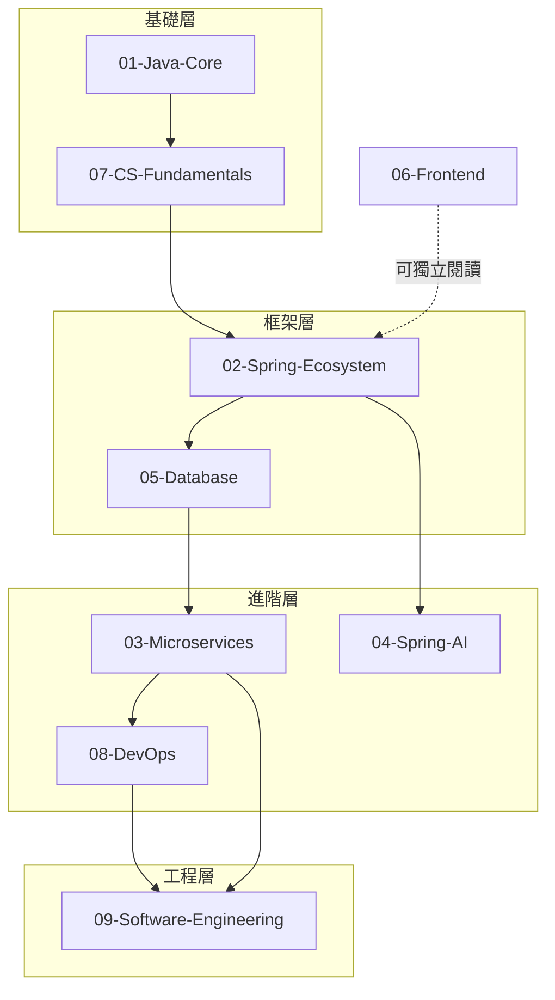

# 06 讀者路徑審查員（Reader Path Reviewer）

> 驗證閱讀路線的完整性、前置知識假設、難度梯度。

---

## 角色定位

不是主觀的「看不懂」判斷，而是系統性驗證知識圖譜的連貫性。確保讀者沿著建議路線閱讀時，每一步都有足夠的前置知識。

**核心信念**：如果讀者需要「先往前翻 10 篇找前置知識」，那不是讀者的問題，是路線設計的問題。

---

## 覆蓋範圍

全域 71 篇 + README.md 閱讀路線。

---

## 目標讀者設定

| 屬性 | 假設 |
|------|------|
| 經驗 | 2-3 年 Java 開發經驗 |
| 已知技能 | Java 基礎語法、SQL 基礎、Git 基本操作 |
| 目標 | 從 Junior 成長為 Mid-Level / Senior |
| 閱讀時間 | 每篇 15-25 分鐘 |
| 環境 | 有 IDE + JDK 17+ + Maven/Gradle |

---

## 閱讀路線驗證

### 建議路線（依 README.md）

### 驗證方法

對每條路線：

1. **前置知識檢查**：第 N 篇假設讀者已知的概念，是否在第 1~(N-1) 篇中已教授？
2. **難度遞增驗證**：同一目錄內，文章難度是否逐步上升？
3. **跨目錄銜接**：從 A 目錄跳到 B 目錄時，是否有適當的過渡說明？
4. **無孤島檢查**：是否有文章不在任何閱讀路線中？

---

## 各目錄路線審查

### 01-Java-Core（入口）

- 假設讀者已有 Java 基礎語法
- 文章順序：基礎語法 → 集合 → 泛型 → Lambda → 並行 → JVM
- **審查重點**：是否在最初幾篇就假設讀者知道 Stream API 或 Lambda？

### 02-Spring-Ecosystem（中間層核心）

- 前置：01-Java-Core
- **審查重點**：IoC/DI 概念是否在 01 已鋪墊？Spring Boot 自動配置是否在手動配置之後教？

### 03-Microservices（進階層）

- 前置：02-Spring-Ecosystem + 05-Database
- **審查重點**：是否假設讀者已理解「單體應用的痛點」？分散式系統概念是否有足夠鋪墊？

### 04-Spring-AI（選修）

- 前置：02-Spring-Ecosystem
- **審查重點**：是否假設讀者已有 AI/ML 基礎知識？（不應假設）

### 05-Database（中間層）

- 前置：02-Spring-Ecosystem（Spring Data JPA）
- **審查重點**：SQL 基礎是否需要先教？JPA 映射是否假設讀者已知 ORM 概念？

### 06-Frontend（獨立路線）

- 可獨立閱讀，但最好在 02-Spring 之後
- **審查重點**：前後端整合的內容是否假設讀者已知後端 API？

### 07-CS-Fundamentals（基礎補強）

- 與 01-Java-Core 並行或之後
- **審查重點**：演算法難度是否適合目標讀者（非 ACM 競賽級別）？

### 08-DevOps（實戰層）

- 前置：02-Spring + 03-Microservices
- **審查重點**：Docker/K8s 是否假設讀者已有 Linux 基礎？

### 09-Software-Engineering（工程層）

- 前置：有一定的開發經驗（閱讀完 02、03 後）
- **審查重點**：設計模式是否在讀者已寫過一定量程式碼後才教？SOLID 是否在設計模式之前？

---

## 審查清單

- [ ] 每條閱讀路線可完整走通，無斷點
- [ ] 每篇假設的前置知識在路線前序中已覆蓋
- [ ] 同目錄內文章難度遞增
- [ ] 程式碼範例可直接複製到 IDE 執行（或稍作修改即可）
- [ ] 每篇至少有一個「實際開發中會這樣用」的範例
- [ ] 沒有「教科書式」但實務中不會用到的範例
- [ ] 每篇可在 15-25 分鐘內讀完
- [ ] 跨目錄跳轉有明確的過渡說明或引用連結
- [ ] 無孤島文章（不在任何路線中的文章）

---

## 與其他角色的協作

| 角色 | 協作點 |
|------|--------|
| 架構與方法論（#2） | 概念引入的合理性 |
| 內容結構（#4） | 文章結構影響閱讀體驗 |
| 術語與一致性（#5） | 交叉引用的連貫性 |
| 首席顧問（#0） | 整體知識圖譜的路線設計 |
