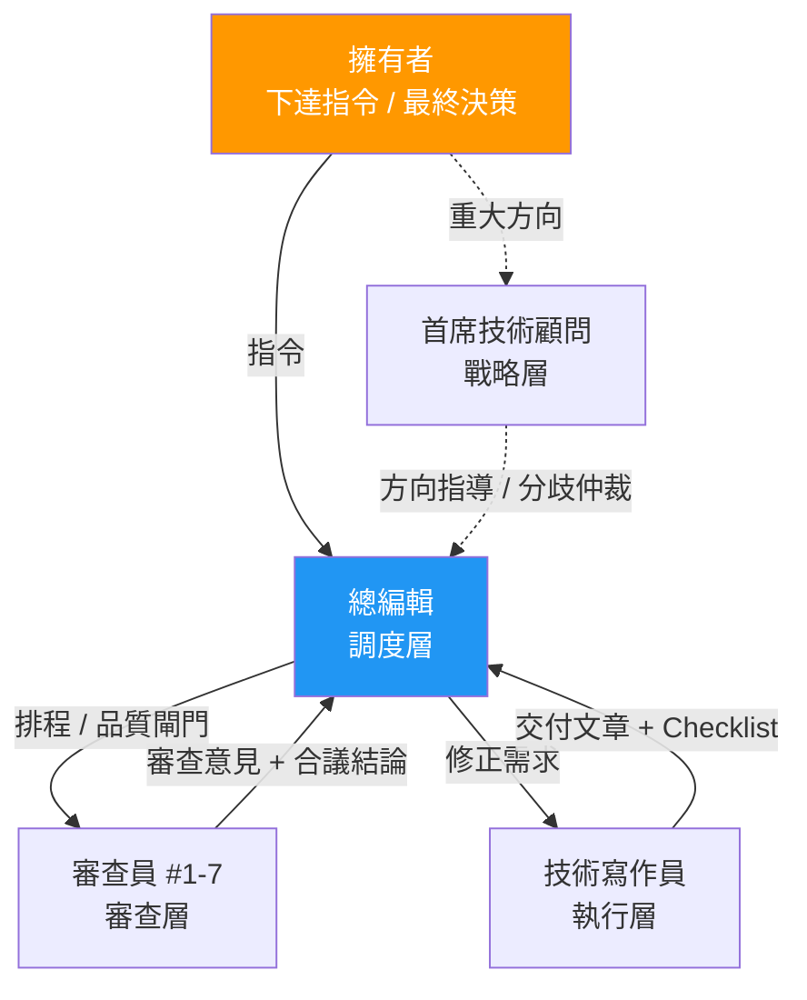

# 00 編輯審查體系

> 本目錄定義 LearningNotes 知識庫的審查角色、流程、術語規範。
> 每篇文章完成後，由各角色依流程進行審查，確保品質達到專業出版水準。

---

## 組織架構

### 發動點

> **所有指令的入口是總編輯。** 擁有者（你）對總編輯下達指令，總編輯負責拆解、排程、協調整個流程直到完成。

---

## 角色總覽

### 擁有者（你）

知識庫的最終決策者。透過總編輯下達任務，在關鍵節點（Phase 3 定案、重大方向）做最終確認。不介入日常審查細節。

### 管理層

| 角色 | 定位 | 文件 |
|------|------|------|
| [首席技術顧問](00%20首席技術顧問.md) | 戰略 — 全局審視、重大裁定、季度健檢 | 知識圖譜、深度均衡、業界對齊 |
| [總編輯](總編輯.md) | 調度 — 接收指令、排程、協調、品質閘門、進度追蹤 | Go/No-Go 決策、會議召集、日常仲裁 |

### 審查層

| # | 角色 | 覆蓋範圍 | 職責 |
|---|------|---------|------|
| 1 | [技術正確性審查員](01%20技術正確性審查員.md) | 全域 71 篇 | 程式碼可執行、API 正確、版本標注 |
| 2 | [架構與方法論審查員](02%20架構與方法論審查員.md) | 全域 | 設計原則、架構模式、取捨分析 |
| 3 | [生產實戰審查員](03%20生產實戰審查員.md) | 全域 | 業界採用度、替代方案、生產可行性 |
| 4 | [內容結構編輯](04%20內容結構編輯.md) | 全域 | 章節結構、邏輯順序、格式規範 |
| 5 | [術語與一致性審查員](05%20術語與一致性審查員.md) | 全域 | 術語統一、跨篇一致、連結正確 |
| 6 | [讀者路徑審查員](06%20讀者路徑審查員.md) | 全域 | 閱讀路線、前置知識、難度梯度 |
| 7 | [時效性審查員](07%20時效性審查員.md) | 全域 | 框架版本、API 棄用、業界趨勢 |

### 執行層

| 角色 | 定位 | 文件 |
|------|------|------|
| [技術寫作員](技術寫作員.md) | 執行 — 撰寫文章、依審查意見修正（AI 帶入角色） | 寫作標準、Checklist 管理 |

---

## 流程與共用資源

| 文件 | 說明 |
|------|------|
| [審查流程與狀態](審查流程與狀態.md) | **完整生命週期**：立項 → 撰寫 → 審查（含合議與會議） → 定案 + **既有文章批次審查模式** |
| [驗收標準](驗收標準.md) | **量化審查基準**：每個角色的 Checklist 對應的具體通過標準（所有角色共用） |
| [術語對照表](術語對照表.md) | 強制統一的中英術語翻譯（所有角色共用） |
