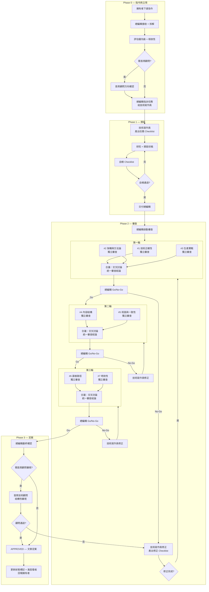
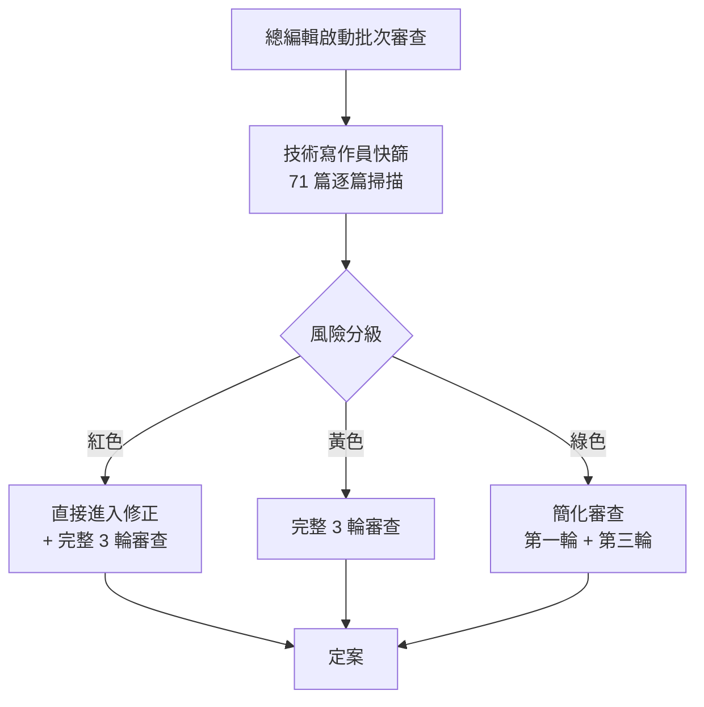
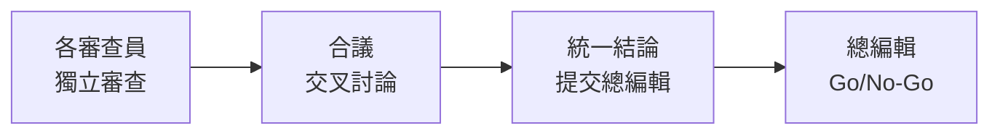

# 審查流程與狀態

> 定義文章從**指令下達 → 立項 → 撰寫 → 審查（含合議與會議） → 定案**的完整生命週期。

---

## 文章生命週期總覽



---

## Phase 0 — 指令與立項

### 發動點

> **擁有者 → 總編輯**。所有任務從擁有者對總編輯下達指令開始。

### 總編輯接收指令後的動作

1. **理解意圖**：擁有者要什麼（新文章 / 更新 / 審查 / 結構調整）
2. **拆解任務**：將高層指令轉化為具體執行項目
3. **評估優先級**：緊急 / 高 / 中 / 低
4. **確認相依性**：是否需要先完成其他文章
5. **判斷升級**：結構性變更需先諮詢首席顧問
6. **指派執行**：產出任務描述，指派給技術寫作員

### 觸發條件

| 類型 | 來源 | 範例 |
|------|------|------|
| 擁有者指令 | 擁有者直接下達 | 「寫一篇 Kafka 的文章」 |
| 新文章 | 首席顧問識別盲點 | 缺少「訊息佇列」主題 |
| 補強 | 審查員發現深度不足 | 03-Microservices 平均 5.9KB |
| 更新 | 時效性審查員標記過時 | Spring AI API 已變更 |
| 修正 | 技術正確性審查員發現錯誤 | 程式碼在新版本無法編譯 |

---

## 既有文章批次審查模式

> 上述生命週期適用於**新文章**。既有 71 篇文章從未經過此體系審查，需要專門的批次審查機制。

### 批次審查流程



### 風險分級標準

| 級別 | 條件（符合任一即歸類） | 處理方式 |
|------|---------------------|---------|
| 紅色 | 已知使用 @Deprecated API；版本標注低於警戒線；交叉引用斷連結；使用已棄用元件作為首選 | 技術寫作員先修正已知問題，再進入完整 3 輪審查 |
| 黃色 | 缺少取捨分析；缺少替代方案；無生產環境注意事項；結構不符文章骨架 | 直接進入完整 3 輪審查 |
| 綠色 | 結構完整、版本正確、無斷連結、無明顯過時內容 | 簡化審查：僅走第一輪（技術正確性 + 架構 + 生產實戰）和第三輪（讀者路徑 + 時效性），跳過第二輪 |

### 快篩的具體檢查項目

技術寫作員對每篇文章執行以下自動化 + 人工檢查：

**自動化檢查**（腳本輔助）：
- [ ] 版本標注區塊存在
- [ ] 所有 `[xxx](xxx.md)` 連結目標存在
- [ ] 無已知禁用術語（依術語對照表）
- [ ] 無 ASCII art 框線字元

**人工檢查**（逐篇快速瀏覽）：
- [ ] 程式碼使用的 API 是否在版本基準線警戒線之上
- [ ] 是否有小結和延伸閱讀
- [ ] 核心元件是否標注業界採用狀態

### 批次審查的排程建議

依目錄優先級分批執行，不一次審查全部 71 篇：

| 批次 | 目錄 | 篇數 | 原因 |
|------|------|------|------|
| 第一批 | 03-Microservices | 8 | 時效性風險最高，多個維護模式元件 |
| 第一批 | 04-Spring-AI | 7 | API 迭代極快，過時風險最高 |
| 第二批 | 02-Spring-Ecosystem | 16 | 核心目錄，篇數最多 |
| 第二批 | 09-Software-Engineering | 10 | 後半段深度不足 |
| 第三批 | 01-Java-Core | 8 | 相對穩定 |
| 第三批 | 05-Database | 4 | 篇數少但穩定 |
| 第四批 | 08-DevOps | 7 | 中等風險 |
| 第四批 | 06-Frontend | 6 | 中等風險 |
| 第四批 | 07-CS-Fundamentals | 5 | 風險最低 |

---

## Phase 1 — 撰寫

### 技術寫作員的工作流程

1. **接收任務** → 產出任務 Checklist（見 [技術寫作員](技術寫作員.md) 的 Checklist 管理機制）
2. **研究充分性自檢** → 官方文件、Release Notes、GitHub Issues、權威二手來源（見 [技術寫作員 — 研究充分性自檢](技術寫作員.md)）
3. **撰寫初稿** → 依文章骨架規範
4. **自檢** → 逐項核對 Checklist + [驗收標準](驗收標準.md)
5. **交付** → 連同完成的 Checklist 一起交給總編輯

### 撰寫品質門檻

初稿交付前必須滿足（否則總編輯退回，不進入審查）：

- 文章骨架完整（版本標注、概述、實作、小結、延伸閱讀）
- 程式碼區塊有語言標注
- 無明顯的術語錯誤
- 交叉引用連結指向存在的檔案

---

## Phase 2 — 審查

### 每輪審查的完整流程

每一輪都遵循「獨立審查 → 合議 → 閘門決策」三步驟：



#### 步驟一：獨立審查

同輪的審查員各自依據自己的職責審查文章，產出各自的審查意見。

#### 步驟二：合議（Round Table）

> **每輪必開。** 這是品質提升的關鍵環節。

同輪審查員完成獨立審查後，進行合議：

1. **交換發現**：每位審查員分享自己發現的問題
2. **交叉檢驗（輪流挑戰法）**：採用結構化方式確保交叉討論不流於形式

   **輪流挑戰法流程**：

   ```mermaid
   flowchart LR
       A[每位審查員<br/>報告發現<br/>3 分鐘/人] --> B[其他審查員<br/>強制提問:<br/>「這會影響<br/>我管的範圍嗎？」] --> C[識別交叉問題<br/>標記為<br/>「合議發現」]
   ```

   - **第一步 — 輪流報告**：每位審查員用 3 分鐘簡述自己的發現（問題 + 嚴重度 + 建議修正方向）
   - **第二步 — 強制交叉提問**：報告完畢後，其他審查員**必須**回答「這個發現是否影響我負責的範圍？」。不能只說「沒影響」，需簡述判斷理由
   - **第三步 — 標記合議發現**：交叉提問中識別出的跨角色問題，標記為「合議發現」。合議發現的權重高於單一角色發現，在修正優先級中優先處理

   **各輪交叉檢驗範例**：
   - 第一輪：#1 發現程式碼有 deprecated API → #3 追問「業界是否已全面遷移」→ #2 評估「是否影響架構建議」
   - 第二輪：#4 認為段落順序應調整 → #5 檢查調整後交叉引用是否受影響
   - 第三輪：#6 認為前置知識跳躍太大 → #7 檢查是否因版本更迭導致中間概念已過時

3. **釐清邊界**：某個問題究竟歸誰管？（避免漏審或重複審）
4. **統一結論**：產出一份整合的審查意見，標明每條意見的來源角色

**合議結論格式**：

```markdown
## 第 N 輪合議結論

### 通過項目
- [描述] — 來源：#N

### 需修正項目
- [描述] — 來源：#N — 嚴重度：高/中/低
- [描述] — 來源：#N+#M（合議中發現的交叉問題）

### 建議項目（非必修）
- [描述] — 來源：#N
```

#### 步驟三：閘門決策（總編輯）

| 決策 | 條件 | 後續動作 |
|------|------|---------|
| **Go** | 無需修正項目 | 進入下一輪 |
| **No-Go** | 有高/中嚴重度的修正項目 | 退回寫作員修正 |
| **有條件 Go** | 僅有低嚴重度或建議項目 | 進入下一輪，寫作員平行修正 |

### 退回修正流程

1. 總編輯將合議結論交給技術寫作員
2. 技術寫作員產出修正 Checklist → 逐條修正
3. 修正完成後交回總編輯
4. 總編輯安排**複審**（僅針對修正項目，不需全文重審）
5. 複審通過 → 進入下一輪

### 跨輪回饋機制

後輪審查員可能發現屬於前輪管轄範圍的問題（例：#6 讀者路徑審查時發現程式碼有 bug，這是 #1 的範圍）。

處理方式：

| 情境 | 處理 |
|------|------|
| 小問題（typo、連結錯誤） | 後輪審查員直接記錄，合議中提出，寫作員一併修正 |
| 中等問題（遺漏的 API 棄用） | 總編輯召開**跨輪回饋會**，邀請前輪相關審查員確認 |
| 嚴重問題（架構方向性錯誤） | 退回到第一輪重新審查 |

### 防卡關機制

| 層級 | 觸發條件 | 處理方式 |
|------|---------|---------|
| L1 正常修正 | 第 1 次 No-Go | 寫作員依合議結論修正，複審通過即可 |
| L2 釐清會 | 寫作員對修正方向有疑問 | 總編輯召開**寫作員釐清會**（寫作員 + 相關審查員） |
| L3 聯席會議 | 同輪退回 > 2 次，或合議中審查員意見無法收斂 | 總編輯召開**聯席會議**（所有相關角色共同討論） |
| L4 顧問仲裁 | 聯席會議仍無法收斂 | 上升到**首席技術顧問仲裁**，顧問裁定為最終結論 |
| L5 擱置 | 顧問認為時機不成熟 | 文章暫時擱置，標記原因，排入下次審查週期 |

> **收斂保證**：每個層級都有明確的升級條件和決策者，不會在同一層級無限循環。最差情況下到 L4 由首席顧問強制裁定，或 L5 擱置。

---

## Phase 3 — 定案

### 總編輯最終確認

三輪審查全部 Go 後，總編輯做最終確認：

- [ ] 7 位審查員的狀態皆為 `[x]`
- [ ] 無遺留的 `[!]` 或 `[ ]` 項目
- [ ] 所有合議結論中的修正項目已完成
- [ ] 修正過程中未引入新問題

### 首席技術顧問審視（視情況）

以下情境需首席顧問額外審視後才能定案：

| 情境 | 原因 |
|------|------|
| 新增的文章屬於新目錄 | 影響知識圖譜結構 |
| 文章涉及重大技術選型變更 | 影響業界對齊度 |
| 審查過程中曾上升到顧問仲裁 | 確認最終結果符合裁定 |
| 季度健檢期間完成的文章 | 納入季度報告 |

一般性的文章更新、術語修正、連結修復等，總編輯可直接定案。

### 定案後的動作

1. 文章底部更新審查狀態標記（全部 `[x]`，標注 APPROVED）
2. 總編輯更新進度看板
3. 確認 README.md 索引同步
4. **回報擁有者**：任務完成

---

## 審查狀態標記

### 文章底部標記模板

```markdown
---
審查狀態：
- [ ] 技術正確性
- [ ] 架構與方法論
- [ ] 生產實戰
- [ ] 內容結構
- [ ] 術語與一致性
- [ ] 讀者路徑
- [ ] 時效性
```

### 狀態符號

| 標記 | 含義 |
|------|------|
| `- [ ]` | 尚未審查 |
| `- [x]` | 審查通過 |
| `- [!]` | 審查未通過，需修正 |

### 完整範例（已定案）

```markdown
---
審查狀態：APPROVED — 2025-Q1
- [x] 技術正確性
- [x] 架構與方法論
- [x] 生產實戰
- [x] 內容結構
- [x] 術語與一致性
- [x] 讀者路徑
- [x] 時效性
```

---

## 匯入知識庫前的最終檢查

在批次匯入（如全庫初次審查完成）時，額外確認：

1. **目錄完整性**：README.md 列出的每篇文章都存在且可開啟
2. **版本一致性**：所有文章標注的技術版本一致
3. **無外部依賴**：沒有引用外部圖床、外部連結不影響閱讀
4. **格式標準化**：所有文章的 Markdown 格式通過 linter 檢查
5. **檔案命名**：統一命名格式，無特殊字元問題
6. **編碼確認**：所有檔案為 UTF-8 編碼
