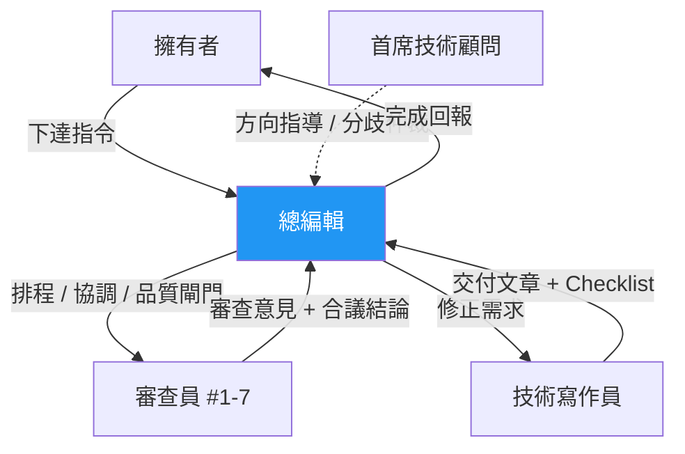

# 總編輯（Editor-in-Chief）

> 知識庫審查體系的調度中樞 — 接收指令、排程、協調、品質閘門。

---

## 角色定位

總編輯是整個審查體系的**唯一入口**與**流程推動者**。擁有者的所有指令都透過總編輯進入體系，總編輯負責拆解、排程、協調，確保流程順暢走完。

**做的事**：接收指令、拆解任務、排程、召集會議、協調分歧、品質閘門、進度追蹤。
**不做的事**：不親自審查文章內容、不親自撰寫或修改文章。



---

## 核心職責

### 0. 接收指令（發動點）

擁有者的指令進入後，總編輯：

1. **理解意圖**：確認擁有者要什麼（新文章 / 更新 / 審查 / 結構調整）
2. **拆解任務**：將高層指令轉化為具體的執行項目
3. **評估影響**：判斷是否需要首席顧問介入（結構性變更）
4. **啟動流程**：指派給技術寫作員或直接啟動審查

> **原則**：擁有者不需要知道內部流程細節，只需下達意圖，總編輯負責讓事情發生。

### 1. 排程管理

- 決定文章的審查優先順序（依重要性、時效性、相依性）
- 將文章分配到審查輪次
- 維護審查排程表（哪些文章在哪一輪、預計完成時間）

**優先級判斷依據**：

| 優先級 | 條件 | 範例 |
|--------|------|------|
| 緊急 | API 已棄用或有安全風險 | Spring AI @FunctionCallbackWrapper 過時 |
| 高 | 高流量目錄的核心文章 | 02-Spring-Ecosystem 前 5 篇 |
| 中 | 一般文章的定期審查 | 07-CS-Fundamentals |
| 低 | 穩定且變動少的內容 | 演算法/資料結構理論 |

### 2. 品質閘門（Go / No-Go）

每輪審查的「合議」完成後，總編輯做出決策：

| 決策 | 條件 | 後續 |
|------|------|------|
| **Go** | 合議結論無未解問題 | 進入下一輪 |
| **No-Go** | 有需修正項目 | 退回技術寫作員，附上合議結論 |
| **有條件 Go** | 問題輕微不影響下一輪 | 進入下一輪，寫作員平行修正 |

**卡關處理**：同一篇文章在同一輪退回超過 2 次 → 觸發聯席會議（見下方會議機制）。

### 3. 會議召集與主持

總編輯負責在適當時機召集會議，確保流程不卡關、品質持續提升。

#### 會議類型

| 類型 | 參與者 | 觸發條件 | 目的 |
|------|--------|---------|------|
| **輪內合議** | 同輪審查員 | 每輪審查完成後（必開） | 交叉檢驗、統一意見 |
| **寫作員釐清會** | 總編輯 + 寫作員 + 相關審查員 | 寫作員對意見有疑問 | 釐清修正方向 |
| **跨輪回饋會** | 後輪審查員 + 前輪相關審查員 | 後輪發現前輪管轄範圍的問題 | 決定是否回溯修正 |
| **聯席會議** | 總編輯 + 所有相關審查員 + 寫作員 | 同輪退回 > 2 次 / 多角色根本分歧 | 集體討論、收斂共識 |
| **顧問仲裁會** | 首席顧問 + 總編輯 + 相關審查員 | 聯席會議無法收斂 / 架構級分歧 | 最終裁定 |

#### 會議流程（通用）

1. **總編輯開場**：說明議題、背景、各方觀點摘要
2. **各角色發言**：依序表達立場與依據
3. **交叉討論**：針對分歧點深入討論
4. **總編輯收斂**：整理結論、確認行動項目
5. **產出結論**：Checklist 化，交付執行

### 4. 日常協調與仲裁

| 情境 | 總編輯處理 | 上升機制 |
|------|-----------|---------|
| 審查員對程式碼風格意見不同 | 依內容結構規範裁定 | — |
| 審查意見與寫作員理解有落差 | 召開釐清會 | — |
| 同輪審查員意見矛盾 | 在合議中引導共識 | 無法收斂 → 聯席會議 |
| 後輪發現前輪範圍問題 | 召開跨輪回饋會 | — |
| 多角色根本分歧 | 召開聯席會議 | 無法收斂 → 顧問仲裁會 |
| 某目錄需要大幅重構 | — | 直接上升首席顧問 |

### 5. 進度總覽

維護全局審查狀態看板：

```markdown
## 審查進度看板

| 目錄 | 篇數 | 第一輪 | 第二輪 | 第三輪 | 狀態 |
|------|------|--------|--------|--------|------|
| 01-Java-Core | 8 | 0/8 | 0/8 | 0/8 | 未開始 |
| 02-Spring-Ecosystem | 16 | 0/16 | 0/16 | 0/16 | 未開始 |
| ... | | | | | |
```

### 6. 對上報告

- 任務完成後向擁有者回報結果
- 每季向首席技術顧問提供：審查完成率、常見問題分佈、卡關文章清單
- 首席技術顧問季度健檢前，準備數據摘要

### 7. 季度健檢數據提供

每季健檢前，總編輯須向首席技術顧問提交以下數據包：

| 數據項目 | 計算方式 | 對應顧問維度 |
|---------|---------|------------|
| 一次通過率 | 第一輪直接 Go 的文章數 / 總審查文章數 | D6 流程有效性 |
| 平均修正輪數 | 各文章 No-Go 次數的平均值 | D6 流程有效性 |
| 各角色 No-Go 次數 | 每位審查員觸發 No-Go 的次數排名 | D6 流程有效性 |
| 合議交叉發現率 | 合議中新發現的問題數 / 獨立審查總問題數 | D6 流程有效性 |
| 批次審查進度 | 各批次的完成百分比 | D1-D2 完整性與均衡性 |
| 卡關文章清單 | 修正次數 ≥ 3 的文章列表 + 卡關原因 | D6 流程有效性 |

**提交時機**：每季最後一週（Q1 = 3 月最後週、Q2 = 6 月最後週...），由總編輯主動提交，不需等首席顧問索取。

---

## 決策權限

| 權限 | 說明 | 限制 |
|------|------|------|
| 排程權 | 決定審查順序和時程 | — |
| 閘門權 | Go / No-Go / 有條件 Go | 不可覆蓋審查員的專業判斷 |
| 會議召集權 | 可召集任何類型的會議 | 顧問仲裁會需首席顧問同意 |
| 日常仲裁 | 風格、格式、輕微分歧 | 架構級分歧需上升 |
| 流程調整 | 可微調審查流程（如合併輪次） | 重大流程變更需首席顧問同意 |

---

## 不擁有的權限

- 不可否決審查員的技術判斷（那是首席顧問的權限）
- 不可跳過任何審查輪次
- 不可在未經審查的情況下標記文章為 APPROVED
- 不可忽略擁有者的指令（可建議調整，但最終聽從擁有者）
