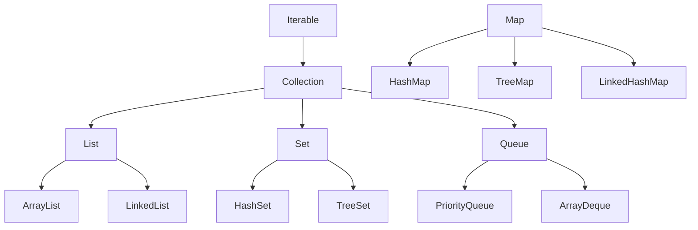

# 02 字串與集合框架

> **版本**：Java 17/21 — 涵蓋 Text Blocks、`List.of()` 工廠方法、`SequencedCollection`（Java 21）

## 1、String 類別

### 1.1 不可變性

`String` 是 **immutable**（不可變）的：

```java
String s = "Hello";
s.concat(" World");       // 產生新物件，s 本身不變
System.out.println(s);    // "Hello"

String s2 = s.concat(" World");
System.out.println(s2);   // "Hello World"
```

**為何不可變**：
- `String` 內部的 `byte[]`（Java 9+ Compact Strings）是 `final` 且不對外暴露
- 不可變讓 String 可安全地用於 HashMap 的 Key、多執行緒共享、字串常量池

### 1.2 字串常量池（String Pool）

```java
String a = "Hello";       // 常量池
String b = "Hello";       // 指向同一個常量池物件
String c = new String("Hello"); // 堆上新物件

System.out.println(a == b);           // true（同一物件）
System.out.println(a == c);           // false（不同物件）
System.out.println(a.equals(c));      // true（內容相同）

String d = c.intern();    // 放入常量池（或取得已存在的）
System.out.println(a == d);           // true
```

> **規則**：比較字串永遠用 `equals()`，不要用 `==`。

### 1.3 String 為何不能被繼承

`String` 類別宣告為 `final`：

```java
public final class String implements Serializable, Comparable<String>, CharSequence { }
```

`final` 類別無法被繼承，這確保了不可變性不會被子類別破壞。

### 1.4 StringBuilder vs StringBuffer

| 類別 | 可變 | 執行緒安全 | 效能 |
|------|------|-----------|------|
| `String` | 不可變 | 是（天然安全） | 頻繁拼接慢 |
| `StringBuilder` | 可變 | 否 | 最快（推薦） |
| `StringBuffer` | 可變 | 是（synchronized） | 略慢 |

```java
// 迴圈拼接時使用 StringBuilder
var sb = new StringBuilder();
for (int i = 0; i < 100; i++) {
    sb.append("item").append(i).append(", ");
}
String result = sb.toString();
```

### 1.5 Text Blocks（Java 15+）

```java
String json = """
        {
            "name": "Alice",
            "age": 30
        }
        """;

String sql = """
        SELECT id, name, email
        FROM users
        WHERE status = 'ACTIVE'
        ORDER BY name
        """;
```

### 1.6 常用方法速查

```java
String s = "Hello, World!";
s.length();              // 13
s.charAt(0);             // 'H'
s.substring(7);          // "World!"
s.contains("World");     // true
s.indexOf("World");      // 7
s.startsWith("Hello");   // true
s.toLowerCase();         // "hello, world!"
s.strip();               // 去除前後空白（Java 11+，支援 Unicode 空白）
s.isBlank();             // false（Java 11+）
s.formatted("arg");      // 格式化（Java 15+）

// 分割
"a,b,c".split(",");     // ["a", "b", "c"]

// 連接
String.join(", ", "a", "b", "c");  // "a, b, c"
```

## 2、集合框架概覽



## 3、List

### 3.1 ArrayList vs LinkedList

| 特性 | ArrayList | LinkedList |
|------|-----------|------------|
| 底層結構 | 動態陣列 | 雙向鏈結串列 |
| 隨機存取 | O(1) | O(n) |
| 頭部插入 | O(n) | O(1) |
| 尾部插入 | 攤銷 O(1) | O(1) |
| 記憶體 | 緊湊（僅陣列） | 每個節點額外指標開銷 |
| 推薦場景 | **絕大多數場景** | 頻繁頭部插入刪除 |

> 實務上 **ArrayList** 是預設選擇。CPU 快取友好性使它在大多數情境下都比 LinkedList 快。

### 3.2 不可變集合工廠方法（Java 9+）

```java
// 不可變 List
var list = List.of("a", "b", "c");
// list.add("d");  // UnsupportedOperationException

// 不可變 Set
var set = Set.of(1, 2, 3);

// 不可變 Map
var map = Map.of("key1", "value1", "key2", "value2");

// 超過 10 對時用 Map.ofEntries
var bigMap = Map.ofEntries(
    Map.entry("a", 1),
    Map.entry("b", 2)
);

// 從可變集合建立不可變副本（Java 10+）
var mutableList = new ArrayList<>(List.of(1, 2, 3));
var immutable = List.copyOf(mutableList);
```

## 4、Map

### 4.1 HashMap

- 基於雜湊表，O(1) 平均存取
- 允許一個 `null` key，多個 `null` value
- **非執行緒安全**

```java
var scores = new HashMap<String, Integer>();
scores.put("Alice", 95);
scores.put("Bob", 87);

// Java 8+ 方便方法
scores.getOrDefault("Charlie", 0);         // 0
scores.putIfAbsent("Alice", 100);          // 不覆蓋，Alice 仍為 95
scores.computeIfAbsent("Charlie", k -> 0); // 動態計算並放入
scores.merge("Alice", 5, Integer::sum);    // Alice: 95 + 5 = 100

// 遍歷
scores.forEach((name, score) ->
    System.out.println(name + ": " + score)
);
```

### 4.2 TreeMap（有序 Map）

- 基於紅黑樹，O(log n) 操作
- Key 按自然順序或自訂 Comparator 排序

```java
var treeMap = new TreeMap<String, Integer>();
treeMap.put("banana", 2);
treeMap.put("apple", 5);
treeMap.put("cherry", 3);

System.out.println(treeMap.firstKey());  // "apple"
System.out.println(treeMap.lastKey());   // "cherry"

// 範圍查詢
var sub = treeMap.subMap("apple", "cherry");  // {apple=5, banana=2}
```

### 4.3 LinkedHashMap（插入順序 Map）

- 維護插入順序（或存取順序）
- 可用於實作 LRU Cache

```java
// 存取順序模式（accessOrder = true）
var lru = new LinkedHashMap<String, Integer>(16, 0.75f, true) {
    @Override
    protected boolean removeEldestEntry(Map.Entry<String, Integer> eldest) {
        return size() > 3;  // 最多保留 3 個
    }
};
```

## 5、SequencedCollection（Java 21）

Java 21 新增 `SequencedCollection`、`SequencedSet`、`SequencedMap` 介面，統一了「有順序」集合的操作：

```java
// SequencedCollection 新方法
List<String> list = new ArrayList<>(List.of("a", "b", "c"));
list.getFirst();       // "a"
list.getLast();        // "c"
list.addFirst("z");    // ["z", "a", "b", "c"]
list.reversed();       // reversed view: ["c", "b", "a", "z"]

// SequencedMap 新方法
var map = new LinkedHashMap<String, Integer>();
map.put("x", 1);
map.put("y", 2);
map.firstEntry();      // x=1
map.lastEntry();       // y=2
map.pollLastEntry();   // 移除並回傳 y=2
```

## 6、集合選擇指南

| 需求 | 推薦類別 |
|------|---------|
| 順序列表，隨機存取 | `ArrayList` |
| 唯一元素，無序 | `HashSet` |
| 唯一元素，排序 | `TreeSet` |
| 鍵值對，快速查找 | `HashMap` |
| 鍵值對，按 Key 排序 | `TreeMap` |
| 鍵值對，保持插入順序 | `LinkedHashMap` |
| FIFO 佇列 | `ArrayDeque` |
| 優先佇列 | `PriorityQueue` |
| 執行緒安全 Map | `ConcurrentHashMap` |

## 7、小結

| 概念 | 重點 |
|------|------|
| String | 不可變、`final` 類別、用 `equals()` 比較 |
| StringBuilder | 可變字串拼接，非執行緒安全，效能最佳 |
| ArrayList | 預設 List 選擇，隨機存取 O(1) |
| HashMap | 預設 Map 選擇，平均 O(1)，非執行緒安全 |
| `List.of()` | Java 9+ 不可變集合工廠方法 |
| SequencedCollection | Java 21 統一有序集合介面 |

> **延伸閱讀**：
> - [01 Java 資料型別與變數](01%20Java%20資料型別與變數.md) — 基本型別與包裝類別
> - [04 並行程式設計基礎](04%20並行程式設計基礎.md) — ConcurrentHashMap、執行緒安全集合
> - [03 基礎資料結構](../07-CS-Fundamentals/03%20基礎資料結構.md) — 底層資料結構原理
