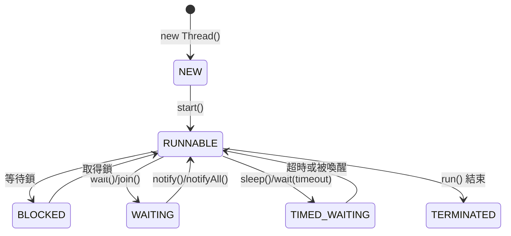

# 04 並行程式設計基礎

> **版本**：Java 17/21 — 涵蓋 ConcurrentHashMap（CAS 架構）、Virtual Threads（Java 21）、NIO 基礎

## 1、執行緒基礎

### 1.1 建立執行緒的方式

```java
// 方式 1：實作 Runnable（推薦）
Runnable task = () -> System.out.println("Hello from " + Thread.currentThread().getName());
new Thread(task).start();

// 方式 2：實作 Callable（有回傳值）
Callable<Integer> callable = () -> {
    Thread.sleep(1000);
    return 42;
};

// 方式 3：繼承 Thread（不推薦，Java 是單繼承）
```

### 1.2 執行緒狀態



## 2、synchronized 與鎖

### 2.1 synchronized 基本用法

```java
public class Counter {
    private int count = 0;

    // 同步方法：鎖是 this
    public synchronized void increment() {
        count++;
    }

    // 同步區塊：可指定鎖物件
    private final Object lock = new Object();

    public void incrementWithBlock() {
        synchronized (lock) {
            count++;
        }
    }

    public int getCount() { return count; }
}
```

### 2.2 volatile

`volatile` 保證**可見性**和**有序性**，但不保證原子性：

```java
public class StopFlag {
    private volatile boolean running = true;

    public void stop() {
        running = false;  // 寫入對其他執行緒立即可見
    }

    public void run() {
        while (running) {
            // 工作...
        }
    }
}
```

## 3、ConcurrentHashMap

### 3.1 為何不用 HashMap + synchronized

- `Collections.synchronizedMap()` 鎖整個 Map，效能差
- `Hashtable` 同理，每個方法都 synchronized

### 3.2 ConcurrentHashMap 架構（Java 8+）

Java 8 之後改用 **CAS + synchronized 節點鎖**：

- 讀操作：無鎖（`volatile` 保證可見性）
- 寫操作：只鎖住對應的桶（bucket）的頭節點
- 樹化：單桶超過 8 個節點時轉為紅黑樹

```java
var map = new ConcurrentHashMap<String, Integer>();

// 原子操作（重要！避免 check-then-act 競態）
map.putIfAbsent("key", 0);
map.compute("key", (k, v) -> v == null ? 1 : v + 1);  // 原子累加
map.merge("key", 1, Integer::sum);                       // 更簡潔

// 批量操作（Java 8+），parallelismThreshold 控制並行度
map.forEach(2, (k, v) -> System.out.println(k + "=" + v));
long sum = map.reduceValuesToLong(2, Long::valueOf, 0, Long::sum);
```

### 3.3 CopyOnWriteArrayList

讀多寫少場景的執行緒安全 List：

```java
var list = new CopyOnWriteArrayList<String>();
list.add("a");  // 寫時複製整個陣列
// 適合：事件監聽器列表、配置列表
// 不適合：頻繁寫入的場景
```

## 4、執行緒池（ExecutorService）

### 4.1 為何使用執行緒池

- 避免頻繁建立/銷毀執行緒的開銷
- 控制並發數量，防止資源耗盡
- 提供任務排隊和拒絕策略

### 4.2 建立執行緒池

```java
// 推薦：手動建立，明確參數
var executor = new ThreadPoolExecutor(
    4,                        // corePoolSize：核心執行緒數
    8,                        // maximumPoolSize：最大執行緒數
    60, TimeUnit.SECONDS,     // keepAliveTime：閒置執行緒存活時間
    new LinkedBlockingQueue<>(100),  // 工作佇列（有界！）
    new ThreadPoolExecutor.CallerRunsPolicy()  // 拒絕策略
);

// 不推薦：Executors 工廠方法（可能導致 OOM）
// Executors.newFixedThreadPool(4);       // 無界佇列，任務堆積可能 OOM
// Executors.newCachedThreadPool();       // 無上限執行緒，可能建立過多
```

### 4.3 提交任務

```java
// 無回傳值
executor.execute(() -> System.out.println("task"));

// 有回傳值
Future<String> future = executor.submit(() -> {
    Thread.sleep(1000);
    return "result";
});
String result = future.get(5, TimeUnit.SECONDS);  // 阻塞等待

// CompletableFuture（Java 8+，推薦）
CompletableFuture.supplyAsync(() -> fetchData(), executor)
    .thenApply(data -> process(data))
    .thenAccept(result -> save(result))
    .exceptionally(ex -> { log.error("Failed", ex); return null; });
```

### 4.4 關閉執行緒池

```java
executor.shutdown();                    // 不接受新任務，等待已提交任務完成
boolean done = executor.awaitTermination(30, TimeUnit.SECONDS);
if (!done) {
    executor.shutdownNow();             // 中斷正在執行的任務
}
```

## 5、NIO 基礎

### 5.1 BIO vs NIO vs AIO

| 模型 | 全稱 | 特點 | 適用場景 |
|------|------|------|---------|
| BIO | Blocking I/O | 一連接一執行緒，阻塞 | 連接數少、固定的場景 |
| NIO | Non-blocking I/O | 多路復用，一執行緒處理多連接 | 高併發（Netty 基於此） |
| AIO | Asynchronous I/O | 完全非同步，回呼通知 | 大量長連接 |

### 5.2 NIO 三大核心

```java
// Channel：雙向通道（取代 Stream）
// Buffer：資料緩衝區
// Selector：多路復用器

// 簡單 NIO 讀取檔案
try (var channel = FileChannel.open(Path.of("data.txt"), StandardOpenOption.READ)) {
    var buffer = ByteBuffer.allocate(1024);
    while (channel.read(buffer) != -1) {
        buffer.flip();  // 切換到讀模式
        while (buffer.hasRemaining()) {
            System.out.print((char) buffer.get());
        }
        buffer.clear();  // 切換回寫模式
    }
}
```

### 5.3 Buffer 的核心概念

Buffer 有三個關鍵指標：`position`、`limit`、`capacity`

- **寫模式**：`position` 指向下一個寫入位置，`limit == capacity`
- `flip()` 後切換到**讀模式**：`limit = position`，`position = 0`
- `clear()` 後切換回寫模式

## 6、Virtual Threads（Java 21）

Java 21 正式引入虛擬執行緒，大幅降低高併發程式的複雜度：

```java
// 建立虛擬執行緒
Thread.startVirtualThread(() -> {
    System.out.println("I'm a virtual thread!");
});

// 使用 ExecutorService
try (var executor = Executors.newVirtualThreadPerTaskExecutor()) {
    for (int i = 0; i < 100_000; i++) {
        executor.submit(() -> {
            Thread.sleep(Duration.ofSeconds(1));  // 不阻塞平台執行緒
            return "done";
        });
    }
}  // try-with-resources 自動關閉

// Spring Boot 3.2+ 支援
// spring.threads.virtual.enabled=true
```

**虛擬執行緒 vs 平台執行緒**：

| 特性 | 平台執行緒 | 虛擬執行緒 |
|------|-----------|-----------|
| 對應 | 1:1 OS 執行緒 | N:M（多對少） |
| 記憶體 | ~1MB 棧空間 | ~幾 KB |
| 數量上限 | 數千個 | 數百萬個 |
| 適合 | CPU 密集型 | I/O 密集型 |
| 使用 synchronized | 正常 | 可能 pin（釘住平台執行緒），改用 ReentrantLock |

## 7、小結

| 概念 | 重點 |
|------|------|
| synchronized | 最基本的同步機制；Java 6+ 有偏向鎖/輕量鎖最佳化 |
| ConcurrentHashMap | CAS + 節點鎖，讀無鎖；用 `compute`/`merge` 做原子操作 |
| 執行緒池 | 手動建立 `ThreadPoolExecutor`，設定有界佇列和拒絕策略 |
| CompletableFuture | 非同步編排首選，支援鏈式呼叫和例外處理 |
| NIO | Channel + Buffer + Selector，高併發基礎 |
| Virtual Threads | Java 21，I/O 密集型的最佳解，幾乎無限並發 |

> **延伸閱讀**：
> - [02 字串與集合框架](02%20字串與集合框架.md) — HashMap 非執行緒安全的替代方案
> - [05 JVM 記憶體與垃圾回收](../07-CS-Fundamentals/05%20JVM%20記憶體與垃圾回收.md) — 執行緒棧與堆的記憶體佈局
> - [01 Spring Core — DI 與 IoC](../02-Spring-Ecosystem/01%20Spring%20Core%20—%20DI%20與%20IoC.md) — Spring Bean 預設單例的執行緒安全考量

---
審查狀態：APPROVED — 2026-Q1
- [x] 技術正確性
- [x] 架構與方法論
- [x] 生產實戰
- [x] 內容結構
- [x] 術語與一致性
- [x] 讀者路徑
- [x] 時效性
