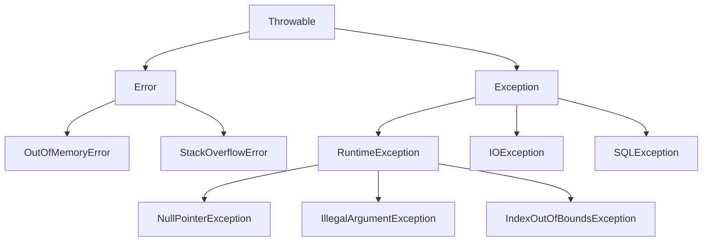

# 08 Optional 與現代錯誤處理

> **版本**：Java 17+ — 涵蓋 Optional 完整用法、Exception 體系、try-with-resources

## 1、Optional

### 1.1 為什麼需要 Optional

`Optional<T>` 是一個可能包含值也可能為空的容器，用來取代 `null`：

```java
// 傳統寫法：容易忘記 null 檢查
public String getCityName(User user) {
    if (user != null) {
        Address address = user.getAddress();
        if (address != null) {
            return address.getCity();
        }
    }
    return "Unknown";
}

// Optional 寫法
public String getCityName(User user) {
    return Optional.ofNullable(user)
        .map(User::getAddress)
        .map(Address::getCity)
        .orElse("Unknown");
}
```

### 1.2 建立 Optional

```java
// 有值
Optional<String> opt1 = Optional.of("hello");       // null 會拋 NPE
Optional<String> opt2 = Optional.ofNullable(name);   // null 則為 empty

// 空值
Optional<String> opt3 = Optional.empty();
```

### 1.3 取值方法

```java
Optional<String> opt = findUserName(id);

// 有預設值
String name1 = opt.orElse("Anonymous");

// 惰性預設（只在需要時計算）
String name2 = opt.orElseGet(() -> generateDefaultName());

// 拋異常
String name3 = opt.orElseThrow();  // NoSuchElementException
String name4 = opt.orElseThrow(() -> new UserNotFoundException(id));

// 條件消費
opt.ifPresent(name -> System.out.println("Found: " + name));

// Java 9+：有值或空時分別處理
opt.ifPresentOrElse(
    name -> System.out.println("Found: " + name),
    () -> System.out.println("Not found")
);
```

### 1.4 轉換與過濾

```java
Optional<User> user = findUser(id);

// map：轉換值
Optional<String> email = user.map(User::getEmail);

// flatMap：當轉換結果本身是 Optional 時
Optional<String> city = user
    .flatMap(User::getAddress)    // getAddress() 回傳 Optional<Address>
    .map(Address::getCity);

// filter：條件過濾
Optional<User> adult = user.filter(u -> u.getAge() >= 18);

// or（Java 9+）：當空時提供替代 Optional
Optional<User> result = findUser(id)
    .or(() -> findUserByEmail(email));

// stream（Java 9+）：轉為 Stream（0 或 1 個元素）
List<String> names = users.stream()
    .map(this::findNickname)       // Stream<Optional<String>>
    .flatMap(Optional::stream)      // 自動過濾空值
    .toList();
```

### 1.5 使用規範

| 正確用法 | 錯誤用法 |
|---------|---------|
| 方法回傳值 | 方法參數（用 `@Nullable` 或多載） |
| 鏈式轉換 | 欄位型別（用 null + getter 返回 Optional） |
| Stream 中搭配 flatMap | `opt.get()` 不檢查（等同 null 不檢查） |
| `orElse` / `orElseThrow` | `opt.isPresent()` + `opt.get()`（回到 if-null 思維） |

```java
// 反模式
if (opt.isPresent()) {
    return opt.get();  // 跟 null 檢查一樣醜
}

// 正確
return opt.orElse(defaultValue);
```

### 1.6 生產注意事項

**序列化限制**：`Optional` 沒有實作 `Serializable`，不能直接作為 JPA Entity 欄位或 DTO 欄位使用。Jackson 預設也無法正確序列化 `Optional` 欄位。替代方案：Entity / DTO 欄位維持一般型別（允許 `null`），在 getter 回傳 `Optional`：

```java
// Entity / DTO 中的正確做法
private String nickname;  // 欄位用普通型別

public Optional<String> getNickname() {
    return Optional.ofNullable(nickname);
}
```

**效能考量**：每次呼叫 `Optional.of()` / `Optional.ofNullable()` 都會建立新物件。在高頻迴圈或效能敏感的熱點路徑中，直接使用 `null` 檢查仍然是合理的選擇：

```java
// 效能敏感場景：傳統 null 檢查更適合
for (int i = 0; i < 1_000_000; i++) {
    Value v = map.get(key);
    if (v != null) { /* ... */ }  // 比 Optional.ofNullable(v) 少一次物件配置
}
```

## 2、異常體系

### 2.1 Java 異常層次



| 類型 | 說明 | 是否必須處理 |
|------|------|-------------|
| `Error` | JVM 層級錯誤（OOM、SOE） | 不應該 catch |
| Checked Exception | 編譯器強制處理 | 必須 catch 或 throws |
| Unchecked Exception | `RuntimeException` 子類別 | 不強制，但建議處理 |

### 2.2 自訂異常

```java
// 業務異常（unchecked，推薦）
public class BusinessException extends RuntimeException {
    private final String errorCode;

    public BusinessException(String errorCode, String message) {
        super(message);
        this.errorCode = errorCode;
    }

    public String getErrorCode() { return errorCode; }
}

// 具體業務異常
public class UserNotFoundException extends BusinessException {
    public UserNotFoundException(Long id) {
        super("USER_NOT_FOUND", "User not found: " + id);
    }
}
```

### 2.3 異常處理最佳實踐

```java
// 1. 具體異常優先於通用異常
try {
    // ...
} catch (FileNotFoundException e) {
    // 處理找不到檔案
} catch (IOException e) {
    // 處理其他 IO 異常
}

// 2. 不要吞掉異常
try {
    riskyOperation();
} catch (Exception e) {
    log.error("Operation failed", e);  // 至少要記錄
    throw new BusinessException("OP_FAILED", e.getMessage());
}

// 3. 不要用異常控制流程
// 錯誤
try {
    int value = Integer.parseInt(input);
} catch (NumberFormatException e) {
    value = 0;  // 用異常當 if-else，效能差
}

// 正確
if (input.matches("-?\\d+")) {
    value = Integer.parseInt(input);
} else {
    value = 0;
}
```

## 3、try-with-resources（Java 7+）

自動關閉實作 `AutoCloseable` 的資源：

```java
// 傳統寫法（容易忘記關閉、finally 中又可能拋異常）
BufferedReader reader = null;
try {
    reader = new BufferedReader(new FileReader("data.txt"));
    String line = reader.readLine();
} finally {
    if (reader != null) reader.close();
}

// try-with-resources（推薦）
try (var reader = new BufferedReader(new FileReader("data.txt"))) {
    String line = reader.readLine();
}  // 自動呼叫 reader.close()

// 多資源
try (var conn = dataSource.getConnection();
     var stmt = conn.prepareStatement(sql);
     var rs = stmt.executeQuery()) {
    while (rs.next()) {
        // 處理結果
    }
}  // rs → stmt → conn 依序關閉（後開先關）
```

## 4、Spring Boot 全域異常處理

```java
@RestControllerAdvice
public class GlobalExceptionHandler {

    @ExceptionHandler(UserNotFoundException.class)
    @ResponseStatus(HttpStatus.NOT_FOUND)
    public ErrorResponse handleNotFound(UserNotFoundException e) {
        return new ErrorResponse(e.getErrorCode(), e.getMessage());
    }

    @ExceptionHandler(MethodArgumentNotValidException.class)
    @ResponseStatus(HttpStatus.BAD_REQUEST)
    public ErrorResponse handleValidation(MethodArgumentNotValidException e) {
        String message = e.getBindingResult().getFieldErrors().stream()
            .map(fe -> fe.getField() + ": " + fe.getDefaultMessage())
            .collect(Collectors.joining("; "));
        return new ErrorResponse("VALIDATION_ERROR", message);
    }

    @ExceptionHandler(Exception.class)
    @ResponseStatus(HttpStatus.INTERNAL_SERVER_ERROR)
    public ErrorResponse handleGeneral(Exception e) {
        log.error("Unexpected error", e);
        return new ErrorResponse("INTERNAL_ERROR", "Internal server error");
    }

    public record ErrorResponse(String code, String message) {}
}
```

## 5、小結

| 概念 | 重點 |
|------|------|
| Optional | 取代 null；用 `map`/`flatMap`/`orElse` 鏈式處理 |
| 反模式 | 不要用 `isPresent()` + `get()`；不要當方法參數 |
| Checked vs Unchecked | 業務異常用 RuntimeException 子類別（unchecked） |
| try-with-resources | 自動關閉資源，後開先關 |
| 全域異常處理 | `@RestControllerAdvice` + `@ExceptionHandler` |

> **延伸閱讀**：
> - [07 Lambda 與 Stream API](07%20Lambda%20與%20Stream%20API.md) — Optional 與 Stream 的搭配
> - [08 Spring MVC 例外處理與驗證](../02-Spring-Ecosystem/08%20Spring%20MVC%20例外處理與驗證.md) — MVC 層的例外處理
> - [13 Spring 事務管理](../02-Spring-Ecosystem/13%20Spring%20事務管理.md) — 異常與事務回滾的關係

---
審查狀態：APPROVED — 2026-Q1
- [x] 技術正確性
- [x] 架構與方法論
- [x] 生產實戰
- [x] 內容結構
- [x] 術語與一致性
- [x] 讀者路徑
- [x] 時效性
