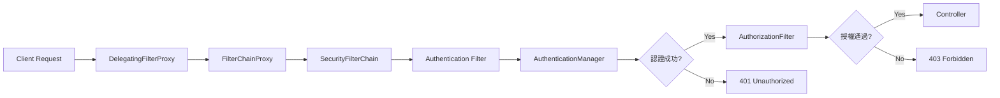
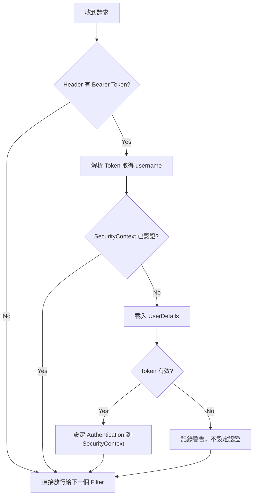

# 14 Spring Security 與 JWT

> **版本**：Spring Boot 3.x / Spring Security 6.x / Java 17+
>
> Spring Security 是 Spring 生態系中最強大的認證與授權框架。搭配 JWT（JSON Web Token），可以實現無狀態的 RESTful API 安全機制，適合前後端分離架構。

## 1、Spring Security 架構概覽

### 1.1 SecurityFilterChain 概念

Spring Security 6.x 以 `SecurityFilterChain` Bean 取代了舊版的 `WebSecurityConfigurerAdapter`（已在 Spring Security 5.7 標記棄用）。新方式採用元件式配置，更符合 Spring Boot 3.x 的設計理念。

| 版本 | 配置方式 | 狀態 |
|------|---------|------|
| Spring Security 5.x 以前 | 繼承 `WebSecurityConfigurerAdapter` | 已棄用 |
| Spring Security 6.x | 註冊 `SecurityFilterChain` Bean | **現行標準** |

### 1.2 請求處理流程



核心元件說明：

| 元件 | 職責 |
|------|------|
| `DelegatingFilterProxy` | Servlet 容器與 Spring Security 的橋樑 |
| `FilterChainProxy` | 管理多個 `SecurityFilterChain`，根據請求路徑選擇對應的鏈 |
| `AuthenticationManager` | 認證管理器，委託 `AuthenticationProvider` 執行實際認證 |
| `SecurityContextHolder` | 儲存當前認證資訊，預設使用 `ThreadLocal` |
| `AuthorizationFilter` | 根據配置的規則判斷是否有權限存取資源 |

## 2、基本配置

### 2.1 SecurityFilterChain 配置

```java
@Configuration
@EnableWebSecurity
public class SecurityConfig {

    private final JwtAuthenticationFilter jwtAuthenticationFilter;
    private final AuthenticationProvider authenticationProvider;

    public SecurityConfig(JwtAuthenticationFilter jwtAuthenticationFilter,
                          AuthenticationProvider authenticationProvider) {
        this.jwtAuthenticationFilter = jwtAuthenticationFilter;
        this.authenticationProvider = authenticationProvider;
    }

    @Bean
    public SecurityFilterChain filterChain(HttpSecurity http) throws Exception {
        http
            // 停用 CSRF（REST API 不需要）
            .csrf(csrf -> csrf.disable())
            // 設定路由規則
            .authorizeHttpRequests(auth -> auth
                .requestMatchers("/api/auth/**").permitAll()
                .requestMatchers("/api/public/**").permitAll()
                .requestMatchers("/api/admin/**").hasRole("ADMIN")
                .requestMatchers("/api/manage/**").hasAnyRole("ADMIN", "MANAGER")
                .anyRequest().authenticated()
            )
            // 無狀態 Session（JWT 不需要 Session）
            .sessionManagement(session -> session
                .sessionCreationPolicy(SessionCreationPolicy.STATELESS)
            )
            // 設定認證提供者
            .authenticationProvider(authenticationProvider)
            // 在 UsernamePasswordAuthenticationFilter 之前加入 JWT Filter
            .addFilterBefore(jwtAuthenticationFilter,
                UsernamePasswordAuthenticationFilter.class);

        return http.build();
    }
}
```

### 2.2 路由規則

`requestMatchers` 支援多種匹配方式：

```java
.authorizeHttpRequests(auth -> auth
    // 精確路徑
    .requestMatchers("/api/auth/login", "/api/auth/register").permitAll()
    // Ant 風格萬用字元
    .requestMatchers("/api/public/**").permitAll()
    // 限定 HTTP 方法
    .requestMatchers(HttpMethod.GET, "/api/products/**").permitAll()
    .requestMatchers(HttpMethod.POST, "/api/products/**").hasRole("ADMIN")
    // 其餘請求皆需認證
    .anyRequest().authenticated()
)
```

| 方法 | 說明 |
|------|------|
| `permitAll()` | 所有人可存取（含匿名） |
| `authenticated()` | 必須認證 |
| `hasRole("ADMIN")` | 需要 `ROLE_ADMIN` 角色 |
| `hasAnyRole("ADMIN", "MANAGER")` | 需要其中任一角色 |
| `hasAuthority("user:write")` | 需要指定權限 |

### 2.3 CSRF 設定

REST API 採用 JWT Token 認證，Token 由前端主動放入 Header，不會受到 CSRF 攻擊，因此通常停用 CSRF：

```java
.csrf(csrf -> csrf.disable())
```

> 如果同時提供傳統表單登入頁面，應考慮僅對 API 路徑停用 CSRF，表單路徑保留。

### 2.4 AuthenticationProvider 與 UserDetailsService

```java
@Configuration
public class AuthenticationConfig {

    private final UserRepository userRepository;

    public AuthenticationConfig(UserRepository userRepository) {
        this.userRepository = userRepository;
    }

    @Bean
    public UserDetailsService userDetailsService() {
        return username -> userRepository.findByUsername(username)
                .orElseThrow(() ->
                    new UsernameNotFoundException("使用者不存在: " + username));
    }

    @Bean
    public AuthenticationProvider authenticationProvider() {
        DaoAuthenticationProvider provider = new DaoAuthenticationProvider();
        provider.setUserDetailsService(userDetailsService());
        provider.setPasswordEncoder(passwordEncoder());
        return provider;
    }

    @Bean
    public AuthenticationManager authenticationManager(
            AuthenticationConfiguration config) throws Exception {
        return config.getAuthenticationManager();
    }

    @Bean
    public PasswordEncoder passwordEncoder() {
        return new BCryptPasswordEncoder();
    }
}
```

## 3、JWT 認證機制

### 3.1 JWT 結構

JWT 由三段以 `.` 分隔的 Base64Url 字串組成：

```
Header.Payload.Signature
```

| 段落 | 內容 | 範例 |
|------|------|------|
| **Header** | 演算法與類型 | `{"alg": "HS256", "typ": "JWT"}` |
| **Payload** | 聲明（Claims） | `{"sub": "admin", "iat": 1700000000, "exp": 1700003600}` |
| **Signature** | 簽名驗證 | `HMACSHA256(base64(header) + "." + base64(payload), secret)` |

常見 Claims：

| Claim | 全稱 | 說明 |
|-------|------|------|
| `sub` | Subject | 主體（通常是使用者帳號或 ID） |
| `iat` | Issued At | Token 簽發時間 |
| `exp` | Expiration | Token 過期時間 |
| `roles` | — | 自訂：使用者角色列表 |

### 3.2 JWT 工具類

使用 `jjwt` 函式庫（io.jsonwebtoken）實作 Token 的產生、解析與驗證：

```java
@Component
public class JwtUtils {

    @Value("${jwt.secret}")
    private String secretKey;

    @Value("${jwt.access-token-expiration:3600000}")   // 預設 1 小時
    private long accessTokenExpiration;

    @Value("${jwt.refresh-token-expiration:604800000}") // 預設 7 天
    private long refreshTokenExpiration;

    /**
     * 取得簽名金鑰
     */
    private SecretKey getSigningKey() {
        byte[] keyBytes = Decoders.BASE64.decode(secretKey);
        return Keys.hmacShaKeyFor(keyBytes);
    }

    /**
     * 產生 Access Token
     */
    public String generateAccessToken(UserDetails userDetails) {
        Map<String, Object> extraClaims = new HashMap<>();
        // 將角色放入 Claims
        List<String> roles = userDetails.getAuthorities().stream()
                .map(GrantedAuthority::getAuthority)
                .toList();
        extraClaims.put("roles", roles);

        return buildToken(extraClaims, userDetails.getUsername(), accessTokenExpiration);
    }

    /**
     * 產生 Refresh Token（不含角色資訊）
     */
    public String generateRefreshToken(UserDetails userDetails) {
        return buildToken(new HashMap<>(), userDetails.getUsername(), refreshTokenExpiration);
    }

    private String buildToken(Map<String, Object> extraClaims,
                              String subject, long expiration) {
        long now = System.currentTimeMillis();
        return Jwts.builder()
                .claims(extraClaims)
                .subject(subject)
                .issuedAt(new Date(now))
                .expiration(new Date(now + expiration))
                .signWith(getSigningKey())
                .compact();
    }

    /**
     * 從 Token 中解析所有 Claims
     */
    public Claims extractAllClaims(String token) {
        return Jwts.parser()
                .verifyWith(getSigningKey())
                .build()
                .parseSignedClaims(token)
                .getPayload();
    }

    /**
     * 取得使用者名稱
     */
    public String extractUsername(String token) {
        return extractAllClaims(token).getSubject();
    }

    /**
     * 驗證 Token 是否有效
     */
    public boolean isTokenValid(String token, UserDetails userDetails) {
        try {
            String username = extractUsername(token);
            return username.equals(userDetails.getUsername()) && !isTokenExpired(token);
        } catch (JwtException | IllegalArgumentException e) {
            return false;
        }
    }

    private boolean isTokenExpired(String token) {
        return extractAllClaims(token).getExpiration().before(new Date());
    }
}
```

對應的 `application.yml` 配置：

```yaml
jwt:
  # Base64 編碼的密鑰（至少 256 bits）
  secret: "dGhpcyBpcyBhIHZlcnkgc2VjdXJlIHNlY3JldCBrZXkgZm9yIGp3dCB0b2tlbg=="
  access-token-expiration: 3600000    # 1 小時
  refresh-token-expiration: 604800000 # 7 天
```

### 3.3 JWT Filter

自訂 `OncePerRequestFilter`，在每個請求中攔截並驗證 JWT：

```java
@Component
public class JwtAuthenticationFilter extends OncePerRequestFilter {

    private final JwtUtils jwtUtils;
    private final UserDetailsService userDetailsService;

    public JwtAuthenticationFilter(JwtUtils jwtUtils,
                                   UserDetailsService userDetailsService) {
        this.jwtUtils = jwtUtils;
        this.userDetailsService = userDetailsService;
    }

    @Override
    protected void doFilterInternal(HttpServletRequest request,
                                    HttpServletResponse response,
                                    FilterChain filterChain)
            throws ServletException, IOException {

        // 1. 從 Header 取出 Token
        String authHeader = request.getHeader("Authorization");
        if (authHeader == null || !authHeader.startsWith("Bearer ")) {
            filterChain.doFilter(request, response);
            return;
        }

        String token = authHeader.substring(7);

        try {
            // 2. 解析使用者名稱
            String username = jwtUtils.extractUsername(token);

            // 3. 若 SecurityContext 中尚未認證，進行驗證
            if (username != null &&
                SecurityContextHolder.getContext().getAuthentication() == null) {

                UserDetails userDetails =
                    userDetailsService.loadUserByUsername(username);

                if (jwtUtils.isTokenValid(token, userDetails)) {
                    // 4. 建立認證物件並設定到 SecurityContext
                    UsernamePasswordAuthenticationToken authToken =
                        new UsernamePasswordAuthenticationToken(
                            userDetails,
                            null,
                            userDetails.getAuthorities()
                        );
                    authToken.setDetails(
                        new WebAuthenticationDetailsSource()
                            .buildDetails(request)
                    );
                    SecurityContextHolder.getContext()
                        .setAuthentication(authToken);
                }
            }
        } catch (JwtException e) {
            // Token 無效，不設定認證，後續 Filter 會回傳 401
            logger.warn("JWT 驗證失敗: " + e.getMessage());
        }

        filterChain.doFilter(request, response);
    }
}
```

JWT Filter 的處理流程：



## 4、登入與 Token 刷新

### 4.1 登入與刷新 DTO

```java
public record LoginRequest(
    @NotBlank(message = "帳號不可為空") String username,
    @NotBlank(message = "密碼不可為空") String password
) {}

public record TokenResponse(
    String accessToken,
    String refreshToken,
    long expiresIn
) {}

public record RefreshTokenRequest(
    @NotBlank(message = "Refresh Token 不可為空") String refreshToken
) {}
```

### 4.2 AuthService

```java
@Service
public class AuthService {

    private final AuthenticationManager authenticationManager;
    private final UserDetailsService userDetailsService;
    private final JwtUtils jwtUtils;

    public AuthService(AuthenticationManager authenticationManager,
                       UserDetailsService userDetailsService,
                       JwtUtils jwtUtils) {
        this.authenticationManager = authenticationManager;
        this.userDetailsService = userDetailsService;
        this.jwtUtils = jwtUtils;
    }

    /**
     * 登入：驗證帳密，回傳雙 Token
     */
    public TokenResponse login(LoginRequest request) {
        // 透過 AuthenticationManager 驗證帳號密碼
        authenticationManager.authenticate(
            new UsernamePasswordAuthenticationToken(
                request.username(), request.password()
            )
        );

        UserDetails userDetails =
            userDetailsService.loadUserByUsername(request.username());

        String accessToken = jwtUtils.generateAccessToken(userDetails);
        String refreshToken = jwtUtils.generateRefreshToken(userDetails);

        return new TokenResponse(accessToken, refreshToken, 3600);
    }

    /**
     * 刷新 Token：用 Refresh Token 換取新的 Access Token
     */
    public TokenResponse refreshToken(RefreshTokenRequest request) {
        String refreshToken = request.refreshToken();
        String username = jwtUtils.extractUsername(refreshToken);

        UserDetails userDetails =
            userDetailsService.loadUserByUsername(username);

        if (!jwtUtils.isTokenValid(refreshToken, userDetails)) {
            throw new RuntimeException("Refresh Token 無效或已過期");
        }

        String newAccessToken = jwtUtils.generateAccessToken(userDetails);

        return new TokenResponse(newAccessToken, refreshToken, 3600);
    }
}
```

### 4.3 AuthController

```java
@RestController
@RequestMapping("/api/auth")
public class AuthController {

    private final AuthService authService;

    public AuthController(AuthService authService) {
        this.authService = authService;
    }

    /**
     * 登入端點
     * POST /api/auth/login
     */
    @PostMapping("/login")
    public ResponseEntity<TokenResponse> login(
            @Valid @RequestBody LoginRequest request) {
        TokenResponse response = authService.login(request);
        return ResponseEntity.ok(response);
    }

    /**
     * Token 刷新端點
     * POST /api/auth/refresh
     */
    @PostMapping("/refresh")
    public ResponseEntity<TokenResponse> refresh(
            @Valid @RequestBody RefreshTokenRequest request) {
        TokenResponse response = authService.refreshToken(request);
        return ResponseEntity.ok(response);
    }
}
```

前端呼叫範例：

```javascript
// 登入
const res = await fetch('/api/auth/login', {
    method: 'POST',
    headers: { 'Content-Type': 'application/json' },
    body: JSON.stringify({ username: 'admin', password: 'password' })
});
const { accessToken, refreshToken } = await res.json();

// 帶 Token 存取受保護的 API
const data = await fetch('/api/products', {
    headers: { 'Authorization': `Bearer ${accessToken}` }
});
```

## 5、角色與權限控制

### 5.1 啟用方法級別安全

```java
@Configuration
@EnableMethodSecurity  // Spring Security 6.x 取代 @EnableGlobalMethodSecurity
public class MethodSecurityConfig {
    // 啟用 @PreAuthorize、@PostAuthorize、@Secured
}
```

### 5.2 @PreAuthorize 用法

```java
@RestController
@RequestMapping("/api/users")
public class UserController {

    /**
     * 僅 ADMIN 角色可存取
     * 注意：hasRole 會自動加上 ROLE_ 前綴
     */
    @PreAuthorize("hasRole('ADMIN')")
    @GetMapping
    public ResponseEntity<List<UserDTO>> getAllUsers() {
        // ...
    }

    /**
     * 細粒度權限控制
     */
    @PreAuthorize("hasAuthority('user:write')")
    @PostMapping
    public ResponseEntity<UserDTO> createUser(@RequestBody UserDTO dto) {
        // ...
    }

    /**
     * 複合條件：ADMIN 或本人
     */
    @PreAuthorize("hasRole('ADMIN') or #id == authentication.principal.id")
    @GetMapping("/{id}")
    public ResponseEntity<UserDTO> getUser(@PathVariable Long id) {
        // ...
    }

    /**
     * 多角色其一即可
     */
    @PreAuthorize("hasAnyRole('ADMIN', 'MANAGER')")
    @DeleteMapping("/{id}")
    public ResponseEntity<Void> deleteUser(@PathVariable Long id) {
        // ...
    }
}
```

### 5.3 UserDetails 實作角色與權限

為了讓 `hasRole` 與 `hasAuthority` 都能正常運作，`UserDetails` 的實作需要正確回傳 `GrantedAuthority`：

```java
@Entity
@Table(name = "app_user")
public class AppUser implements UserDetails {

    @Id
    @GeneratedValue(strategy = GenerationType.IDENTITY)
    private Long id;

    @Column(nullable = false, unique = true)
    private String username;

    @Column(nullable = false)
    private String password;

    @Enumerated(EnumType.STRING)
    private Role role;  // ADMIN, MANAGER, USER

    @Override
    public Collection<? extends GrantedAuthority> getAuthorities() {
        // hasRole("ADMIN") 檢查的是 ROLE_ADMIN
        List<SimpleGrantedAuthority> authorities = new ArrayList<>();
        authorities.add(new SimpleGrantedAuthority("ROLE_" + role.name()));

        // 可加入細粒度權限
        for (String permission : role.getPermissions()) {
            authorities.add(new SimpleGrantedAuthority(permission));
        }
        return authorities;
    }

    @Override
    public boolean isAccountNonExpired() { return true; }

    @Override
    public boolean isAccountNonLocked() { return true; }

    @Override
    public boolean isCredentialsNonExpired() { return true; }

    @Override
    public boolean isEnabled() { return true; }

    // getter/setter 省略
}
```

```java
public enum Role {
    USER(Set.of("user:read")),
    MANAGER(Set.of("user:read", "user:write")),
    ADMIN(Set.of("user:read", "user:write", "user:delete", "admin:read"));

    private final Set<String> permissions;

    Role(Set<String> permissions) {
        this.permissions = permissions;
    }

    public Set<String> getPermissions() {
        return permissions;
    }
}
```

## 6、CORS 安全配置

### 6.1 CorsConfigurationSource Bean

在 `SecurityConfig` 中配置 CORS，確保跨域請求能正確攜帶 `Authorization` Header：

```java
@Bean
public CorsConfigurationSource corsConfigurationSource() {
    CorsConfiguration configuration = new CorsConfiguration();
    // 允許的來源（開發環境）
    configuration.setAllowedOrigins(List.of(
        "http://localhost:3000",
        "http://localhost:5173"
    ));
    // 允許的 HTTP 方法
    configuration.setAllowedMethods(List.of(
        "GET", "POST", "PUT", "DELETE", "PATCH", "OPTIONS"
    ));
    // 允許的 Header
    configuration.setAllowedHeaders(List.of(
        "Authorization", "Content-Type", "X-Requested-With"
    ));
    // 允許攜帶 Cookie
    configuration.setAllowCredentials(true);
    // 預檢請求快取時間
    configuration.setMaxAge(3600L);

    UrlBasedCorsConfigurationSource source =
        new UrlBasedCorsConfigurationSource();
    source.registerCorsConfiguration("/api/**", configuration);
    return source;
}
```

### 6.2 整合到 SecurityFilterChain

```java
@Bean
public SecurityFilterChain filterChain(HttpSecurity http) throws Exception {
    http
        .cors(cors -> cors.configurationSource(corsConfigurationSource()))
        .csrf(csrf -> csrf.disable())
        // ... 其餘配置
        ;
    return http.build();
}
```

> **注意**：Spring Security 的 CORS 設定會覆蓋 `@CrossOrigin` 註解與 `WebMvcConfigurer` 的 CORS 設定。建議統一在 `SecurityFilterChain` 中配置，避免多處設定衝突。

## 7、常見陷阱

### 7.1 401 vs 403 區別

| 狀態碼 | 含義 | 觸發情境 |
|--------|------|---------|
| **401 Unauthorized** | 未認證（身份不明） | 沒有 Token、Token 過期、Token 無效 |
| **403 Forbidden** | 已認證但未授權（權限不足） | 已登入但角色/權限不符 |

自訂錯誤回應，避免預設的 HTML 錯誤頁面：

```java
@Bean
public SecurityFilterChain filterChain(HttpSecurity http) throws Exception {
    http
        // ... 其餘配置
        .exceptionHandling(ex -> ex
            // 未認證
            .authenticationEntryPoint((request, response, authException) -> {
                response.setContentType("application/json;charset=UTF-8");
                response.setStatus(HttpServletResponse.SC_UNAUTHORIZED);
                response.getWriter().write(
                    "{\"error\":\"未認證\",\"message\":\"請先登入\"}");
            })
            // 未授權
            .accessDeniedHandler((request, response, accessDeniedException) -> {
                response.setContentType("application/json;charset=UTF-8");
                response.setStatus(HttpServletResponse.SC_FORBIDDEN);
                response.getWriter().write(
                    "{\"error\":\"未授權\",\"message\":\"權限不足\"}");
            })
        );
    return http.build();
}
```

### 7.2 SecurityFilterChain 順序問題

當定義多個 `SecurityFilterChain` 時，必須使用 `@Order` 指定優先順序。**數字越小優先級越高**，且第一個匹配的鏈會被使用：

```java
@Bean
@Order(1)
public SecurityFilterChain apiFilterChain(HttpSecurity http) throws Exception {
    http
        .securityMatcher("/api/**")
        .csrf(csrf -> csrf.disable())
        .sessionManagement(s -> s.sessionCreationPolicy(SessionCreationPolicy.STATELESS))
        // API 專用配置
        ;
    return http.build();
}

@Bean
@Order(2)
public SecurityFilterChain webFilterChain(HttpSecurity http) throws Exception {
    http
        .securityMatcher("/**")
        // 傳統 Web 頁面配置（保留 CSRF、Session）
        .formLogin(Customizer.withDefaults())
        ;
    return http.build();
}
```

### 7.3 @Transactional 在 Security Service 中的行為

`AuthenticationManager.authenticate()` 內部會呼叫 `UserDetailsService.loadUserByUsername()`。如果 `UserDetails` 實體有延遲載入（Lazy Loading）的關聯欄位，必須注意：

- `loadUserByUsername` 方法加上 `@Transactional(readOnly = true)`，確保 Session 存活
- 或在查詢時使用 `JOIN FETCH` 一次載入所有必要欄位
- 避免在 Security Filter 中存取延遲載入的屬性（此時已不在 Transaction 範圍內）

```java
@Service
public class CustomUserDetailsService implements UserDetailsService {

    private final UserRepository userRepository;

    public CustomUserDetailsService(UserRepository userRepository) {
        this.userRepository = userRepository;
    }

    @Override
    @Transactional(readOnly = true)
    public UserDetails loadUserByUsername(String username)
            throws UsernameNotFoundException {
        return userRepository.findByUsernameWithRoles(username)
                .orElseThrow(() ->
                    new UsernameNotFoundException("使用者不存在: " + username));
    }
}
```

對應的 Repository 查詢：

```java
public interface UserRepository extends JpaRepository<AppUser, Long> {

    // JOIN FETCH 避免 LazyInitializationException
    @Query("SELECT u FROM AppUser u LEFT JOIN FETCH u.roles WHERE u.username = :username")
    Optional<AppUser> findByUsernameWithRoles(@Param("username") String username);

    Optional<AppUser> findByUsername(String username);
}
```

## 8、pom.xml 依賴

```xml
<dependencies>
    <!-- Spring Security -->
    <dependency>
        <groupId>org.springframework.boot</groupId>
        <artifactId>spring-boot-starter-security</artifactId>
    </dependency>

    <!-- Spring Web -->
    <dependency>
        <groupId>org.springframework.boot</groupId>
        <artifactId>spring-boot-starter-web</artifactId>
    </dependency>

    <!-- Spring Data JPA -->
    <dependency>
        <groupId>org.springframework.boot</groupId>
        <artifactId>spring-boot-starter-data-jpa</artifactId>
    </dependency>

    <!-- JWT (jjwt 0.12.x) -->
    <dependency>
        <groupId>io.jsonwebtoken</groupId>
        <artifactId>jjwt-api</artifactId>
        <version>0.12.6</version>
    </dependency>
    <dependency>
        <groupId>io.jsonwebtoken</groupId>
        <artifactId>jjwt-impl</artifactId>
        <version>0.12.6</version>
        <scope>runtime</scope>
    </dependency>
    <dependency>
        <groupId>io.jsonwebtoken</groupId>
        <artifactId>jjwt-jackson</artifactId>
        <version>0.12.6</version>
        <scope>runtime</scope>
    </dependency>

    <!-- Validation -->
    <dependency>
        <groupId>org.springframework.boot</groupId>
        <artifactId>spring-boot-starter-validation</artifactId>
    </dependency>
</dependencies>
```

> `jjwt-impl` 與 `jjwt-jackson` 設定為 `runtime` scope，因為應用程式只需透過 `jjwt-api` 的介面操作，實作在執行期自動載入。

## 9、小結

本文涵蓋了 Spring Security 6.x 搭配 JWT 的完整認證與授權方案：

| 主題 | 重點 |
|------|------|
| SecurityFilterChain | 取代 `WebSecurityConfigurerAdapter`，元件式配置 |
| JWT 三段式結構 | Header.Payload.Signature，無狀態認證 |
| 雙 Token 機制 | Access Token（短期）+ Refresh Token（長期） |
| 角色與權限 | `hasRole` 檢查角色，`hasAuthority` 檢查細粒度權限 |
| CORS | 統一在 SecurityFilterChain 配置，避免多處衝突 |
| 常見陷阱 | 401/403 區分、FilterChain 順序、Lazy Loading |

延伸閱讀：

- [01 Spring Core — DI 與 IoC](01%20Spring%20Core%20—%20DI%20與%20IoC.md)
- [06 Spring Boot RESTful API 開發](06%20Spring%20Boot%20RESTful%20API%20開發.md)
- [09 Spring MVC 攔截器與跨域](09%20Spring%20MVC%20攔截器與跨域.md)

---
審查狀態：APPROVED — 2026-Q1
- [x] 技術正確性
- [x] 架構與方法論
- [x] 生產實戰
- [x] 內容結構
- [x] 術語與一致性
- [x] 讀者路徑
- [x] 時效性
