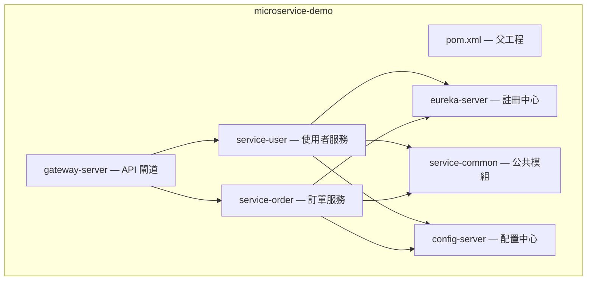

# 01 Spring Cloud 概述與微服務架構

> **版本**：Spring Cloud 2024.0 (Moorgate) / Spring Boot 3.4.x / Java 17+

## 什麼是 Spring Cloud

Spring Cloud 是基於 Spring Boot 的微服務架構開發工具集，它提供了一系列框架來快速構建分散式系統中的常見模式，例如：服務發現、配置管理、智慧路由、負載均衡、熔斷機制、訊息匯流排等。

Spring Cloud 並不是一個具體的框架，而是一系列框架的有序集合，它利用 Spring Boot 的開發便利性巧妙地簡化了分散式系統基礎設施的開發。

## 微服務架構

微服務架構是一種將單一應用程式拆分為一組小型服務的方法，每個服務運行在自己的程序中，服務間採用輕量級的通訊機制（通常是 HTTP RESTful API）。每個服務圍繞具體業務進行構建，並且能夠獨立部署到生產環境。

### 單體架構 vs 微服務架構

**單體架構的問題：**

- 所有功能集中在一個專案中，隨著業務增長，程式碼變得越來越複雜
- 部署效率低：修改一個小功能，需要重新部署整個應用
- 技術棧受限：所有模組必須使用相同的技術框架
- 可靠性差：一個模組出問題，可能導致整個系統崩潰

**微服務架構的優勢：**

- 每個服務獨立開發、部署、擴展
- 技術棧多元化，不同服務可使用不同技術
- 容錯性好，單一服務故障不影響全域
- 團隊可以獨立開發各自負責的服務

### 微服務架構的挑戰

- 服務間通訊複雜度增加
- 分散式事務處理困難
- 服務監控與除錯難度上升
- 部署和維運複雜度增加

## Spring Cloud 核心元件

| 元件 | 功能 | 說明 |
|------|------|------|
| Spring Cloud Netflix Eureka | 服務註冊與發現 | 管理微服務的註冊與發現 |
| Spring Cloud Config | 配置中心 | 集中管理各服務的配置 |
| Spring Cloud Gateway | API 閘道 | 統一入口，路由、過濾、限流 |
| Spring Cloud OpenFeign | 宣告式 HTTP 用戶端 | 簡化服務間 HTTP 呼叫 |
| Spring Cloud LoadBalancer | 負載均衡 | 用戶端負載均衡 |
| Spring Cloud CircuitBreaker | 熔斷器 | 防止服務雪崩 |
| Spring Cloud Stream | 訊息驅動 | 統一訊息中介軟體抽象 |
| Spring Cloud Sleuth / Micrometer Tracing | 鏈路追蹤 | 分散式請求追蹤（⚠ Sleuth 自 Spring Cloud 2022.0 起已棄用，由 Micrometer Tracing 取代） |

## 版本對應關係

Spring Cloud 的版本與 Spring Boot 版本有嚴格的對應關係：

| Spring Cloud | Spring Boot |
|--------------|-------------|
| 2024.0.x (Moorgate) | 3.4.x |
| 2023.0.x (Leyton) | 3.2.x / 3.3.x |
| 2022.0.x (Kilburn) | 3.0.x / 3.1.x |

## 快速開始

### 建立父工程

使用 Maven 多模組管理微服務專案：

```xml
<parent>
    <groupId>org.springframework.boot</groupId>
    <artifactId>spring-boot-starter-parent</artifactId>
    <version>3.3.0</version>
    <relativePath/>
</parent>

<properties>
    <java.version>17</java.version>
    <spring-cloud.version>2023.0.2</spring-cloud.version>
</properties>

<dependencyManagement>
    <dependencies>
        <dependency>
            <groupId>org.springframework.cloud</groupId>
            <artifactId>spring-cloud-dependencies</artifactId>
            <version>${spring-cloud.version}</version>
            <type>pom</type>
            <scope>import</scope>
        </dependency>
    </dependencies>
</dependencyManagement>
```

### 專案結構範例



## 微服務 vs 單體：何時選擇微服務

並非所有專案都適合微服務架構。在選擇之前，應根據團隊與業務現況進行評估。

**適合採用微服務的情境：**

- 團隊規模較大（10 人以上），需要多團隊平行開發
- 各模組的部署頻率差異大，需要獨立部署能力
- 業務領域複雜，可明確劃分出多個有界上下文（Bounded Context）
- 對技術多元化有需求，例如部分服務需使用不同語言或資料庫

**不適合採用微服務的情境：**

- 小型團隊（5 人以下），維運成本會高於收益
- 業務領域單純，拆分後反而增加不必要的通訊複雜度
- 產品處於早期探索階段，需求尚不穩定，頻繁重構成本過高

**決策參考框架：**

| 維度 | 傾向單體 | 傾向微服務 |
|------|---------|-----------|
| 團隊規模 | ≤ 5 人 | ≥ 10 人 |
| 領域複雜度 | 單一領域 | 多個有界上下文 |
| 部署頻率 | 每週或更低 | 每日多次、各模組獨立 |
| 可用性要求 | 整體可接受短暫停機 | 核心服務需 99.9%+ |

### 非 Spring Cloud 的替代方案

Spring Cloud 並非微服務架構的唯一選擇。隨著雲原生生態系發展，以下方案也值得評估：

- **Kubernetes 原生 + Service Mesh（Istio / Linkerd）**：將服務發現、負載均衡、熔斷等能力下沉至基礎設施層，應用程式碼無需引入額外框架
- **Dapr（Distributed Application Runtime）**：以 Sidecar 模式提供服務呼叫、狀態管理、Pub/Sub 等構建塊，與語言無關
- **雲供應商原生方案**：如 AWS App Mesh + ECS、GCP Cloud Run + Traffic Management，適合深度綁定特定雲平台的團隊

## 生產環境注意事項

將微服務架構部署至生產環境時，需額外關注以下面向：

- **監控基礎設施**：至少需要日誌聚合（ELK / Loki）、指標收集（Prometheus + Grafana）、鏈路追蹤（Jaeger / Zipkin + Micrometer Tracing）三大支柱
- **服務數量治理**：服務不是越多越好，應控制在團隊可維運的範圍內。經驗法則：每個團隊（5-8 人）負責不超過 3-5 個服務
- **分散式追蹤配置**：確保所有服務統一傳遞 Trace ID，以便端到端排查問題。Spring Boot 3.x 搭配 Micrometer Tracing 可自動完成
- **CI/CD 複雜度**：每個服務需獨立的建構、測試、部署流水線。建議使用 Mono-repo 或統一的 Pipeline 模板降低維護成本

## 小結

Spring Cloud 為微服務架構提供了完整的解決方案，透過整合各種成熟的開源元件，讓開發者能夠快速搭建分散式系統。後續章節將逐一介紹各核心元件的配置和使用。

## 延伸閱讀

- [02 服務註冊與發現（Eureka）](02%20%E6%9C%8D%E5%8B%99%E8%A8%BB%E5%86%8A%E8%88%87%E7%99%BC%E7%8F%BE%EF%BC%88Eureka%EF%BC%89.md) — 服務發現機制
- [04 API 閘道（Spring Cloud Gateway）](04%20API%20%E9%96%98%E9%81%93%EF%BC%88Spring%20Cloud%20Gateway%EF%BC%89.md) — 統一入口與路由
- [03 軟體架構模式](../09-Software-Engineering/03%20軟體架構模式.md) — DDD、CQRS、事件驅動等架構選型
- [09 系統設計入門](../09-Software-Engineering/09%20系統設計入門.md) — 高可用、CAP、微服務拆分依據
