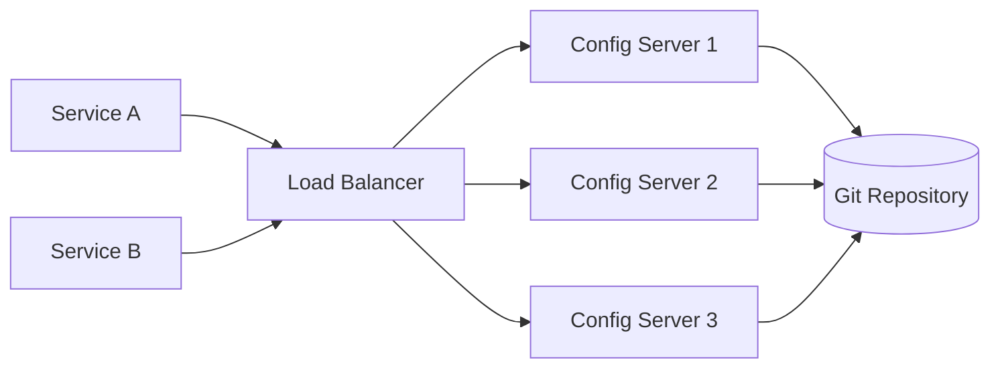

# 03 配置中心（Spring Cloud Config）

> **版本**：Spring Cloud 2023.x / Spring Boot 3.x / Java 17+

## 為什麼需要配置中心

在微服務架構中，每個服務都有自己的配置檔案。當服務數量增多時，分散的配置管理會帶來以下問題：

- 配置分散在各處，難以統一管理
- 修改配置需要重新打包部署
- 不同環境（開發、測試、正式）的配置切換麻煩
- 缺乏配置的版本管理和稽核追蹤

## Spring Cloud Config 簡介

Spring Cloud Config 提供了集中化的外部配置管理，分為：

- **Config Server**：配置伺服器，集中管理各環境配置
- **Config Client**：各微服務，從 Config Server 獲取配置

配置可以存放在 Git 倉庫、本地檔案系統或資料庫中。

## 何時使用 Spring Cloud Config

### 適合使用的場景

- **多環境配置管理**：開發、測試、預發、正式環境需要不同的配置，且希望集中管理
- **集中控制**：多個微服務的配置需要統一維護，避免分散在各服務中
- **Git 稽核追蹤**：需要配置變更的版本歷史、diff 比較和回滾能力
- **配置共享**：多個服務共用部分配置（如資料庫連線、訊息佇列地址）

### 不適合使用的場景

- **簡單應用**：單體應用或少量服務，使用環境變數或 Spring Profiles 即可
- **Kubernetes 環境**：已有 ConfigMap/Secret 機制，引入 Config Server 增加額外複雜度
- **已使用 Nacos/Apollo**：這些方案自帶配置管理，不需要再疊加 Config Server

### 配置管理方案比較

| 維度 | Spring Cloud Config | Kubernetes ConfigMap | Nacos Config | 環境變數 |
|------|---------------------|---------------------|-------------|---------|
| 適用場景 | 多環境微服務 | K8s 原生應用 | 微服務（偏 Alibaba 生態） | 簡單應用 |
| 配置儲存 | Git / 檔案系統 / DB | etcd | 內建資料庫 | OS / 容器 |
| 版本管理 | Git 原生支援 | kubectl rollout | 內建版本管理 | 無 |
| 動態重新整理 | 需搭配 Bus 或手動 refresh | 需重啟 Pod 或 Reloader | 即時推送（長輪詢） | 需重啟 |
| 管理介面 | 無（依賴 Git 平台） | kubectl / Dashboard | 視覺化 Web 介面 | 無 |
| 加密支援 | 內建對稱/非對稱加密 | Secret（Base64） | 無內建加密 | 依賴外部工具 |
| 學習成本 | 中等 | 低（K8s 使用者） | 低 | 最低 |

## 搭建 Config Server

### 1. 新增依賴

```xml
<dependency>
    <groupId>org.springframework.cloud</groupId>
    <artifactId>spring-cloud-config-server</artifactId>
</dependency>
```

### 2. 啟動類

```java
@SpringBootApplication
@EnableConfigServer
public class ConfigServerApplication {
    public static void main(String[] args) {
        SpringApplication.run(ConfigServerApplication.class, args);
    }
}
```

### 3. 配置檔案（使用 Git 倉庫）

> 此為教學簡化範例，生產環境需額外考慮：Git 倉庫的存取權限控制（SSH key 或 Deploy Token）、Config Server 高可用部署、以及健康監控。

```yaml
server:
  port: 8888

spring:
  application:
    name: config-server
  cloud:
    config:
      server:
        git:
          uri: https://github.com/your-org/config-repo
          default-label: main
          search-paths: '{application}'
```

### 4. Git 倉庫結構

```
config-repo/
├── service-user/
│   ├── service-user-dev.yml
│   ├── service-user-test.yml
│   └── service-user-prod.yml
├── service-order/
│   ├── service-order-dev.yml
│   └── service-order-prod.yml
└── application.yml          # 共用配置
```

### 5. 存取規則

Config Server 提供以下 REST 端點：

```
/{application}/{profile}[/{label}]
/{application}-{profile}.yml
/{application}-{profile}.properties
```

例如：`http://localhost:8888/service-user/dev` 會返回 `service-user-dev.yml` 的內容。

### Config Server 高可用部署

單一 Config Server 是生產環境的單點故障風險。建議部署多個 Config Server 實例，透過負載平衡器對外提供服務：



**部署要點**：

- 所有 Config Server 實例指向同一個 Git 倉庫，天然保持一致
- 搭配 Spring Cloud Discovery（Eureka / Consul），Client 端可使用服務名稱連線，自動負載平衡
- Config Server 本身為無狀態服務，水平擴展簡單
- 建議啟用 Actuator health endpoint，讓負載平衡器進行健康檢查

Client 端使用服務發現連線 Config Server 的配置：

```yaml
spring:
  config:
    import: "configserver:"
  cloud:
    config:
      discovery:
        enabled: true
        service-id: config-server
      fail-fast: true
      retry:
        max-attempts: 5
```

## 搭建 Config Client

### 1. 新增依賴

```xml
<dependency>
    <groupId>org.springframework.cloud</groupId>
    <artifactId>spring-cloud-starter-config</artifactId>
</dependency>
```

### 2. 配置檔案 application.yml

```yaml
spring:
  application:
    name: service-user
  profiles:
    active: dev
  config:
    import: "configserver:http://localhost:8888"
```

### 3. 使用配置

```java
@RestController
public class ConfigTestController {

    @Value("${custom.message:預設訊息}")
    private String message;

    @GetMapping("/config")
    public String getConfig() {
        return message;
    }
}
```

## 配置動態重新整理

### 使用 @RefreshScope

```java
@RestController
@RefreshScope
public class ConfigTestController {

    @Value("${custom.message}")
    private String message;

    @GetMapping("/config")
    public String getConfig() {
        return message;
    }
}
```

需要新增 Actuator 依賴：

```xml
<dependency>
    <groupId>org.springframework.boot</groupId>
    <artifactId>spring-boot-starter-actuator</artifactId>
</dependency>
```

暴露 refresh 端點：

```yaml
management:
  endpoints:
    web:
      exposure:
        include: refresh
```

手動觸發重新整理：

```bash
curl -X POST http://localhost:8001/actuator/refresh
```

### 使用 Spring Cloud Bus 自動重新整理

> 此為教學簡化範例，生產環境需額外考慮：重新整理策略（避免所有服務同時 refresh 造成瞬間負載）、搭配 Git Webhook 自動觸發、以及 Bus 訊息佇列的可用性。

結合訊息中介軟體（如 RabbitMQ），可以實現配置修改後自動通知所有服務：

```xml
<dependency>
    <groupId>org.springframework.cloud</groupId>
    <artifactId>spring-cloud-starter-bus-amqp</artifactId>
</dependency>
```

## 配置加密

Spring Cloud Config 支援對敏感配置進行加密。

### 對稱加密（教學範例）

> 此為教學簡化範例，生產環境需額外考慮：改用非對稱加密（RSA）或整合 HashiCorp Vault，避免金鑰明文寫在配置中。

```yaml
# 對稱加密（僅適合開發/測試環境）
encrypt:
  key: my-secret-key
```

加密配置值以 `{cipher}` 前綴標記：

```yaml
spring:
  datasource:
    password: '{cipher}AQBHn3...'
```

### 生產環境建議：非對稱加密或 Vault

**方式一：非對稱加密（RSA）**

產生 keystore 並配置 Config Server：

```bash
keytool -genkeypair -alias config-key -keyalg RSA -keysize 2048 \
  -keystore config-server.jks -storepass changeit -keypass changeit
```

```yaml
encrypt:
  key-store:
    location: classpath:config-server.jks
    password: ${KEYSTORE_PASSWORD}   # 透過環境變數注入
    alias: config-key
    secret: ${KEY_PASSWORD}
```

**方式二：整合 HashiCorp Vault**

使用 Spring Cloud Vault 直接從 Vault 讀取機敏配置，不經過 Git 倉庫：

```xml
<dependency>
    <groupId>org.springframework.cloud</groupId>
    <artifactId>spring-cloud-starter-vault-config</artifactId>
</dependency>
```

```yaml
spring:
  cloud:
    vault:
      uri: https://vault.example.com
      authentication: TOKEN
      token: ${VAULT_TOKEN}
```

> 參考：[Spring Cloud Vault 官方文件](https://docs.spring.io/spring-cloud-vault/reference/)

## Nacos Config 替代方案

與服務發現類似，Nacos 同時提供配置管理功能：

```xml
<dependency>
    <groupId>com.alibaba.cloud</groupId>
    <artifactId>spring-cloud-starter-alibaba-nacos-config</artifactId>
</dependency>
```

```yaml
spring:
  cloud:
    nacos:
      config:
        server-addr: localhost:8848
        file-extension: yml
```

Nacos 的優勢在於提供了視覺化的管理介面，支援配置的即時推送，無需手動觸發重新整理。

## 生產環境注意事項

### Git 倉庫存取控制

- 配置倉庫應為**私有倉庫**，限制存取權限
- Config Server 使用 SSH key 或 Deploy Token 存取，避免帳號密碼明文
- 為不同環境（dev / prod）使用不同的 Git 分支或倉庫，限縮權限範圍

### 配置重新整理策略

- 避免使用 `/actuator/bus-refresh` 一次重新整理所有服務，建議分批執行
- 搭配 Git Webhook 觸發 Config Server 的 `/monitor` 端點，實現自動化
- 關鍵服務的配置變更應搭配灰度發佈流程

### Config Server 監控

- 啟用 Actuator 的 `health`、`info`、`metrics` 端點
- 監控 Config Server 與 Git 倉庫的連線狀態
- 設定告警：Config Server 無法連線 Git 時即時通知
- Client 端配置 `fail-fast: true` 搭配 retry，避免因 Config Server 暫時不可用而啟動失敗

## 小結

配置中心是微服務架構中不可或缺的基礎設施。Spring Cloud Config 基於 Git 提供了版本化的配置管理，而 Nacos Config 則提供了更便捷的操作介面和即時推送能力。

## 延伸閱讀

- [01 Spring Cloud 概述與微服務架構](01%20Spring%20Cloud%20%E6%A6%82%E8%BF%B0%E8%88%87%E5%BE%AE%E6%9C%8D%E5%8B%99%E6%9E%B6%E6%A7%8B.md) — 微服務架構總覽
- [05 Spring Boot 配置檔案與 Profiles](../02-Spring-Ecosystem/05%20Spring%20Boot%20配置檔案與%20Profiles.md) — Spring Boot 配置檔案基礎

---
審查狀態：APPROVED — 2026-Q1
- [x] 技術正確性
- [x] 架構與方法論
- [x] 生產實戰
- [x] 內容結構
- [x] 術語與一致性
- [x] 讀者路徑
- [x] 時效性
