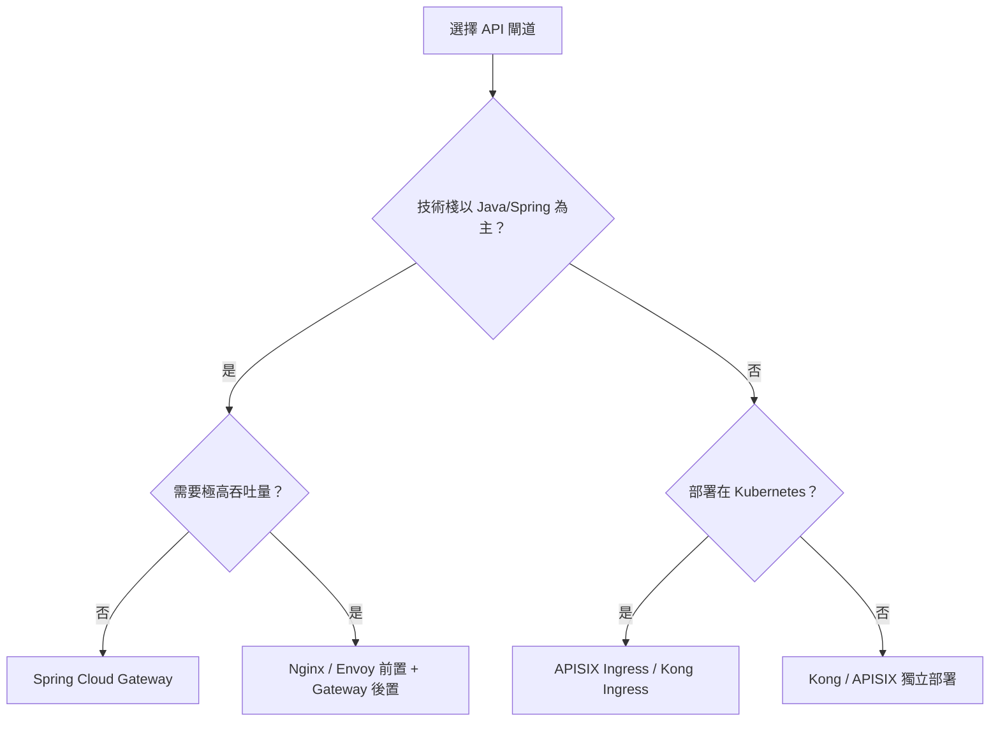

# 04 API 閘道（Spring Cloud Gateway）

> **版本**：Spring Cloud 2023.x / Spring Boot 3.x / Java 17+

## 什麼是 API 閘道

API 閘道是微服務架構中的統一入口，所有外部請求都先經過閘道，再由閘道路由到對應的微服務。閘道可以處理：

- **路由轉發**：根據規則將請求轉發到不同服務
- **負載均衡**：將請求分配到多個服務例項
- **認證授權**：統一的身份驗證
- **限流熔斷**：保護後端服務
- **日誌監控**：統一的請求日誌

## Spring Cloud Gateway 簡介

Spring Cloud Gateway 是基於 Spring 6、Spring Boot 3 和 Project Reactor 構建的 API 閘道，提供了高效能的非同步非阻塞路由機制。

核心概念：

- **Route（路由）**：閘道的基本構建塊，由 ID、目標 URI、Predicate 集合和 Filter 集合組成
- **Predicate（斷言）**：匹配 HTTP 請求的條件（路徑、標頭、引數等）
- **Filter（過濾器）**：對請求和回應進行處理

## 搭建 Gateway

### 1. 新增依賴

```xml
<dependency>
    <groupId>org.springframework.cloud</groupId>
    <artifactId>spring-cloud-starter-gateway</artifactId>
</dependency>
<dependency>
    <groupId>org.springframework.cloud</groupId>
    <artifactId>spring-cloud-starter-netflix-eureka-client</artifactId>
</dependency>
```

### 2. 配置路由（YAML 方式）

> 此為教學簡化範例，生產環境需額外考慮：逾時設定、健康檢查、存取日誌、CORS 等配置。

```yaml
server:
  port: 9000

spring:
  application:
    name: gateway-server
  cloud:
    gateway:
      routes:
        - id: user-service
          uri: lb://service-user
          predicates:
            - Path=/api/user/**
          filters:
            - StripPrefix=1

        - id: order-service
          uri: lb://service-order
          predicates:
            - Path=/api/order/**
          filters:
            - StripPrefix=1
```

上述配置表示：
- `http://gateway:9000/api/user/1` → `http://service-user/user/1`
- `http://gateway:9000/api/order/1` → `http://service-order/order/1`

### 3. 配置路由（Java 程式碼方式）

> 此為教學簡化範例，生產環境需額外考慮：路由健康檢查、動態路由更新、全域錯誤處理等機制。

```java
@Configuration
public class GatewayConfig {

    @Bean
    public RouteLocator customRouteLocator(RouteLocatorBuilder builder) {
        return builder.routes()
            .route("user-service", r -> r
                .path("/api/user/**")
                .filters(f -> f.stripPrefix(1))
                .uri("lb://service-user"))
            .route("order-service", r -> r
                .path("/api/order/**")
                .filters(f -> f.stripPrefix(1))
                .uri("lb://service-order"))
            .build();
    }
}
```

## 常用 Predicate

```yaml
predicates:
  # 路徑匹配
  - Path=/api/**

  # 請求方法
  - Method=GET,POST

  # 時間之後
  - After=2024-01-01T00:00:00+08:00

  # 時間之前
  - Before=2025-12-31T23:59:59+08:00

  # 請求標頭
  - Header=X-Request-Id, \d+

  # 查詢引數
  - Query=name, zhangsan

  # 來源 IP
  - RemoteAddr=192.168.1.0/24
```

## 常用 Filter

### 內建過濾器

```yaml
filters:
  # 移除路徑前綴
  - StripPrefix=1

  # 新增請求標頭
  - AddRequestHeader=X-Request-Source, gateway

  # 新增回應標頭
  - AddResponseHeader=X-Response-Time, 100

  # 重寫路徑
  - RewritePath=/api/(?<segment>.*), /$\{segment}

  # 重試
  - name: Retry
    args:
      retries: 3
      statuses: BAD_GATEWAY

  # 熔斷器
  - name: CircuitBreaker
    args:
      name: myCircuitBreaker
      fallbackUri: forward:/fallback
```

### 自訂全域過濾器

> 此為教學簡化範例，生產環境需額外考慮：Token 快取驗證、白名單路徑排除、安全標頭注入等。

```java
@Component
public class AuthGlobalFilter implements GlobalFilter, Ordered {

    @Override
    public Mono<Void> filter(ServerWebExchange exchange, GatewayFilterChain chain) {
        String token = exchange.getRequest().getHeaders().getFirst("Authorization");

        if (token == null || token.isEmpty()) {
            exchange.getResponse().setStatusCode(HttpStatus.UNAUTHORIZED);
            return exchange.getResponse().setComplete();
        }

        // 驗證 token 邏輯...
        return chain.filter(exchange);
    }

    @Override
    public int getOrder() {
        return -1; // 數字越小，優先度越高
    }
}
```

## Gateway 整合熔斷器

```xml
<dependency>
    <groupId>org.springframework.cloud</groupId>
    <artifactId>spring-cloud-starter-circuitbreaker-reactor-resilience4j</artifactId>
</dependency>
```

```java
@Bean
public RouteLocator routes(RouteLocatorBuilder builder) {
    return builder.routes()
        .route("user-service", r -> r.path("/api/user/**")
            .filters(f -> f
                .circuitBreaker(c -> c
                    .setName("userCircuitBreaker")
                    .setFallbackUri("forward:/fallback"))
                .stripPrefix(1))
            .uri("lb://service-user"))
        .build();
}
```

## 限流配置

使用 Redis 實現限流：

> 此為教學簡化範例，生產環境需額外考慮：Redis 叢集高可用、限流 Key 策略（IP / 使用者 / API 組合）、限流降級回應等。

```xml
<dependency>
    <groupId>org.springframework.boot</groupId>
    <artifactId>spring-boot-starter-data-redis-reactive</artifactId>
</dependency>
```

```yaml
filters:
  - name: RequestRateLimiter
    args:
      redis-rate-limiter.replenishRate: 10   # 每秒允許 10 個請求
      redis-rate-limiter.burstCapacity: 20   # 最大突發量
      key-resolver: "#{@ipKeyResolver}"
```

```java
@Bean
public KeyResolver ipKeyResolver() {
    return exchange -> Mono.just(
        exchange.getRequest().getRemoteAddress().getAddress().getHostAddress()
    );
}
```

## 閘道方案比較

選擇 API 閘道時，需根據團隊技術棧、效能需求和維運能力綜合評估。以下為主流方案的多維度比較：

| 維度 | Spring Cloud Gateway | Nginx | Kong | Apache APISIX |
|------|---------------------|-------|------|---------------|
| **生態整合** | 與 Spring Cloud 深度整合（Eureka、Config、Sleuth） | 通用型，需自行整合服務發現 | 支援多種服務發現，Kubernetes 原生整合 | 支援 etcd/Nacos/Eureka，雲原生友好 |
| **效能** | 基於 Netty，非阻塞模型，中高吞吐量 | C 語言實作，極高吞吐量與低延遲 | 基於 Nginx/OpenResty，高吞吐量 | 基於 Nginx/OpenResty，高吞吐量，動態路由效能佳 |
| **外掛生態** | 透過 Filter 機制擴展，需 Java 開發 | Lua 模組或商業版 Nginx Plus | 豐富外掛市場（認證、限流、日誌等） | 豐富外掛，支援多語言開發（Lua、Java、Go） |
| **學習曲線** | Java/Spring 開發者容易上手 | 配置語法簡單，進階 Lua 開發門檻較高 | 管理 API 友好，但架構理解需時間 | 控制面板直觀，外掛開發需了解 APISIX 架構 |
| **部署模型** | JVM 應用，與 Spring Boot 應用一致 | 獨立行程，輕量部署 | 獨立部署，依賴 PostgreSQL/Cassandra | 獨立部署，依賴 etcd |

## 取捨分析：何時選擇哪種方案

選擇閘道方案時，應從團隊現況與業務需求出發，而非追求技術新穎度。

**適合選擇 Spring Cloud Gateway 的場景**：

- 後端技術棧以 **Java / Spring Cloud** 為主，團隊對 Spring 生態熟悉
- 需要與 **Eureka、Nacos、Spring Cloud Config** 等元件深度整合
- 閘道需要較複雜的 **業務邏輯過濾**（如 Token 解析、權限注入），用 Java 開發更順暢
- 專案規模為中小型，**單閘道即可承載流量**

**適合考慮替代方案的場景**：

- **極高吞吐量需求**（> 10 萬 QPS）→ 優先考慮 **Nginx** 或 **Envoy**，C/C++ 實作在原始效能上有明顯優勢
- **多語言微服務架構**（非純 Java）→ 考慮 **Kong** 或 **APISIX**，語言無關的閘道更合適
- **Kubernetes 原生部署**→ **APISIX Ingress** 或 **Kong Ingress Controller** 與 K8s 整合更自然
- **需要豐富開箱即用外掛**→ Kong / APISIX 外掛市場較成熟，減少自行開發成本



## 生產環境注意事項

將 Spring Cloud Gateway 部署到生產環境時，以下面向需要特別關注。

### Netty 記憶體調校

Gateway 基於 Netty，預設的記憶體配置可能不適合高流量場景：

```yaml
server:
  netty:
    # 工作執行緒數，預設為 CPU 核心數 × 2
    # 高流量場景可適度調高
    max-threads: 16

spring:
  codec:
    # 請求/回應 body 最大緩衝區（預設 256KB）
    max-in-memory-size: 1MB
```

JVM 參數建議：

```
-Xms512m -Xmx512m
-XX:MaxDirectMemorySize=256m
-Dio.netty.leakDetection.level=paranoid   # 僅限測試環境
```

### 高可用部署

閘道作為流量入口，必須避免單點故障：

- 部署 **至少 2 個 Gateway 實例**，搭配負載均衡器（如 Nginx、ALB）
- 使用 **健康檢查端點**（`/actuator/health`）進行存活偵測
- 考慮 **藍綠部署** 或 **滾動更新** 策略，避免更新時流量中斷

### CORS 配置

前後端分離架構下，閘道層統一處理 CORS 可避免各服務重複配置：

```yaml
spring:
  cloud:
    gateway:
      globalcors:
        cors-configurations:
          '[/**]':
            allowedOrigins: "https://your-domain.com"
            allowedMethods:
              - GET
              - POST
              - PUT
              - DELETE
              - OPTIONS
            allowedHeaders: "*"
            allowCredentials: true
            maxAge: 3600
```

> **注意**：避免使用 `allowedOrigins: "*"` 搭配 `allowCredentials: true`，這在瀏覽器端會被拒絕。

### 存取日誌最佳實踐

閘道的存取日誌是排查問題的關鍵資訊來源：

```yaml
spring:
  cloud:
    gateway:
      httpserver:
        wiretap: true   # 開發環境開啟，生產環境建議關閉

logging:
  level:
    reactor.netty.http.server: INFO
    org.springframework.cloud.gateway: INFO
```

建議透過自訂 `GlobalFilter` 記錄結構化存取日誌（請求路徑、回應狀態碼、耗時、來源 IP），並輸出至日誌收集系統（如 ELK、Loki）。

### 限流持久化（Redis 叢集）

生產環境的限流不應依賴單節點 Redis：

```yaml
spring:
  data:
    redis:
      cluster:
        nodes:
          - redis-node-1:6379
          - redis-node-2:6379
          - redis-node-3:6379
      timeout: 2000ms
      lettuce:
        pool:
          max-active: 16
          max-idle: 8
```

- Redis 叢集確保限流計數器在節點故障時不遺失
- 設定合理的連線池大小，避免高流量時連線耗盡
- 建議搭配 **限流降級策略**：當 Redis 不可用時，選擇放行或拒絕（依業務決定）

## 小結

Spring Cloud Gateway 是微服務架構中的重要元件，作為統一入口提供了路由、過濾、限流、熔斷等功能。它基於 WebFlux 的非同步非阻塞模型，具有出色的效能表現。

## 延伸閱讀

- [05 熔斷與限流（Resilience4j）](05%20%E7%86%94%E6%96%B7%E8%88%87%E9%99%90%E6%B5%81%EF%BC%88Resilience4j%EF%BC%89.md) — 容錯與限流機制
- [01 Spring Cloud 概述與微服務架構](01%20Spring%20Cloud%20%E6%A6%82%E8%BF%B0%E8%88%87%E5%BE%AE%E6%9C%8D%E5%8B%99%E6%9E%B6%E6%A7%8B.md) — 微服務架構總覽
- [04 API 設計最佳實踐](../09-Software-Engineering/04%20API%20設計最佳實踐.md) — RESTful 設計原則、版本策略、冪等性
- [06 安全開發實踐](../09-Software-Engineering/06%20安全開發實踐.md) — OWASP Top 10 與閘道層安全
