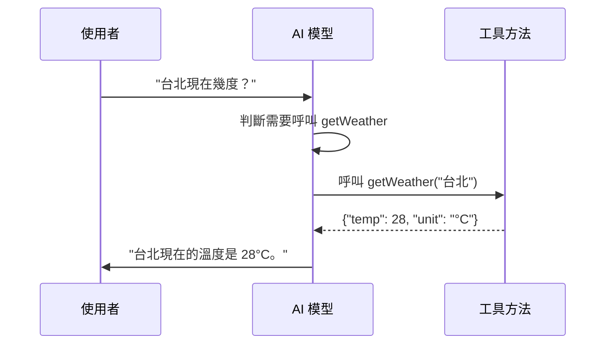

# 06 Function Calling 工具呼叫

> **版本**：Spring AI 1.0+ / Spring Boot 3.4.x / Java 17+

## 概述

AI 模型本身只能處理文字，無法存取即時資料（如天氣、股價）或執行操作（如發送郵件、查詢資料庫）。Function Calling（又稱 Tool Calling，工具呼叫）讓 AI 模型可以**請求呼叫開發者定義的函式**，從而擴展 AI 的能力邊界。

Spring AI 1.0 GA 採用 `@Tool` 註解作為工具定義的主要方式，取代了早期的 `@Bean Function<I,O>` 模式，提供更直覺、更簡潔的開發體驗。

## 為什麼需要 Function Calling

傳統 AI 對話只能根據訓練資料回答問題，面對以下場景無能為力：

- **即時資料**：天氣、匯率、庫存等即時變動的資料
- **企業內部資料**：客戶資訊、訂單狀態、員工排班
- **執行操作**：發送通知、建立工單、更新資料庫

Function Calling 讓 AI 模型成為「調度者」——判斷使用者意圖後，呼叫對應的工具取得資訊或執行操作，再將結果組織成自然語言回覆。

## 核心概念

### 工作流程



整個過程對使用者來說是透明的，看起來就像 AI 直接知道答案。Spring AI 會自動處理工具呼叫的序列化、反序列化與多輪對話。

### 關鍵註解

| 註解 | 用途 |
|------|------|
| `@Tool` | 標記方法為 AI 可呼叫的工具，附帶描述 |
| `@ToolParam` | 描述方法參數，幫助 AI 理解參數用途 |

### 取捨分析：何時該用 Function Calling

**適合使用的場景**：

- 需要存取即時或動態資料
- 需要執行具體操作（CRUD、通知、計算）
- 查詢結構化的企業內部資料

**不適合的場景**：

- **延遲敏感**：每次工具呼叫都會增加一輪 API 往返，回應時間可能增加 2-5 秒
- **模型幻覺風險**：模型可能傳入錯誤參數或在不需要時呼叫工具，需做好輸入驗證
- **模型支援度**：並非所有模型都支援 Tool Calling（需確認供應商文件）
- **簡單查詢**：如果 RAG 或 Prompt Engineering 即可解決，不需要引入工具呼叫的複雜度

## 實作步驟

### 方式一：使用 `@Tool` 註解（推薦）

將工具方法定義在一個類別中，使用 `@Tool` 註解標記：

```java
import org.springframework.ai.tool.annotation.Tool;
import org.springframework.ai.tool.annotation.ToolParam;
import org.springframework.stereotype.Component;

@Component
public class WeatherTools {

    @Tool(description = "根據城市名稱查詢當前天氣")
    public WeatherResponse getWeather(
            @ToolParam(description = "城市名稱，例如：台北、東京") String city) {
        // 實際應用中會呼叫天氣 API
        double temp = switch (city) {
            case "台北" -> 28.5;
            case "東京" -> 22.0;
            case "紐約" -> 15.3;
            default -> 20.0;
        };
        return new WeatherResponse(city, temp, "°C", "晴天");
    }

    public record WeatherResponse(
        String city, double temperature, String unit, String condition) {}
}
```

> 此為教學簡化範例，生產環境需額外考慮：輸入驗證、API 呼叫失敗處理、快取機制。

### 在對話中使用工具

透過 `ChatClient` 的 `.tools()` 方法註冊工具實例：

```java
@RestController
@RequiredArgsConstructor
public class WeatherController {

    private final ChatClient chatClient;
    private final WeatherTools weatherTools;

    @GetMapping("/weather")
    public String askWeather(@RequestParam String question) {
        return chatClient.prompt()
            .user(question)
            .tools(weatherTools)  // 傳入工具實例
            .call()
            .content();
    }
}
```

呼叫 `/weather?question=台北和東京哪個比較熱` 時，AI 會自動呼叫 `getWeather` 兩次（分別查詢台北和東京），然後比較結果回答。

### 全域註冊工具

如果某些工具在所有對話中都需要使用，可以在建構 `ChatClient` 時全域註冊：

```java
@Configuration
public class ChatClientConfig {

    @Bean
    public ChatClient chatClient(ChatModel chatModel, WeatherTools weatherTools) {
        return ChatClient.builder(chatModel)
            .defaultTools(weatherTools)  // 所有請求自動包含此工具
            .build();
    }
}
```

全域註冊後，每次呼叫 `chatClient.prompt()` 時不需要再手動指定 `.tools()`。

### 方式二：使用 `FunctionToolCallback`（程式化定義）

當需要動態建立工具或工具邏輯較簡單時，可以使用程式化方式：

```java
@GetMapping("/calculate")
public String calculate(@RequestParam String question) {
    return chatClient.prompt()
        .user(question)
        .tools(FunctionToolCallback
            .builder("calculateBMI", (BmiRequest req) -> {
                double bmi = req.weight() / Math.pow(req.height() / 100.0, 2);
                String category;
                if (bmi < 18.5) category = "過輕";
                else if (bmi < 24) category = "正常";
                else if (bmi < 27) category = "過重";
                else category = "肥胖";
                return new BmiResponse(bmi, category);
            })
            .description("計算 BMI 指數")
            .inputType(BmiRequest.class)
            .build())
        .call()
        .content();
}

record BmiRequest(double height, double weight) {}
record BmiResponse(double bmi, String category) {}
```

> 此為教學簡化範例，生產環境需額外考慮：數值範圍驗證、例外處理。

**兩種方式的比較**：

| 面向 | `@Tool` 註解 | `FunctionToolCallback` |
|------|-------------|----------------------|
| 適用場景 | 固定的業務工具 | 動態生成的工具 |
| 可讀性 | 高，宣告式 | 中，程式化 |
| 依賴注入 | 支援（`@Component`） | 需手動處理 |
| 推薦程度 | 優先使用 | 特殊需求時使用 |

## 進階用法

### 實用範例：資料庫查詢助手

以下範例展示如何將資料庫查詢包裝為 AI 工具：

```java
@Component
@RequiredArgsConstructor
public class DatabaseTools {

    private final JdbcTemplate jdbcTemplate;

    @Tool(description = "根據客戶名稱查詢客戶資訊，包含姓名、電話、地址")
    public CustomerInfo queryCustomer(
            @ToolParam(description = "客戶姓名關鍵字") String name) {
        Map<String, Object> result = jdbcTemplate.queryForMap(
            "SELECT name, phone, address FROM customers WHERE name LIKE ?",
            "%" + name + "%");
        return new CustomerInfo(
            (String) result.get("name"),
            (String) result.get("phone"),
            (String) result.get("address"));
    }

    @Tool(description = "查詢指定產品的庫存數量")
    public StockInfo queryStock(
            @ToolParam(description = "產品名稱") String productName) {
        Map<String, Object> result = jdbcTemplate.queryForMap(
            "SELECT product_name, quantity FROM inventory WHERE product_name LIKE ?",
            "%" + productName + "%");
        return new StockInfo(
            (String) result.get("product_name"),
            (Integer) result.get("quantity"));
    }

    public record CustomerInfo(String name, String phone, String address) {}
    public record StockInfo(String productName, int quantity) {}
}
```

> 此為教學簡化範例，生產環境需額外考慮：SQL 注入防護（此處已使用參數化查詢）、查無資料處理、分頁。

在 Controller 中使用這些工具：

```java
@GetMapping("/assistant")
public String assistant(@RequestParam String question) {
    return chatClient.prompt()
        .system("你是一位客服助手，可以查詢客戶資訊和庫存。用繁體中文回答。")
        .user(question)
        .tools(databaseTools)
        .call()
        .content();
}
```

使用者可以自然地提問：

- 「幫我查一下王先生的電話」
- 「205/55R16 的庫存還有多少」

AI 會自動判斷需要呼叫哪個工具方法，並用自然語言回覆。

### 多工具協作

AI 模型可以在一次對話中呼叫多個工具。只需將多個工具類別傳入 `.tools()`：

```java
@Component
public class TravelTools {

    @Tool(description = "查詢航班資訊")
    public FlightInfo queryFlight(
            @ToolParam(description = "出發城市") String from,
            @ToolParam(description = "目的城市") String to,
            @ToolParam(description = "出發日期，格式 yyyy-MM-dd") String date) {
        // 呼叫航班 API ...
    }

    @Tool(description = "查詢飯店空房")
    public HotelInfo queryHotel(
            @ToolParam(description = "城市名稱") String city,
            @ToolParam(description = "入住日期") String checkIn) {
        // 呼叫飯店 API ...
    }
}
```

使用者說「幫我查下週五台北到東京的航班，順便找一間飯店」，AI 會自動呼叫 `queryFlight` 和 `queryHotel` 兩個工具。

### 安全與輸入驗證

工具方法直接與外部系統互動，安全性至關重要：

```java
@Component
public class OrderTools {

    @Tool(description = "查詢訂單狀態")
    public OrderStatus queryOrder(
            @ToolParam(description = "訂單編號") String orderId) {
        // 輸入驗證
        if (orderId == null || orderId.isBlank()) {
            return new OrderStatus("error", "訂單編號不能為空");
        }
        if (!orderId.matches("^ORD-\\d{8}$")) {
            return new OrderStatus("error", "訂單編號格式不正確");
        }
        // 使用參數化查詢，防止 SQL 注入
        // ...
    }

    public record OrderStatus(String status, String message) {}
}
```

**安全守則**：

- **永遠不要**讓 AI 直接執行原始 SQL，應透過參數化查詢
- 對所有工具輸入進行格式驗證與清理
- 限制可用工具的範圍，不要暴露危險操作（刪除、修改權限等）
- 記錄所有工具呼叫的日誌，便於稽核追蹤

## 生產環境注意事項

將 Function Calling 部署到生產環境時，需要額外考慮以下面向：

| 面向 | 建議 |
|------|------|
| **執行逾時** | 為每個工具方法設定合理的 timeout，避免外部 API 無回應時阻塞整個對話 |
| **重試機制** | 工具呼叫失敗時，考慮是否需要重試（冪等操作可重試，非冪等操作需謹慎） |
| **錯誤傳播** | 工具方法拋出例外時，Spring AI 會將錯誤訊息回傳給模型，確保錯誤訊息不洩漏敏感資訊 |
| **成本控制** | 每次工具呼叫都會產生額外的 token 消耗（工具描述 + 參數 + 回傳值），監控 token 使用量 |
| **日誌與監控** | 記錄每次工具呼叫的輸入、輸出、耗時，搭配 [Advisors](07%20Advisors%20API%20與對話記憶.md) 實現統一的日誌攔截 |
| **輸入驗證** | 模型可能傳入格式錯誤或超出預期的參數，所有工具方法都必須做防禦性驗證 |

## 替代方案

`@Tool` 並非唯一的選擇，根據需求可以考慮：

- **直接 API 呼叫**：如果不需要 AI 判斷「何時呼叫」，直接在程式碼中呼叫 API 更簡單、更可控
- **RAG（檢索增強生成）**：如果只是需要讓 AI 存取靜態或半靜態的知識，RAG 比 Function Calling 更適合
- **LangChain4j Tool Binding**：另一個 Java AI 框架，提供類似的工具綁定機制，適合非 Spring 專案

## 小結

Function Calling 大幅擴展了 AI 模型的能力邊界，讓 AI 可以存取即時資料並執行操作。Spring AI 1.0 透過 `@Tool` 註解提供了簡潔的宣告式工具定義方式，搭配 `ChatClient` 的 `.tools()` 方法即可輕鬆將既有業務邏輯暴露給 AI 模型。對於動態場景，`FunctionToolCallback` 提供了程式化的替代方案。

在實際應用中，務必重視輸入驗證、錯誤處理與成本監控，確保工具呼叫的安全性與可靠性。

## 延伸閱讀

- [02 ChatClient API 與對話模型](02%20ChatClient%20API%20與對話模型.md) — ChatClient 基礎用法與模型參數調整
- [07 Advisors API 與對話記憶](07%20Advisors%20API%20與對話記憶.md) — 使用 Advisors 組合 Function Calling 與其他 AI 互動模式
- [Spring AI 官方文件 - Tool Calling](https://docs.spring.io/spring-ai/reference/api/tools.html) — 完整的工具呼叫 API 參考
- [Spring AI 官方文件 - 遷移指南](https://docs.spring.io/spring-ai/reference/api/tools-migration.html) — 從 pre-1.0 API 遷移至 1.0 GA
