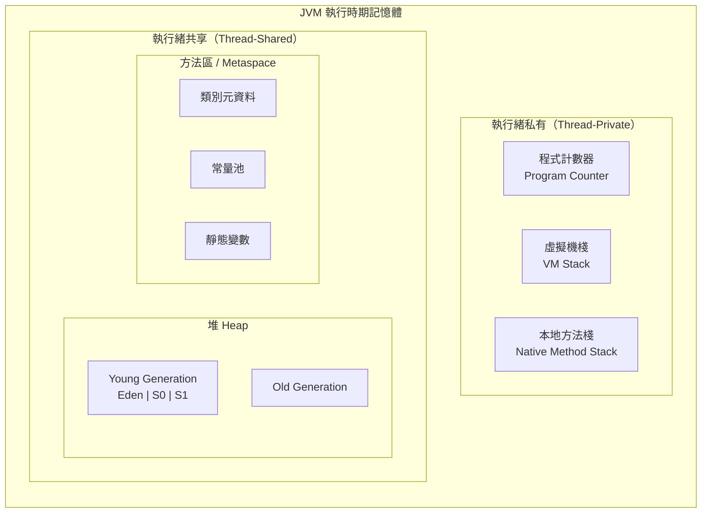
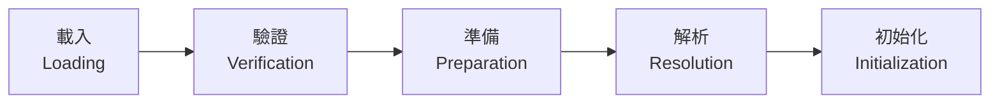
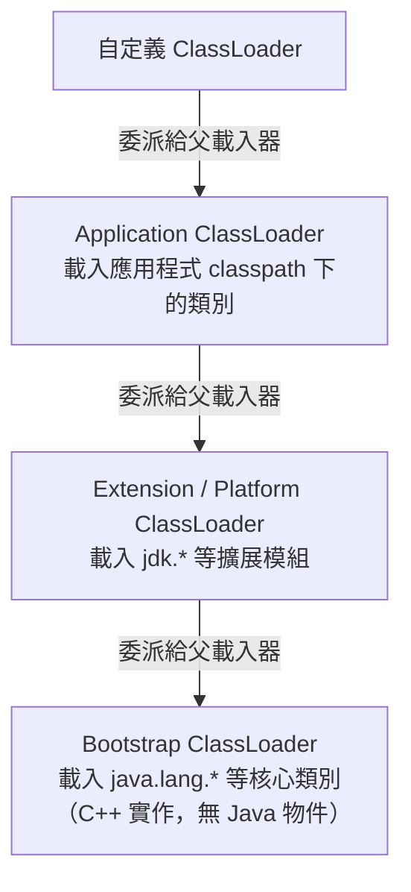

# 05 JVM 記憶體與垃圾回收

> **版本**：Java 17+ / HotSpot JVM — 基於現代 JVM 架構（Metaspace 取代 PermGen）

理解 JVM 的記憶體管理與垃圾回收機制，是 Java 開發者排查效能問題、避免記憶體洩漏的核心能力。本文整合 JVM 記憶體區域、類載入機制、垃圾回收演算法與實務排查技巧，以現代 JVM（Java 17+）為基準進行說明。

---

## 1、JVM 記憶體區域

JVM 執行時期的記憶體可分為**執行緒私有**與**執行緒共享**兩大類：



### 1.1 程式計數器（Program Counter）

程式計數器是一塊極小的記憶體空間，記錄目前執行緒正在執行的**位元組碼指令位址**。每個執行緒各自擁有獨立的程式計數器，彼此互不影響。

- 若執行 Java 方法，計數器記錄的是位元組碼指令的位址。
- 若執行 Native 方法，計數器值為 `undefined`。
- 這是 JVM 規範中**唯一不會發生 OutOfMemoryError** 的記憶體區域。

### 1.2 虛擬機棧（VM Stack）

每個 Java 執行緒建立時，都會分配一個虛擬機棧。每次方法呼叫會產生一個**棧幀（Stack Frame）**，包含以下結構：

| 結構 | 說明 |
|------|------|
| **區域變數表（Local Variables）** | 存放方法參數和區域變數，基本型別直接存值，參考型別存指標 |
| **運算元棧（Operand Stack）** | 方法執行時的運算工作區，位元組碼指令在此進行入棧、出棧操作 |
| **動態連結（Dynamic Linking）** | 指向執行時期常量池中該方法的符號參考，支援多型呼叫 |
| **方法回傳位址（Return Address）** | 記錄方法結束後應返回的呼叫點位址 |

當棧深度超過限制時拋出 `StackOverflowError`；若棧允許動態擴展但無法取得足夠記憶體，則拋出 `OutOfMemoryError`。

### 1.3 本地方法棧（Native Method Stack）

與虛擬機棧類似，但服務對象是 **Native 方法**（如透過 JNI 呼叫的 C/C++ 函式）。HotSpot JVM 實作上將虛擬機棧與本地方法棧合併為同一個棧。

### 1.4 堆（Heap）

堆是 JVM 中**最大的記憶體區域**，所有物件實例和陣列都在此分配。堆也是**垃圾回收的主要目標區域**。

依據分代收集理論，堆分為：

- **Young Generation（年輕代）**：新物件優先在此分配
  - **Eden 區**：物件首先被分配到 Eden
  - **Survivor 0（S0）** 和 **Survivor 1（S1）**：經歷一次 Minor GC 後存活的物件會被移到 Survivor 區，兩個 Survivor 區交替使用
  - 預設比例為 Eden : S0 : S1 = 8 : 1 : 1
- **Old Generation（老年代）**：長期存活的物件（經歷多次 GC 仍存活）或大型物件直接進入老年代

> 注意：G1 和 ZGC 等現代收集器使用 Region 為基礎的記憶體布局，不再嚴格劃分物理上的年輕代與老年代，但邏輯上仍保留分代概念。

### 1.5 方法區 / Metaspace

方法區是 JVM 規範定義的邏輯概念，用於存放已載入的**類別元資料、常量池、靜態變數**等。

**Java 8 以前**：HotSpot 使用堆中的 **PermGen（永久代）** 實作方法區，容量固定且容易觸發 `OutOfMemoryError: PermGen space`。

**Java 8 以後**：PermGen 被移除，改為使用 **Metaspace**，直接分配在**本地記憶體（Native Memory）** 上。好處包括：

- 預設不設定上限，根據系統可用記憶體動態擴展
- 類別卸載更高效
- 避免 PermGen 固定大小造成的溢位問題

**字串常量池（String Pool）** 在 Java 7 就已從 PermGen 搬移到堆中，這點在 Java 8+ 依然適用。

---

## 2、類載入機制

### 2.1 類載入過程

一個 `.class` 檔案從載入到可使用，經歷以下五個階段：



| 階段 | 說明 |
|------|------|
| **載入** | 透過全限定類別名取得二進位位元組流，產生 `Class` 物件 |
| **驗證** | 確認位元組碼符合 JVM 規範，不會危害虛擬機安全（魔數、版本、語義檢查） |
| **準備** | 為類別的**靜態變數**分配記憶體並設定零值（`int` → 0, `reference` → null） |
| **解析** | 將常量池中的符號參考替換為直接參考（記憶體位址） |
| **初始化** | 執行類別建構器 `<clinit>()`，真正賦予靜態變數程式中指定的初始值 |

### 2.2 雙親委派模型（Parent Delegation）

JVM 的類載入器採用層級式的委派機制：



**運作流程**：當一個類載入器收到載入請求時，先將請求**委派給父載入器**處理。只有當父載入器反饋無法完成載入時，子載入器才嘗試自行載入。

**設計目的**：
- **安全性**：防止使用者自定義的 `java.lang.Object` 覆蓋核心類別
- **唯一性**：確保同一個類別不會被重複載入

**Java 9+ 模組系統的影響**：引入 Module System（JPMS）後，Extension ClassLoader 更名為 **Platform ClassLoader**，類別的可見性由模組描述符（`module-info.java`）控制，但雙親委派的基本原則仍然保留。

### 2.3 打破雙親委派

某些場景需要打破雙親委派模型：

| 場景 | 原因 |
|------|------|
| **SPI（Service Provider Interface）** | 核心介面由 Bootstrap 載入，但實作類別在 classpath 上，需透過 `Thread.currentThread().getContextClassLoader()` 載入 |
| **JNDI** | 與 SPI 類似，JNDI 服務需要載入第三方實作 |
| **OSGi** | 每個 Bundle 有自己的 ClassLoader，實現模組化熱部署 |
| **自定義 ClassLoader** | 如 Tomcat 的 WebAppClassLoader，優先載入 Web 應用自己的類別，實現應用間隔離 |

以 SPI 為例，`java.util.ServiceLoader` 使用執行緒上下文類載入器（Thread Context ClassLoader）來載入服務提供者的實作類別，繞過了 Bootstrap ClassLoader 無法向下委派的限制。

---

## 3、垃圾回收機制

### 3.1 如何判斷物件可回收

**方法一：引用計數法（Reference Counting）**

為每個物件維護一個引用計數器，被引用時加 1，引用失效時減 1，計數為 0 則可回收。

- 優點：實作簡單、判定效率高
- 缺點：**無法解決循環引用**問題（A 引用 B、B 引用 A，計數永不為 0）

**方法二：可達性分析（Reachability Analysis）** — JVM 實際採用

從一組稱為 **GC Roots** 的根物件出發，沿引用鏈向下搜索。無法從任何 GC Root 到達的物件即為可回收。

**可作為 GC Roots 的物件**：

- 虛擬機棧中區域變數表所引用的物件
- 方法區中靜態變數引用的物件
- 方法區中常量引用的物件
- JNI（Native 方法）引用的物件
- JVM 內部引用（如基本型別的 Class 物件、系統類載入器等）
- 被 `synchronized` 鎖持有的物件

### 3.2 垃圾回收演算法

| 演算法 | 原理 | 優點 | 缺點 | 適用場景 |
|--------|------|------|------|----------|
| **標記-清除（Mark-Sweep）** | 標記所有可回收物件，然後統一清除 | 實作簡單 | 產生記憶體碎片，分配效率低 | 早期演算法，CMS 的基礎 |
| **複製（Copying）** | 將存活物件複製到另一塊空間，清空原空間 | 無碎片，分配快速 | 可用空間減半，存活率高時複製成本大 | Young Generation（存活率低） |
| **標記-整理（Mark-Compact）** | 標記存活物件後，向一端移動壓縮，清理邊界外記憶體 | 無碎片，空間利用率高 | 移動物件成本高 | Old Generation（存活率高） |
| **分代收集（Generational）** | 依物件存活週期分區，各區採用最適合的演算法 | 綜合效率最佳 | 需要維護跨代引用 | 現代 JVM 的主流策略 |

分代收集的核心思想：大部分物件朝生夕滅（Young Gen 使用 Copying），少部分長期存活（Old Gen 使用 Mark-Compact）。

### 3.3 常見垃圾收集器

| 收集器 | 區域 | 演算法 | 特點 |
|--------|------|--------|------|
| **Serial** | Young | 複製 | 單執行緒，Stop-The-World；適合客戶端小型應用 |
| **Serial Old** | Old | 標記-整理 | Serial 的老年代版本 |
| **Parallel Scavenge** | Young | 複製 | 多執行緒並行，注重吞吐量；Java 8 預設搭配 |
| **Parallel Old** | Old | 標記-整理 | Parallel Scavenge 的老年代版本；Java 8 預設搭配 |
| **CMS** | Old | 標記-清除 | 低停頓時間為目標，併發標記；Java 9 起標記為 deprecated，Java 14 移除 |
| **G1** | 全堆 | Region + 複製 + 標記-整理 | Java 9+ 預設收集器；將堆劃分為多個等大 Region，可預測停頓時間，兼顧吞吐量與延遲 |
| **ZGC** | 全堆 | 著色指標 + 讀屏障 | Java 15+ 正式可用；停頓時間 < 1ms（與堆大小無關），支援 TB 級堆；使用 Colored Pointers 和 Load Barrier 實現幾乎完全併發 |
| **Shenandoah** | 全堆 | 轉發指標 + 讀屏障 | 由 Red Hat 開發，目標與 ZGC 類似（超低停頓），透過 Brooks Pointer 實現併發壓縮；OpenJDK 可用 |

**G1 收集器重點說明**：

G1 將堆劃分為大小相等的 **Region**（預設 2048 個），每個 Region 可以動態充當 Eden、Survivor 或 Old。G1 會優先回收「垃圾比例最高」的 Region（Garbage-First 名稱由來），透過 **Mixed GC** 同時回收年輕代與部分老年代 Region，以達成使用者設定的停頓時間目標（`-XX:MaxGCPauseMillis`，預設 200ms）。

**ZGC 收集器重點說明**：

ZGC 使用**著色指標（Colored Pointers）** 將 GC 元資料嵌入物件指標中，搭配**讀屏障（Load Barrier）** 在應用程式讀取物件引用時進行自愈（self-healing）。幾乎所有 GC 工作都與應用程式併發執行，停頓時間控制在亞毫秒等級，且不隨堆大小增長。

### 3.4 常用 JVM 參數

```
# 堆記憶體
-Xms512m                          # 堆初始大小
-Xmx2g                            # 堆最大大小（建議 Xms = Xmx 避免動態擴展）

# 棧大小
-Xss512k                          # 每個執行緒的棧大小

# 垃圾收集器選擇
-XX:+UseG1GC                      # 使用 G1（Java 9+ 預設）
-XX:+UseZGC                       # 使用 ZGC（Java 15+ 建議）
-XX:MaxGCPauseMillis=200           # G1 目標停頓時間

# Metaspace
-XX:MetaspaceSize=128m             # Metaspace 初始閾值
-XX:MaxMetaspaceSize=512m          # Metaspace 上限（預設無上限）

# GC 日誌（Java 9+）
-Xlog:gc*:file=gc.log:time        # 統一日誌框架輸出 GC 日誌
# Java 8 舊式寫法（參考）
# -XX:+PrintGCDetails -Xloggc:gc.log
```

---

## 4、記憶體問題排查

### 常見錯誤類型

| 錯誤 | 原因 | 常見場景 |
|------|------|----------|
| `OutOfMemoryError: Java heap space` | 堆記憶體不足 | 記憶體洩漏、大量物件未釋放、堆設定過小 |
| `OutOfMemoryError: Metaspace` | 類別元資料過多 | 動態產生大量類別（如 CGLib、反射）、ClassLoader 洩漏 |
| `StackOverflowError` | 棧深度超過限制 | 無限遞迴、遞迴深度過大 |
| `OutOfMemoryError: Direct buffer memory` | 直接記憶體不足 | NIO 的 DirectByteBuffer 未釋放 |

### 排查工具

| 工具 | 用途 |
|------|------|
| `jps` | 列出當前所有 Java 程序的 PID |
| `jstat -gcutil <pid>` | 即時監控 GC 統計（各區使用率、GC 次數與耗時） |
| `jmap -heap <pid>` | 查看堆記憶體配置與使用狀況 |
| `jmap -dump:format=b,file=heap.hprof <pid>` | 匯出 Heap Dump 供離線分析 |
| `jstack <pid>` | 匯出執行緒快照，排查死鎖與執行緒阻塞 |
| **VisualVM** | 圖形化監控工具，整合 CPU、記憶體、GC、執行緒分析 |
| **JFR（Java Flight Recorder）** | 低開銷的生產環境事件記錄框架，搭配 JMC 分析 |
| **Eclipse MAT** | 分析 Heap Dump，找出記憶體洩漏的物件引用鏈 |

### 基本排查步驟

1. **確認錯誤類型**：從錯誤訊息判斷是 Heap、Metaspace 還是 Stack 問題。
2. **收集現場資料**：使用 `jstat` 觀察 GC 趨勢，使用 `jmap` 匯出 Heap Dump。建議加上 `-XX:+HeapDumpOnOutOfMemoryError` 讓 JVM 在 OOM 時自動匯出。
3. **分析 Heap Dump**：用 Eclipse MAT 或 VisualVM 開啟 `.hprof` 檔案，找出佔用記憶體最多的物件與其引用鏈（Dominator Tree）。
4. **定位程式碼**：根據引用鏈找到對應的程式碼位置，確認是記憶體洩漏（物件不該存活卻被引用）還是記憶體溢位（確實需要更多記憶體）。
5. **修復並驗證**：修復後使用壓力測試確認記憶體使用趨於穩定，GC 後老年代不會持續增長。

---

## 5、小結

| 記憶體區域 | 執行緒共享 | 存放內容 | 可能的異常 |
|------------|-----------|----------|-----------|
| 程式計數器 | 否 | 目前指令位址 | 無 |
| 虛擬機棧 | 否 | 棧幀（區域變數、運算元棧等） | StackOverflowError / OOM |
| 本地方法棧 | 否 | Native 方法的棧幀 | StackOverflowError / OOM |
| 堆 | 是 | 物件實例、陣列 | OutOfMemoryError |
| 方法區 / Metaspace | 是 | 類別元資料、常量池、靜態變數 | OutOfMemoryError: Metaspace |

**關鍵要點回顧**：

- JVM 記憶體分為執行緒私有（計數器、VM Stack、Native Stack）和執行緒共享（Heap、Metaspace）。
- 類載入採用雙親委派模型確保安全性與唯一性，SPI 等場景需打破此模型。
- 垃圾回收透過可達性分析判斷物件存活，分代收集是主流策略。
- **G1** 是 Java 9+ 預設收集器，適合大多數場景；**ZGC** 適合對延遲敏感的大型應用。
- 記憶體問題排查的核心工具鏈：`jstat` 觀察趨勢 → `jmap` 匯出快照 → MAT/JFR 深入分析。

### 延伸閱讀

- [01 排序演算法總覽](01%20排序演算法總覽.md)
- [04 並行程式設計基礎](../01-Java-Core/04%20並行程式設計基礎.md)

---
審查狀態：APPROVED — 2026-Q1
- [x] 技術正確性
- [x] 架構與方法論
- [x] 生產實戰
- [x] 內容結構
- [x] 術語與一致性
- [x] 讀者路徑
- [x] 時效性
