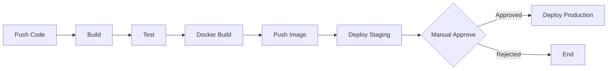

# 06 CI/CD 流程（GitHub Actions）

> **版本**：GitHub Actions / Docker / Spring Boot 3.x

CI/CD 是現代軟體開發的基石，透過自動化建置、測試、部署，確保每次程式碼變更都經過一致的品質檢查，並能快速、安全地交付到正式環境。GitHub Actions 是 GitHub 內建的 CI/CD 平台，與 GitHub 深度整合，無需額外架設 Jenkins 等工具。

---

## 1、CI/CD 概念

### 三個階段

- **Continuous Integration（持續整合）**：開發者頻繁地將程式碼合併到主分支，每次合併自動觸發建置和測試，盡早發現問題。
- **Continuous Delivery（持續交付）**：在 CI 的基礎上，自動將通過測試的版本部署到 staging 環境，但部署到 production 需要手動審批。
- **Continuous Deployment（持續部署）**：完全自動化，通過所有檢查後直接部署到 production，無需人工介入。

大多數團隊採用 Continuous Delivery（手動審批正式部署），在自動化與風險控制之間取得平衡。

### 流程概覽



---

## 2、GitHub Actions 基礎

### 工作流程檔案

GitHub Actions 的工作流程定義在 `.github/workflows/` 目錄下的 YAML 檔案中。當指定事件觸發時，GitHub 會自動執行工作流程。

### 核心概念

| 概念 | 說明 |
|------|------|
| **Workflow** | 一個完整的自動化流程，對應一個 YAML 檔案 |
| **Event（觸發事件）** | 啟動 workflow 的條件（push、PR、定時等） |
| **Job** | workflow 中的一組步驟，每個 job 在獨立的虛擬機上執行 |
| **Step** | job 中的單一操作（執行命令或使用 action） |
| **Action** | 可複用的操作單元（社群或自建） |
| **Runner** | 執行 job 的虛擬機（GitHub 提供或自建） |

### 觸發條件

```yaml
on:
  # 推送到指定分支
  push:
    branches: [main, develop]
    paths-ignore:
      - '**/*.md'              # 忽略文件變更

  # Pull Request
  pull_request:
    branches: [main]

  # 定時排程（每天凌晨 2 點，UTC）
  schedule:
    - cron: '0 2 * * *'

  # 手動觸發
  workflow_dispatch:
    inputs:
      environment:
        description: '部署環境'
        required: true
        type: choice
        options:
          - staging
          - production
```

### 基本結構

```yaml
name: CI Pipeline

on:
  push:
    branches: [main]
  pull_request:
    branches: [main]

jobs:
  build:
    runs-on: ubuntu-latest       # 使用 GitHub 提供的 Ubuntu runner

    steps:
      - name: Checkout code
        uses: actions/checkout@v4

      - name: Run a script
        run: echo "Hello, CI!"
```

---

## 3、Java + Gradle CI 流程

### 完整的 Build + Test Workflow

```yaml
# .github/workflows/ci.yml
name: Java CI

on:
  push:
    branches: [main, develop]
  pull_request:
    branches: [main]

jobs:
  build:
    runs-on: ubuntu-latest
    timeout-minutes: 15

    steps:
      # 1. 取出程式碼
      - name: Checkout code
        uses: actions/checkout@v4

      # 2. 設定 Java 環境
      - name: Set up JDK 17
        uses: actions/setup-java@v4
        with:
          java-version: '17'
          distribution: 'temurin'       # Eclipse Temurin（原 AdoptOpenJDK）

      # 3. 設定 Gradle 快取（加速建置）
      - name: Setup Gradle
        uses: gradle/actions/setup-gradle@v3
        with:
          cache-read-only: ${{ github.ref != 'refs/heads/main' }}

      # 4. 編譯
      - name: Build
        run: ./gradlew build -x test --no-daemon

      # 5. 執行測試
      - name: Run tests
        run: ./gradlew test --no-daemon

      # 6. 上傳測試報告
      - name: Upload test results
        uses: actions/upload-artifact@v4
        if: ${{ !cancelled() }}
        with:
          name: test-results
          path: |
            **/build/reports/tests/
            **/build/test-results/
          retention-days: 14

      # 7. 上傳 JAR 檔案（供後續 job 使用）
      - name: Upload JAR
        uses: actions/upload-artifact@v4
        with:
          name: app-jar
          path: build/libs/*.jar
          retention-days: 1
```

**快取策略說明**：`gradle/actions/setup-gradle` 會自動快取 Gradle 的依賴套件和建置輸出。`cache-read-only` 設定讓非 main 分支只讀取快取、不寫入，避免 PR 分支的快取互相干擾。

### Maven 版本對照

```yaml
      - name: Set up JDK 17
        uses: actions/setup-java@v4
        with:
          java-version: '17'
          distribution: 'temurin'
          cache: 'maven'                # 自動快取 ~/.m2/repository

      - name: Build and Test
        run: mvn verify --no-transfer-progress
```

---

## 4、Docker 映像建置與推送

### 推送到 GitHub Container Registry（ghcr.io）

```yaml
# .github/workflows/docker.yml
name: Docker Build & Push

on:
  push:
    branches: [main]
    tags: ['v*']                        # 推送版本標籤時也觸發

jobs:
  docker:
    runs-on: ubuntu-latest
    permissions:
      contents: read
      packages: write                   # 寫入 ghcr.io 的權限

    steps:
      - name: Checkout code
        uses: actions/checkout@v4

      # 設定 Docker Buildx（多平台建置）
      - name: Set up Docker Buildx
        uses: docker/setup-buildx-action@v3

      # 登入 GitHub Container Registry
      - name: Login to GHCR
        uses: docker/login-action@v3
        with:
          registry: ghcr.io
          username: ${{ github.actor }}
          password: ${{ secrets.GITHUB_TOKEN }}   # GitHub 自動提供

      # 產生映像檔標籤
      - name: Docker metadata
        id: meta
        uses: docker/metadata-action@v5
        with:
          images: ghcr.io/${{ github.repository }}
          tags: |
            type=ref,event=branch
            type=semver,pattern={{version}}
            type=sha,prefix=

      # 建置並推送
      - name: Build and push
        uses: docker/build-push-action@v5
        with:
          context: .
          push: true
          tags: ${{ steps.meta.outputs.tags }}
          labels: ${{ steps.meta.outputs.labels }}
          cache-from: type=gha                     # 使用 GitHub Actions 快取
          cache-to: type=gha,mode=max
```

**映像檔標籤策略**：

| 觸發事件 | 產生的標籤 | 範例 |
|---------|----------|------|
| push to main | 分支名稱 | `ghcr.io/myorg/myapp:main` |
| push tag v1.2.3 | 版本號 | `ghcr.io/myorg/myapp:1.2.3` |
| 每次 push | commit SHA | `ghcr.io/myorg/myapp:a1b2c3d` |

`docker/metadata-action` 自動根據 Git 事件產生合適的標籤，無需手動管理版本號。

---

## 5、環境變數與 Secrets

### GitHub Secrets

機密資訊（密碼、API Key、Token）不能寫在程式碼中，應使用 GitHub Secrets 管理。

**設定路徑**：Repository Settings > Secrets and variables > Actions > New repository secret

```yaml
# 在 workflow 中使用 Secret
steps:
  - name: Deploy
    run: |
      ssh ${{ secrets.DEPLOY_USER }}@${{ secrets.DEPLOY_HOST }} \
        "docker pull ghcr.io/myorg/myapp:latest && docker compose up -d"
    env:
      SSH_PRIVATE_KEY: ${{ secrets.SSH_PRIVATE_KEY }}

  - name: Database migration
    run: ./gradlew flywayMigrate
    env:
      SPRING_DATASOURCE_URL: ${{ secrets.DB_URL }}
      SPRING_DATASOURCE_PASSWORD: ${{ secrets.DB_PASSWORD }}
```

**注意**：`GITHUB_TOKEN` 是 GitHub 自動提供的臨時 token，不需要手動設定。它擁有當前 repository 的讀寫權限，適合用於推送 Docker 映像到 ghcr.io、建立 Release 等操作。

### Environment 環境

GitHub Environments 允許為不同部署目標（staging、production）設定各自的 Secrets 和保護規則。

```yaml
jobs:
  deploy-staging:
    runs-on: ubuntu-latest
    environment: staging              # 使用 staging 環境的 Secrets
    steps:
      - name: Deploy to staging
        run: ./deploy.sh
        env:
          API_URL: ${{ vars.API_URL }}           # Environment variable
          DB_PASSWORD: ${{ secrets.DB_PASSWORD }} # Environment secret

  deploy-production:
    runs-on: ubuntu-latest
    needs: deploy-staging
    environment: production           # 使用 production 環境的 Secrets
    steps:
      - name: Deploy to production
        run: ./deploy.sh
```

### 手動審批（Environment Protection Rules）

在 Repository Settings > Environments > production 中設定：

- **Required reviewers**：指定必須審批的人員（最多 6 人）
- **Wait timer**：部署前強制等待時間（例如 15 分鐘冷靜期）
- **Deployment branches**：限制只有特定分支可以部署到此環境

設定後，workflow 執行到 `environment: production` 的 job 時，會暫停並等待審批者在 GitHub 上點擊 Approve。

---

## 6、完整 CI/CD Pipeline 範例

將前面所有步驟整合為一個完整的流程：

```yaml
# .github/workflows/pipeline.yml
name: Full CI/CD Pipeline

on:
  push:
    branches: [main]

jobs:
  # ===== Stage 1: Build & Test =====
  build:
    runs-on: ubuntu-latest
    timeout-minutes: 15
    steps:
      - uses: actions/checkout@v4

      - uses: actions/setup-java@v4
        with:
          java-version: '17'
          distribution: 'temurin'

      - uses: gradle/actions/setup-gradle@v3

      - name: Build and Test
        run: ./gradlew build --no-daemon

      - name: Upload test results
        uses: actions/upload-artifact@v4
        if: ${{ !cancelled() }}
        with:
          name: test-results
          path: '**/build/reports/tests/'

      - name: Upload JAR
        uses: actions/upload-artifact@v4
        with:
          name: app-jar
          path: build/libs/*.jar
          retention-days: 1

  # ===== Stage 2: Docker Build & Push =====
  docker:
    runs-on: ubuntu-latest
    needs: build                      # 等待 build job 成功
    permissions:
      contents: read
      packages: write
    steps:
      - uses: actions/checkout@v4

      - uses: docker/setup-buildx-action@v3

      - uses: docker/login-action@v3
        with:
          registry: ghcr.io
          username: ${{ github.actor }}
          password: ${{ secrets.GITHUB_TOKEN }}

      - uses: docker/metadata-action@v5
        id: meta
        with:
          images: ghcr.io/${{ github.repository }}
          tags: |
            type=sha,prefix=
            type=raw,value=latest

      - uses: docker/build-push-action@v5
        with:
          context: .
          push: true
          tags: ${{ steps.meta.outputs.tags }}
          cache-from: type=gha
          cache-to: type=gha,mode=max

  # ===== Stage 3: Deploy to Staging =====
  deploy-staging:
    runs-on: ubuntu-latest
    needs: docker
    environment: staging
    steps:
      - name: Deploy to staging
        run: |
          echo "Deploying to staging server..."
          # 實際部署指令，例如：
          # ssh deploy@staging-server "docker pull ghcr.io/${{ github.repository }}:latest"
          # ssh deploy@staging-server "cd /app && docker compose up -d"

  # ===== Stage 4: Deploy to Production（需手動審批）=====
  deploy-production:
    runs-on: ubuntu-latest
    needs: deploy-staging
    environment: production           # 設定了 required reviewers
    steps:
      - name: Deploy to production
        run: |
          echo "Deploying to production server..."
          # ssh deploy@prod-server "docker pull ghcr.io/${{ github.repository }}:latest"
          # ssh deploy@prod-server "cd /app && docker compose up -d"
```

**流程說明**：

1. **build**：編譯 + 測試，失敗則後續步驟不執行
2. **docker**：建置 Docker 映像並推送到 ghcr.io
3. **deploy-staging**：自動部署到 staging 環境
4. **deploy-production**：等待指定審批者在 GitHub 上確認後，才部署到正式環境

---

## 7、常用 Actions 推薦

| Action | 用途 | 說明 |
|--------|------|------|
| `actions/checkout@v4` | 取出程式碼 | 幾乎所有 workflow 都需要 |
| `actions/setup-java@v4` | 設定 JDK | 支援 temurin、corretto、zulu 等發行版 |
| `actions/setup-node@v4` | 設定 Node.js | 前端建置、Playwright 測試 |
| `gradle/actions/setup-gradle@v3` | Gradle 建置 | 自動快取、建置掃描 |
| `docker/build-push-action@v5` | Docker 建置推送 | 支援多平台、快取 |
| `docker/login-action@v3` | Docker Registry 登入 | 支援 ghcr.io、Docker Hub、ECR |
| `docker/metadata-action@v5` | 映像檔標籤管理 | 自動根據 Git 事件產生標籤 |
| `actions/upload-artifact@v4` | 上傳產出物 | 測試報告、JAR、截圖 |
| `actions/download-artifact@v4` | 下載產出物 | 跨 job 傳遞檔案 |
| `actions/cache@v4` | 通用快取 | 快取 npm、pip 等依賴 |

### 快取最佳實踐

```yaml
# npm 依賴快取
- uses: actions/setup-node@v4
  with:
    node-version: 20
    cache: 'npm'                 # 自動快取 node_modules

# Gradle 依賴快取（gradle/actions/setup-gradle 已內建）

# 通用快取（其他場景）
- uses: actions/cache@v4
  with:
    path: ~/.cache/pip
    key: ${{ runner.os }}-pip-${{ hashFiles('**/requirements.txt') }}
    restore-keys: |
      ${{ runner.os }}-pip-
```

快取的 key 應包含依賴定義檔案的 hash（如 `package-lock.json`、`build.gradle`），當依賴變更時自動更新快取。

---

## 8、小結

本篇涵蓋了 GitHub Actions CI/CD 的核心知識：

- **CI/CD 概念**：持續整合、持續交付、持續部署的差異與選擇
- **GitHub Actions 基礎**：workflow、job、step 的結構與觸發條件
- **Java CI**：Gradle/Maven 建置、測試、快取策略
- **Docker 整合**：映像建置、ghcr.io 推送、自動標籤管理
- **Secrets 與環境**：機密管理、Environment 隔離、手動審批機制
- **完整 Pipeline**：Build > Test > Docker > Staging > Approve > Production

延伸閱讀：

- **Docker 容器化部署**：`08-DevOps/02 Docker 容器化部署.md`
- **Kubernetes 入門**：`08-DevOps/03 Kubernetes 入門.md`

---
審查狀態：APPROVED — 2026-Q1
- [x] 技術正確性
- [x] 架構與方法論
- [x] 生產實戰
- [x] 內容結構
- [x] 術語與一致性
- [x] 讀者路徑
- [x] 時效性
