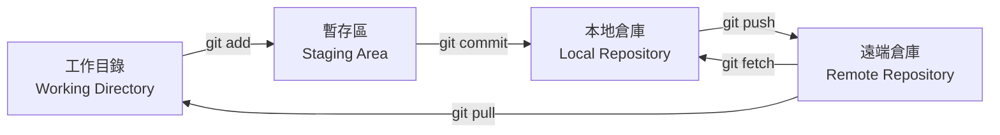
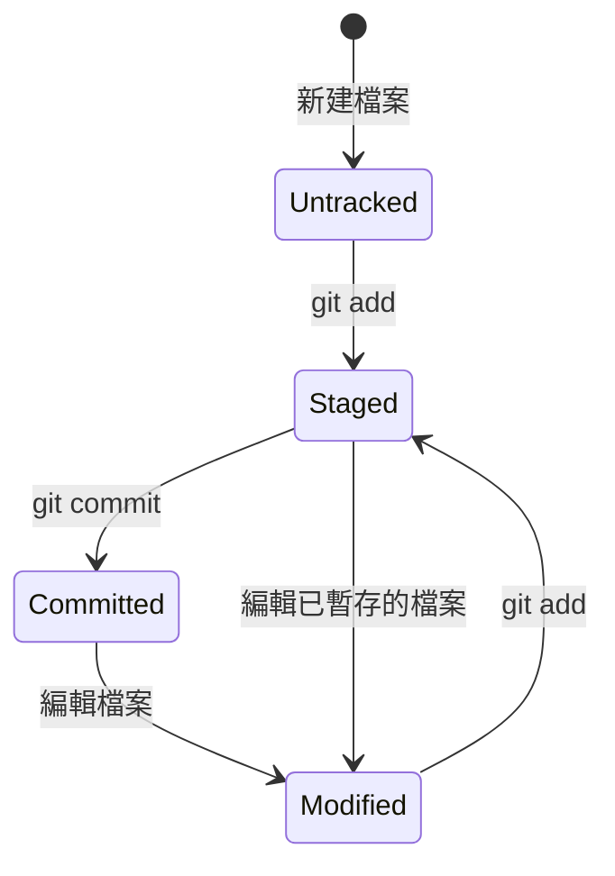
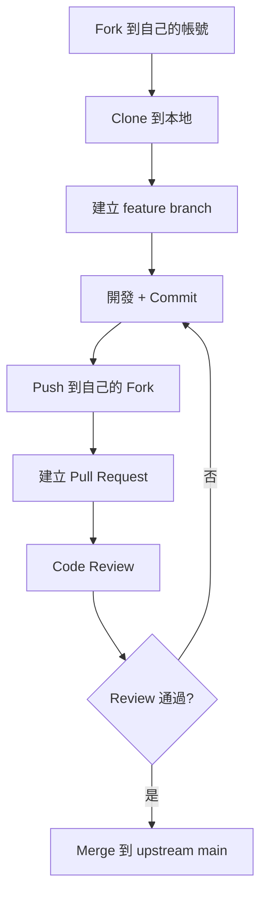

# 07 Git 與 GitHub 版本控制

> **版本**：Git 2.40+ / GitHub — 涵蓋日常開發工作流程、分支策略、Pull Request、常見問題排查

## 1、Git 核心概念

### 1.1 三個區域



| 區域 | 說明 |
|------|------|
| 工作目錄 | 實際的檔案系統，你看到和編輯的檔案 |
| 暫存區（Index） | `git add` 後的快照，準備提交的內容 |
| 本地倉庫 | `git commit` 後的歷史紀錄 |
| 遠端倉庫 | GitHub/GitLab 上的共享倉庫 |

### 1.2 檔案狀態



## 2、基本操作

### 2.1 初始化與設定

```bash
# 初始化倉庫
git init

# 設定使用者（全域）
git config --global user.name "Your Name"
git config --global user.email "your@email.com"

# 設定預設分支名稱
git config --global init.defaultBranch main

# 查看設定
git config --list
```

### 2.2 日常工作流程

```bash
# 查看狀態
git status

# 加入暫存區
git add file.txt          # 單一檔案
git add src/              # 整個目錄
git add -A                # 所有變更（新增 + 修改 + 刪除）

# 提交
git commit -m "feat: add user registration"

# 查看歷史
git log --oneline --graph --all

# 推送到遠端
git push origin main

# 拉取遠端變更
git pull origin main
```

### 2.3 .gitignore

```gitignore
# Java
*.class
*.jar
target/
build/
.gradle/

# IDE
.idea/
*.iml
.vscode/
.settings/

# 環境變數（重要！不要提交密碼）
.env
.env.local
application-local.yml

# OS
.DS_Store
Thumbs.db

# Node
node_modules/
dist/
```

## 3、分支操作

### 3.1 基本命令

```bash
# 查看分支
git branch            # 本地
git branch -r         # 遠端
git branch -a         # 全部

# 建立並切換分支
git checkout -b feature/user-auth
# 或 Git 2.23+
git switch -c feature/user-auth

# 切換分支
git switch main

# 刪除分支
git branch -d feature/user-auth      # 已合併的分支
git branch -D feature/old-branch     # 強制刪除

# 推送新分支到遠端
git push -u origin feature/user-auth
```

### 3.2 分支命名規範

| 前綴 | 用途 | 範例 |
|------|------|------|
| `feature/` | 新功能 | `feature/user-auth` |
| `fix/` | 修復 Bug | `fix/login-error` |
| `hotfix/` | 緊急修復 | `hotfix/security-patch` |
| `refactor/` | 重構 | `refactor/api-response` |
| `docs/` | 文件 | `docs/api-guide` |
| `chore/` | 雜項（CI、依賴更新） | `chore/upgrade-spring` |

### 3.3 合併與 Rebase

```bash
# Merge：保留分支歷史（推薦用於 feature → main）
git switch main
git merge feature/user-auth

# Rebase：線性歷史（推薦用於更新 feature 分支）
git switch feature/user-auth
git rebase main

# 合併衝突時
# 1. 手動編輯衝突檔案
# 2. git add <resolved-files>
# 3. git merge --continue 或 git rebase --continue
```

**Merge vs Rebase 選擇**：

| 場景 | 建議 |
|------|------|
| feature 合入 main | `merge`（保留歷史） |
| 更新 feature 分支 | `rebase main`（保持線性） |
| 公共分支 | **永遠不要 rebase 已推送的公共分支** |

## 4、Commit Message 規範

### 4.1 Conventional Commits

```
<type>(<scope>): <description>

[optional body]

[optional footer]
```

| Type | 說明 |
|------|------|
| `feat` | 新功能 |
| `fix` | 修復 Bug |
| `docs` | 文件變更 |
| `style` | 格式調整（不影響邏輯） |
| `refactor` | 重構（不是 feat 也不是 fix） |
| `test` | 新增或修改測試 |
| `chore` | 建置工具、CI、依賴更新 |
| `perf` | 效能最佳化 |

```bash
# 好的 commit message
git commit -m "feat(auth): add JWT token refresh endpoint"
git commit -m "fix(order): correct total calculation with discount"
git commit -m "docs: update API documentation for v2"

# 不好的 commit message
git commit -m "update"
git commit -m "fix bug"
git commit -m "WIP"
```

## 5、GitHub 工作流程

### 5.1 Fork + Pull Request 流程（開源）



### 5.2 團隊協作流程（企業）

```bash
# 1. 從 main 建立 feature branch
git switch main
git pull origin main
git switch -c feature/user-profile

# 2. 開發並提交
git add .
git commit -m "feat(user): add profile edit page"

# 3. 推送到遠端
git push -u origin feature/user-profile

# 4. 在 GitHub 建立 Pull Request
# 5. 團隊 Code Review
# 6. CI 自動測試通過
# 7. Squash and Merge 到 main
# 8. 刪除 feature branch
```

### 5.3 GitHub CLI（gh）

```bash
# 安裝後可直接在終端操作 GitHub
gh pr create --title "feat: user profile" --body "Add profile edit page"
gh pr list
gh pr checkout 42
gh pr merge 42 --squash
gh issue create --title "Bug: login fails"
gh issue list --label bug
```

## 6、常見問題與解法

### 6.1 撤銷操作

```bash
# 撤銷工作目錄的修改（未 add）
git restore file.txt

# 撤銷暫存（已 add，想取消）
git restore --staged file.txt

# 修改最後一次 commit message
git commit --amend -m "new message"

# 撤銷最後一次 commit（保留檔案變更）
git reset --soft HEAD~1

# 完全撤銷最後一次 commit（丟棄變更，慎用）
git reset --hard HEAD~1
```

### 6.2 暫存工作（Stash）

```bash
# 暫時存放未完成的工作
git stash

# 查看 stash 列表
git stash list

# 恢復最近的 stash
git stash pop

# 恢復指定的 stash
git stash apply stash@{1}
```

### 6.3 Cherry Pick

```bash
# 將其他分支的某個 commit 應用到當前分支
git cherry-pick abc1234
```

### 6.4 找回遺失的 commit

```bash
# reflog 記錄所有 HEAD 移動
git reflog
# 找到遺失的 commit hash 後
git cherry-pick <hash>
# 或建立新分支
git branch recovery <hash>
```

## 7、Git Flow vs GitHub Flow vs Trunk-Based

| 策略 | 分支 | 適用 |
|------|------|------|
| **Git Flow** | main + develop + feature + release + hotfix | 版本發佈型產品 |
| **GitHub Flow** | main + feature（PR 合入 main） | 持續部署、SaaS |
| **Trunk-Based** | main + 短命 feature（< 1 天） | 高成熟度團隊、CI/CD |

> **建議**：大多數團隊從 **GitHub Flow** 開始，簡單有效。

## 8、實用設定

### 8.1 Git Alias

```bash
git config --global alias.st status
git config --global alias.co checkout
git config --global alias.br branch
git config --global alias.ci commit
git config --global alias.lg "log --oneline --graph --all --decorate"
```

### 8.2 SSH Key 設定

```bash
# 產生 SSH Key
ssh-keygen -t ed25519 -C "your@email.com"

# 複製公鑰
cat ~/.ssh/id_ed25519.pub
# 貼到 GitHub → Settings → SSH and GPG keys → New SSH Key

# 測試連線
ssh -T git@github.com
```

## 9、小結

| 概念 | 重點 |
|------|------|
| 三個區域 | 工作目錄 → 暫存區 → 本地倉庫 → 遠端 |
| 分支策略 | GitHub Flow 最簡單；feature branch + PR + review |
| Commit 規範 | Conventional Commits：type(scope): description |
| 合併 | feature → main 用 merge；更新 feature 用 rebase |
| 安全 | .gitignore 排除密碼；永遠不要 rebase 公共分支 |

> **延伸閱讀**：
> - [06 CI/CD 流程（GitHub Actions）](06%20CI／CD%20流程（GitHub%20Actions）.md) — 自動化建置與部署
> - [01 Gradle 建置工具](01%20Gradle%20建置工具.md) — 建置工具與 Git 的配合
