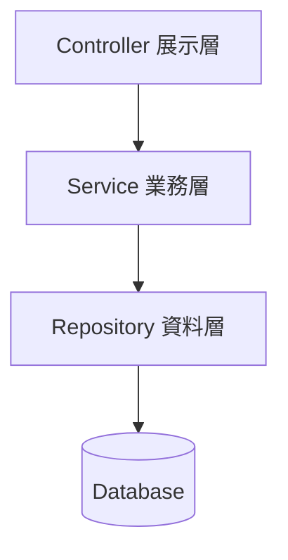
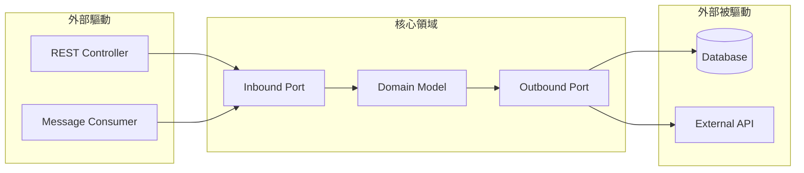
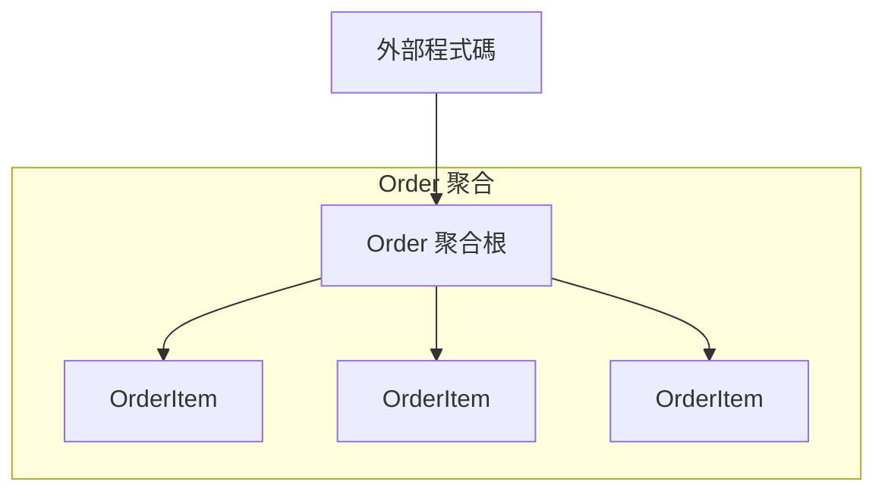
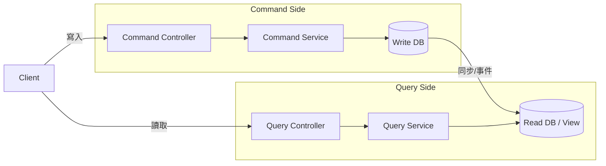
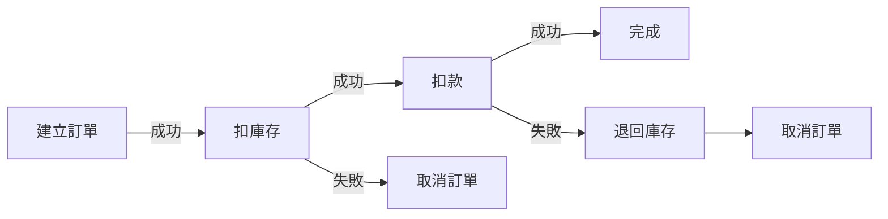

# 03 軟體架構模式

> **版本**：Java 17+ / Spring Boot 3.x — 從分層架構到 DDD、CQRS、事件驅動

架構模式是解決特定問題的成熟方案。選對架構，團隊開發效率高、系統好維護；選錯架構，輕則過度設計拖慢進度，重則在業務成長時被迫重寫。本篇從最常見的分層架構出發，逐步介紹六角架構、DDD 戰術模式、CQRS 與事件驅動，最後給出選型決策表。

---

## 1、分層架構（Layered Architecture）

分層架構是最廣泛採用的模式，也是多數 Spring Boot 專案的預設結構。

### 1.1 傳統三層

```
Controller（展示層）→ Service（業務層）→ Repository（資料層）
```

每一層只能呼叫「下一層」，不能跳層或反向呼叫。



### 1.2 Spring Boot 標準分層

在 Spring Boot 專案中，分層通常對應這樣的 package 結構：

```
com.example.order
├── controller/      # REST API，接收請求、回傳 DTO
├── service/         # 業務邏輯，事務管理
├── repository/      # Spring Data JPA 介面
├── entity/          # JPA Entity
└── dto/             # 請求/回應物件
```

```java
@RestController
@RequestMapping("/api/orders")
@RequiredArgsConstructor
public class OrderController {

    private final OrderService orderService;

    @PostMapping
    public ResponseEntity<OrderResponse> create(@RequestBody @Valid CreateOrderRequest request) {
        return ResponseEntity.ok(orderService.createOrder(request));
    }
}

@Service
@RequiredArgsConstructor
@Transactional
public class OrderService {

    private final OrderRepository orderRepository;

    public OrderResponse createOrder(CreateOrderRequest request) {
        Order order = Order.from(request);
        orderRepository.save(order);
        return OrderResponse.from(order);
    }
}
```

### 1.3 優缺點

**優點**：結構清楚、團隊熟悉、新人好上手、Spring Boot 生態原生支持。

**缺點**：

- **業務邏輯洩漏**：Controller 裡開始出現 `if` 判斷、Service 裡開始寫 SQL 查詢條件。
- **Service 變肥**：所有邏輯堆在 Service，一個檔案動輒上千行。
- **測試困難**：Service 直接依賴 Repository，單元測試必須 mock 資料層。
- **跨層耦合**：Entity 同時扮演資料庫映射和業務物件，修改資料表就連帶影響業務邏輯。

> **實務觀察**：大部分 CRUD 為主的系統，分層架構完全夠用。當你發現 Service 開始失控時，才需要考慮更進階的架構。

---

## 2、六角架構（Hexagonal / Ports & Adapters）

### 2.1 核心思想

Alistair Cockburn 在 2005 年提出六角架構（又稱 Ports & Adapters），核心理念是：**把業務邏輯放在中心，所有外部依賴都透過介面（Port）連接，具體實作（Adapter）可以隨時替換。**

- **Port（埠）**：業務核心定義的介面，宣告「我需要什麼能力」。
- **Adapter（適配器）**：外部世界的具體實作，提供「這個能力怎麼做到」。



### 2.2 與 Spring Boot 的對應

| 六角架構概念 | Spring Boot 對應 |
|-------------|-----------------|
| Inbound Port | Service 介面（UseCase） |
| Inbound Adapter | Controller、MessageListener |
| Domain | Entity、Value Object、Domain Service |
| Outbound Port | Repository 介面、Gateway 介面 |
| Outbound Adapter | JPA Repository 實作、REST Client 實作 |

### 2.3 程式碼範例

```java
// === Outbound Port：核心領域定義的介面 ===
public interface OrderPort {
    Order findById(Long id);
    void save(Order order);
    List<Order> findByCustomerId(Long customerId);
}

// === Outbound Adapter：JPA 實作 ===
@Repository
@RequiredArgsConstructor
public class JpaOrderAdapter implements OrderPort {

    private final JpaOrderRepository jpaRepository;

    @Override
    public Order findById(Long id) {
        return jpaRepository.findById(id)
                .map(OrderEntity::toDomain)
                .orElseThrow(() -> new OrderNotFoundException(id));
    }

    @Override
    public void save(Order order) {
        jpaRepository.save(OrderEntity.fromDomain(order));
    }

    @Override
    public List<Order> findByCustomerId(Long customerId) {
        return jpaRepository.findByCustomerId(customerId).stream()
                .map(OrderEntity::toDomain)
                .toList();
    }
}

// === Inbound Port（UseCase）===
public interface CreateOrderUseCase {
    OrderResult execute(CreateOrderCommand command);
}

// === Domain Service 實作 UseCase ===
@Service
@RequiredArgsConstructor
public class CreateOrderService implements CreateOrderUseCase {

    private final OrderPort orderPort;
    private final InventoryPort inventoryPort;

    @Override
    @Transactional
    public OrderResult execute(CreateOrderCommand command) {
        inventoryPort.reserve(command.items());
        Order order = Order.create(command);
        orderPort.save(order);
        return OrderResult.from(order);
    }
}
```

**關鍵好處**：`CreateOrderService` 只依賴介面，不知道底層是 JPA、MongoDB 或記憶體實作。單元測試可以直接注入假實作，不需要啟動 Spring Context。

---

## 3、領域驅動設計（DDD）戰術模式

DDD 分為「戰略」（Bounded Context、Context Map）和「戰術」（Entity、Value Object、Aggregate）。戰略模式偏向組織與溝通，本篇聚焦對開發者更直接的**戰術模式**。

### 3.1 Entity vs Value Object

| 特性 | Entity | Value Object |
|------|--------|-------------|
| 身份 | 有唯一 ID | 無 ID，以屬性值判斷相等 |
| 可變性 | 可變（有生命週期） | 不可變 |
| 範例 | Order、Customer | Money、Address、DateRange |

**Entity 範例**：

```java
@Entity
@Table(name = "orders")
public class Order {

    @Id
    @GeneratedValue(strategy = GenerationType.IDENTITY)
    private Long id;

    @Embedded
    private Money totalAmount;

    @Enumerated(EnumType.STRING)
    private OrderStatus status;

    // 業務行為放在 Entity 裡，而不是 Service
    public void confirm() {
        if (this.status != OrderStatus.PENDING) {
            throw new IllegalStateException("只有待確認的訂單可以確認");
        }
        this.status = OrderStatus.CONFIRMED;
    }
}
```

**Value Object 用 Java record 實作**：

```java
// Value Object：不可變、以值比較
public record Money(BigDecimal amount, Currency currency) {

    public Money {
        if (amount.compareTo(BigDecimal.ZERO) < 0) {
            throw new IllegalArgumentException("金額不能為負數");
        }
        Objects.requireNonNull(currency, "幣別不能為空");
    }

    public Money add(Money other) {
        if (!this.currency.equals(other.currency)) {
            throw new IllegalArgumentException("幣別不同，無法相加");
        }
        return new Money(this.amount.add(other.amount), this.currency);
    }
}

public record Address(String city, String district, String street, String zipCode) {
    // record 天生不可變，equals / hashCode 自動以所有欄位比較
}
```

> `record` 是 Java 16+ 正式功能，天生符合 Value Object 的語義：不可變、基於值比較。

### 3.2 Aggregate 與 Aggregate Root

**聚合（Aggregate）** 是一致性邊界——聚合內的所有物件必須同時滿足業務規則。**聚合根（Aggregate Root）** 是外部存取聚合的唯一入口。



**規則**：外部程式碼不能直接操作 `OrderItem`，只能透過 `Order` 的方法。

```java
@Entity
public class Order {

    @Id
    @GeneratedValue(strategy = GenerationType.IDENTITY)
    private Long id;

    @OneToMany(cascade = CascadeType.ALL, orphanRemoval = true)
    @JoinColumn(name = "order_id")
    private List<OrderItem> items = new ArrayList<>();

    @Embedded
    private Money totalAmount;

    // 外部只能透過聚合根操作
    public void addItem(String productName, int quantity, Money unitPrice) {
        OrderItem item = new OrderItem(productName, quantity, unitPrice);
        this.items.add(item);
        recalculateTotal();
    }

    public void removeItem(Long itemId) {
        this.items.removeIf(item -> item.getId().equals(itemId));
        recalculateTotal();
    }

    private void recalculateTotal() {
        this.totalAmount = items.stream()
                .map(OrderItem::subtotal)
                .reduce(Money.ZERO, Money::add);
    }
}
```

### 3.3 Repository

**只為聚合根建立 Repository**，不為內部實體（如 `OrderItem`）建立。

```java
// Domain 層定義的 Repository 介面
public interface OrderRepository {
    Optional<Order> findById(Long id);
    void save(Order order);
    List<Order> findByStatus(OrderStatus status);
}

// Infrastructure 層的 Spring Data JPA 實作
public interface JpaOrderRepository extends JpaRepository<Order, Long> {
    List<Order> findByStatus(OrderStatus status);
}
```

如果你用六角架構，Domain 層的 `OrderRepository` 就是 Outbound Port，`JpaOrderRepository` 是 Adapter。如果是標準分層架構，直接用 `JpaRepository` 也完全可行。

### 3.4 Domain Event

聚合之間不應該直接互相呼叫，而是透過**領域事件（Domain Event）**通訊。

```java
// 定義領域事件
public record OrderConfirmedEvent(Long orderId, Money totalAmount, LocalDateTime occurredAt) {
    public OrderConfirmedEvent(Long orderId, Money totalAmount) {
        this(orderId, totalAmount, LocalDateTime.now());
    }
}

// 聚合根發布事件（搭配 Spring 的 AbstractAggregateRoot）
@Entity
public class Order extends AbstractAggregateRoot<Order> {

    public void confirm() {
        if (this.status != OrderStatus.PENDING) {
            throw new IllegalStateException("只有待確認的訂單可以確認");
        }
        this.status = OrderStatus.CONFIRMED;
        registerEvent(new OrderConfirmedEvent(this.id, this.totalAmount));
    }
}

// 事件監聽器
@Component
@RequiredArgsConstructor
public class OrderConfirmedListener {

    private final InventoryService inventoryService;
    private final NotificationService notificationService;

    @TransactionalEventListener
    public void onOrderConfirmed(OrderConfirmedEvent event) {
        inventoryService.deductStock(event.orderId());
        notificationService.sendConfirmation(event.orderId());
    }
}
```

> `@TransactionalEventListener` 預設在交易提交後才觸發，確保訂單確實儲存成功才執行後續動作。

---

## 4、CQRS（Command Query Responsibility Segregation）

### 4.1 核心概念

CQRS 將「寫入（Command）」和「讀取（Query）」拆成獨立的模型。原因很簡單：寫入需要驗證業務規則、維持一致性；讀取需要快速回應、靈活組合欄位。兩者的需求天生不同。



### 4.2 簡單版 CQRS

不需要兩個資料庫，只需要在程式碼層面分離讀寫邏輯：

```java
// Command：寫入操作
public record CreateOrderCommand(Long customerId, List<OrderItemCommand> items) {}

@Service
@RequiredArgsConstructor
public class OrderCommandService {

    private final OrderRepository orderRepository;

    @Transactional
    public Long createOrder(CreateOrderCommand command) {
        Order order = Order.create(command);
        orderRepository.save(order);
        return order.getId();
    }
}

// Query：讀取操作，直接用 DTO 投影
public record OrderSummaryView(Long id, String customerName,
                                BigDecimal totalAmount, String status) {}

@Service
@RequiredArgsConstructor
@Transactional(readOnly = true)
public class OrderQueryService {

    private final EntityManager em;

    public List<OrderSummaryView> findByCustomer(Long customerId) {
        return em.createQuery("""
                SELECT new com.example.query.OrderSummaryView(
                    o.id, c.name, o.totalAmount.amount, o.status)
                FROM Order o JOIN o.customer c
                WHERE c.id = :customerId
                """, OrderSummaryView.class)
                .setParameter("customerId", customerId)
                .getResultList();
    }
}
```

### 4.3 何時需要 CQRS

| 情境 | 需要 CQRS | 不需要 CQRS |
|------|-----------|-------------|
| 讀寫比例 | 讀取遠多於寫入（如報表系統） | 讀寫比例相近 |
| 查詢複雜度 | 需要跨多個聚合組合資料 | 單一聚合就能滿足 |
| 效能瓶頸 | 讀寫互相干擾、需要分別優化 | 目前效能足夠 |
| 團隊規模 | 讀寫團隊可以獨立開發 | 團隊人少，分開反而增加溝通成本 |

> **Trade-off**：CQRS 增加了系統複雜度。簡單版（程式碼分離）成本低，值得採用；進階版（讀寫不同資料庫）要考慮資料同步的最終一致性問題。

---

## 5、事件驅動架構

### 5.1 事件溯源（Event Sourcing）

傳統做法是儲存「當前狀態」，事件溯源則是儲存「所有狀態變更事件」，透過重播事件來還原狀態。

```
傳統：Order { status: CONFIRMED, total: 500 }
事件溯源：
  1. OrderCreated { total: 0 }
  2. ItemAdded { product: "輪胎A", price: 300 }
  3. ItemAdded { product: "輪胎B", price: 200 }
  4. OrderConfirmed {}
```

**好處**：完整審計軌跡、可以回到任意時間點的狀態。
**代價**：查詢複雜、需要搭配 CQRS、學習曲線高。

> 除非有明確的審計或時間回溯需求，否則不建議在一般專案中導入事件溯源。

### 5.2 Saga 模式

當一筆業務流程跨越多個服務（或多個聚合），傳統的資料庫交易無法涵蓋所有步驟。Saga 將長交易拆成一系列本地交易，每個步驟有對應的**補償操作（Compensation）**。



### 5.3 Choreography vs Orchestration

**Choreography（編舞式）**：每個服務監聽事件，自行決定下一步。

```
OrderService 發布 OrderCreated
  → InventoryService 監聽，扣庫存，發布 StockReserved
    → PaymentService 監聽，扣款，發布 PaymentCompleted
      → OrderService 監聽，確認訂單
```

- 優點：服務解耦、無中心點。
- 缺點：流程散落在各服務，難以追蹤完整流程。

**Orchestration（指揮式）**：一個 Saga Orchestrator 負責調度所有步驟。

```java
@Service
@RequiredArgsConstructor
public class CreateOrderSaga {

    private final OrderService orderService;
    private final InventoryService inventoryService;
    private final PaymentService paymentService;

    @Transactional
    public OrderResult execute(CreateOrderCommand command) {
        // Step 1：建立訂單
        Order order = orderService.create(command);
        try {
            // Step 2：扣庫存
            inventoryService.reserve(order.getId(), command.items());
            try {
                // Step 3：扣款
                paymentService.charge(order.getId(), order.getTotalAmount());
                order.confirm();
                return OrderResult.success(order);
            } catch (PaymentException e) {
                // 補償 Step 2
                inventoryService.cancelReserve(order.getId());
                order.cancel("扣款失敗：" + e.getMessage());
                return OrderResult.failed(order, e.getMessage());
            }
        } catch (InventoryException e) {
            // 補償 Step 1
            order.cancel("庫存不足：" + e.getMessage());
            return OrderResult.failed(order, e.getMessage());
        }
    }
}
```

- 優點：流程集中、好理解、好除錯。
- 缺點：Orchestrator 成為中心點，可能變成上帝類別。

> **實務建議**：微服務間用 Choreography + Message Broker（如 Kafka）；單體應用內用 Orchestration + Spring Event。

---

## 6、架構選擇決策

| 架構 | 適用場景 | 建議團隊規模 | 複雜度 | 學習成本 |
|------|---------|-------------|--------|---------|
| 分層架構 | CRUD 為主、業務規則簡單 | 1-5 人 | 低 | 低 |
| 六角架構 | 需要可測試性、外部依賴多 | 3-10 人 | 中 | 中 |
| DDD 戰術模式 | 業務邏輯複雜、領域知識深 | 5-15 人 | 中高 | 高 |
| CQRS（簡單版） | 讀寫需求差異大 | 3-10 人 | 中 | 中 |
| CQRS + 事件溯源 | 審計需求、狀態回溯 | 8+ 人 | 高 | 很高 |
| Saga | 跨服務/跨聚合的業務流程 | 5+ 人 | 高 | 高 |

**不要過度設計**：

1. **先用分層架構**。多數系統一輩子都不需要 DDD。
2. 當 Service 超過 500 行，開始抽取 Domain Model，引入六角架構的概念。
3. 當查詢效能成為瓶頸，考慮 CQRS。
4. 當跨服務交易出現，才引入 Saga。
5. 架構可以逐步演進——**不需要第一天就設計到位**。

> 「任何架構的目的都是降低變更成本。如果你的架構讓變更變得更難，那它就是錯誤的架構。」

---

## 7、小結

- **分層架構**是起點，簡單有效，適合多數中小型專案。
- **六角架構**讓核心業務與外部依賴解耦，提升可測試性。
- **DDD 戰術模式**把業務邏輯回歸到領域物件，避免 Service 肥大。
- **CQRS** 針對讀寫不同需求分別優化，簡單版幾乎零成本。
- **事件驅動**處理跨聚合/跨服務的業務流程，但帶來最終一致性的挑戰。

選擇架構的核心原則：**從簡單開始，按需演進，永遠不要為了還沒發生的問題過度設計。**

### 延伸閱讀

- [01 SOLID 原則](01%20SOLID%20原則與%20Clean%20Code.md)：架構的基石，尤其是依賴反轉原則（DIP）與六角架構的關係
- [02 設計模式](02%20設計模式實戰應用.md)：策略模式、觀察者模式在架構中的應用
- [04 API 設計](04%20API%20設計最佳實踐.md)：分層架構中 Controller 層的設計規範
- [09 系統設計](09%20系統設計入門.md)：從單體到微服務的架構演進

---
審查狀態：APPROVED — 2026-Q1
- [x] 技術正確性
- [x] 架構與方法論
- [x] 生產實戰
- [x] 內容結構
- [x] 術語與一致性
- [x] 讀者路徑
- [x] 時效性
