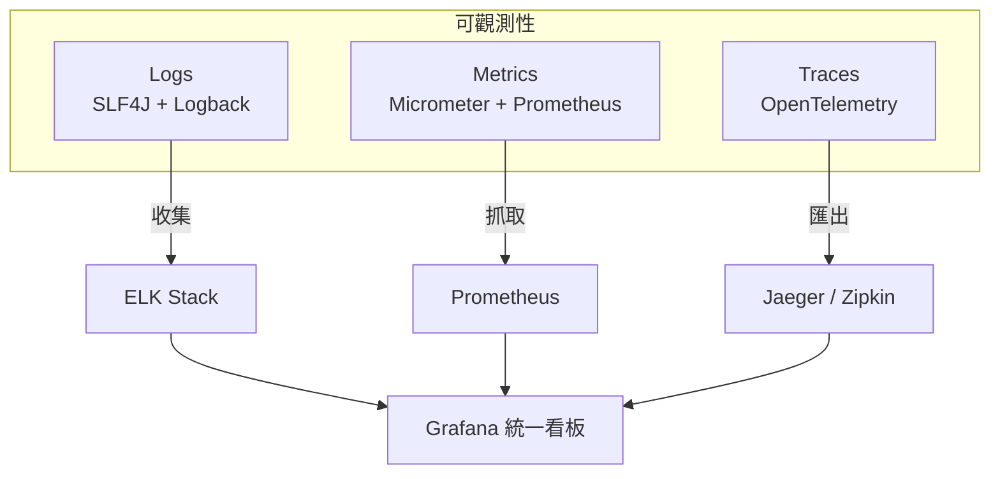
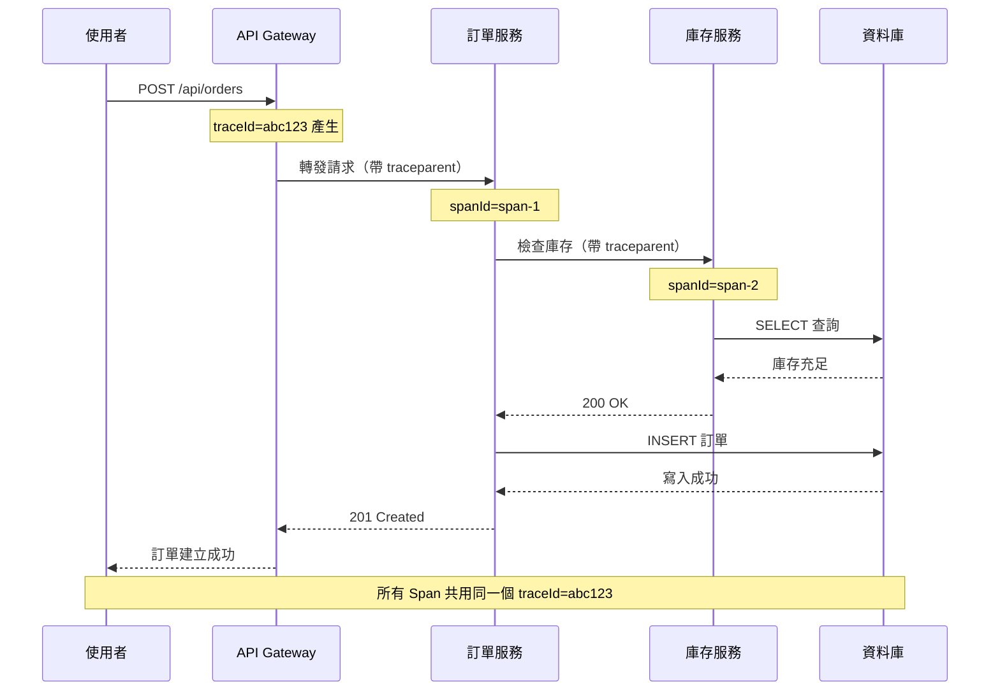
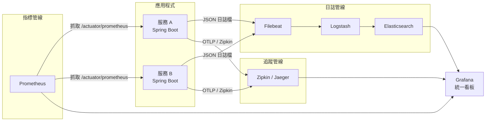

# 05 日誌、監控與可觀測性

> **版本**：Spring Boot 3.x / Micrometer 1.12+ / OpenTelemetry — 涵蓋日誌、指標、追蹤三大支柱

當應用程式部署到正式環境後，「出了問題能多快找到原因」決定了系統的可靠度。可觀測性（Observability）不是事後補救，而是開發階段就應該設計進去的能力。本篇整理日誌、指標、追蹤三大支柱在 Spring Boot 3.x 中的實踐方式。

---

## 1、可觀測性三大支柱

可觀測性由三個互補的維度組成：

| 支柱 | 英文 | 回答的問題 | 資料型態 |
|------|------|-----------|---------|
| 日誌 | Logs | 發生了什麼事？ | 離散事件文字 |
| 指標 | Metrics | 系統現在的狀態如何？ | 數值時序資料 |
| 追蹤 | Traces | 這個請求經過了哪些服務？ | 請求鏈路樹狀結構 |

三者缺一不可：日誌告訴你細節，指標告訴你趨勢，追蹤告訴你因果關係。



---

## 2、日誌（Logging）

### 2.1 SLF4J + Logback

Spring Boot 預設使用 **SLF4J** 作為日誌門面（Facade），底層實作為 **Logback**。引入 `spring-boot-starter` 即自動包含，不需額外依賴。

**日誌級別由低到高**：

```
TRACE < DEBUG < INFO < WARN < ERROR
```

設定為某個級別後，該級別及以上的日誌才會輸出。例如設為 `INFO`，則 `TRACE` 和 `DEBUG` 都不會顯示。

**環境區分配置**（`application.yml`）：

```yaml
# 預設級別
logging:
  level:
    root: INFO
    com.example: INFO

---
# 開發環境
spring:
  config:
    activate:
      on-profile: dev
logging:
  level:
    com.example: DEBUG
    org.springframework.web: DEBUG

---
# 正式環境
spring:
  config:
    activate:
      on-profile: prod
logging:
  level:
    root: WARN
    com.example: INFO
```

**基本的 `logback-spring.xml`**：

```xml
<?xml version="1.0" encoding="UTF-8"?>
<configuration>
    <include resource="org/springframework/boot/logging/logback/defaults.xml"/>

    <!-- 開發環境：Console 輸出 -->
    <springProfile name="dev">
        <appender name="CONSOLE" class="ch.qos.logback.core.ConsoleAppender">
            <encoder>
                <pattern>%d{HH:mm:ss.SSS} %highlight(%-5level) [%thread] %cyan(%logger{36}) - %msg%n</pattern>
            </encoder>
        </appender>
        <root level="DEBUG">
            <appender-ref ref="CONSOLE"/>
        </root>
    </springProfile>

    <!-- 正式環境：檔案輸出 + 滾動 -->
    <springProfile name="prod">
        <appender name="FILE" class="ch.qos.logback.core.rolling.RollingFileAppender">
            <file>logs/application.log</file>
            <rollingPolicy class="ch.qos.logback.core.rolling.SizeAndTimeBasedRollingPolicy">
                <fileNamePattern>logs/application.%d{yyyy-MM-dd}.%i.log</fileNamePattern>
                <maxFileSize>100MB</maxFileSize>
                <maxHistory>30</maxHistory>
                <totalSizeCap>3GB</totalSizeCap>
            </rollingPolicy>
            <encoder>
                <pattern>%d{yyyy-MM-dd HH:mm:ss.SSS} %-5level [%thread] %logger{36} - %msg%n</pattern>
            </encoder>
        </appender>
        <root level="INFO">
            <appender-ref ref="FILE"/>
        </root>
    </springProfile>
</configuration>
```

### 2.2 結構化日誌

傳統的純文字日誌在本地開發很好讀，但到了正式環境需要用 ELK 等工具搜尋時，**結構化的 JSON 格式**才方便機器解析與查詢。

**為什麼需要結構化？**

- 純文字日誌需要正規表示式解析，容易斷行錯誤
- JSON 格式可以直接被 Logstash / Filebeat 解析
- 欄位可被 Elasticsearch 索引，支援精確搜尋

**JSON 格式輸出配置**（使用 Logback 的 `logstash-logback-encoder`）：

```xml
<!-- pom.xml -->
<dependency>
    <groupId>net.logstash.logback</groupId>
    <artifactId>logstash-logback-encoder</artifactId>
    <version>7.4</version>
</dependency>
```

```xml
<!-- logback-spring.xml（正式環境部分） -->
<springProfile name="prod">
    <appender name="JSON_FILE" class="ch.qos.logback.core.rolling.RollingFileAppender">
        <file>logs/application.json</file>
        <rollingPolicy class="ch.qos.logback.core.rolling.SizeAndTimeBasedRollingPolicy">
            <fileNamePattern>logs/application.%d{yyyy-MM-dd}.%i.json</fileNamePattern>
            <maxFileSize>100MB</maxFileSize>
            <maxHistory>30</maxHistory>
        </rollingPolicy>
        <encoder class="net.logstash.logback.encoder.LogstashEncoder">
            <includeMdcKeyName>requestId</includeMdcKeyName>
            <includeMdcKeyName>userId</includeMdcKeyName>
        </encoder>
    </appender>
    <root level="INFO">
        <appender-ref ref="JSON_FILE"/>
    </root>
</springProfile>
```

**MDC（Mapped Diagnostic Context）— 為每筆日誌注入上下文**：

MDC 是 SLF4J 提供的執行緒級別的上下文機制，可以把 `requestId`、`userId` 等資訊自動附加到每一行日誌。

```java
@Component
public class RequestContextFilter implements Filter {

    @Override
    public void doFilter(ServletRequest request, ServletResponse response,
                         FilterChain chain) throws IOException, ServletException {
        try {
            HttpServletRequest httpRequest = (HttpServletRequest) request;

            // 從 Header 取得或產生 requestId
            String requestId = httpRequest.getHeader("X-Request-Id");
            if (requestId == null) {
                requestId = UUID.randomUUID().toString().substring(0, 8);
            }

            // 從已認證的使用者取得 userId
            String userId = Optional.ofNullable(SecurityContextHolder.getContext().getAuthentication())
                    .map(Authentication::getName)
                    .orElse("anonymous");

            MDC.put("requestId", requestId);
            MDC.put("userId", userId);

            chain.doFilter(request, response);
        } finally {
            MDC.clear(); // 務必清除，避免執行緒池汙染
        }
    }
}
```

注入後，每一行日誌自動帶有 `requestId` 和 `userId`，不需要每次手動傳參：

```java
log.info("建立訂單成功，訂單編號：{}", order.getId());
// JSON 輸出自動包含：{"requestId":"a1b2c3d4","userId":"charlie","message":"建立訂單成功，訂單編號：ORD-001"}
```

### 2.3 日誌最佳實踐

**該記什麼**：
- 業務關鍵操作（建立訂單、修改權限、刪除資料）
- 外部系統呼叫的請求與回應摘要
- 異常與錯誤的完整 stack trace
- 效能瓶頸（慢查詢、逾時）

**不該記什麼**：
- 密碼、身分證字號、信用卡號等敏感資料
- 大量迴圈內的逐筆日誌（會拖垮效能）
- 正常且頻繁的心跳檢查

**敏感資料脫敏**：

```java
// 錯誤示範
log.info("使用者登入，密碼：{}", password);

// 正確做法 — 敏感欄位不記錄或脫敏
log.info("使用者登入，帳號：{}", username);
log.info("信用卡末四碼：{}", cardNumber.substring(cardNumber.length() - 4));
```

**效能考量 — 使用 `{}` 佔位符而非字串拼接**：

```java
// 錯誤：即使 DEBUG 級別被關閉，字串拼接仍然會執行
log.debug("處理訂單 " + orderId + "，金額 " + amount);

// 正確：只有在 DEBUG 啟用時才會組合字串
log.debug("處理訂單 {}，金額 {}", orderId, amount);

// 昂貴運算加上級別判斷
if (log.isDebugEnabled()) {
    log.debug("訂單明細：{}", buildExpensiveDetail(order));
}
```

**錯誤日誌要包含上下文**：

```java
// 錯誤示範 — 只有例外訊息，無法定位是哪筆資料出問題
log.error("訂單建立失敗", e);

// 正確做法 — 包含業務上下文
log.error("訂單建立失敗，客戶ID={}，商品={}，金額={}",
          customerId, productCode, amount, e);
```

---

## 3、指標（Metrics）

### 3.1 Micrometer + Prometheus

Spring Boot Actuator 內建 **Micrometer** 作為指標門面（類似 SLF4J 之於日誌），搭配 Prometheus registry 即可匯出指標。

**依賴配置**：

```xml
<dependency>
    <groupId>org.springframework.boot</groupId>
    <artifactId>spring-boot-starter-actuator</artifactId>
</dependency>
<dependency>
    <groupId>io.micrometer</groupId>
    <artifactId>micrometer-registry-prometheus</artifactId>
</dependency>
```

**application.yml**：

```yaml
management:
  endpoints:
    web:
      exposure:
        include: health,prometheus,metrics
  prometheus:
    metrics:
      export:
        enabled: true
```

**四種指標類型**：

| 類型 | 用途 | 範例 |
|------|------|------|
| Counter | 只增不減的計數器 | 訂單總數、錯誤次數 |
| Gauge | 可升可降的瞬時值 | 目前連線數、佇列長度 |
| Timer | 計時 + 次數 | API 回應時間 |
| Distribution Summary | 分布統計 | 訂單金額分布 |

### 3.2 自訂業務指標

Actuator 內建了 JVM、HTTP、資料庫連線池等基礎指標，但業務指標需要自己定義：

```java
@Service
public class OrderService {

    private final Counter orderCreatedCounter;
    private final Counter orderFailedCounter;
    private final Timer orderProcessingTimer;
    private final AtomicInteger pendingOrders = new AtomicInteger(0);

    public OrderService(MeterRegistry registry) {
        // Counter — 訂單建立成功 / 失敗次數
        this.orderCreatedCounter = Counter.builder("orders.created.total")
                .description("成功建立的訂單總數")
                .tag("type", "standard")
                .register(registry);

        this.orderFailedCounter = Counter.builder("orders.failed.total")
                .description("建立失敗的訂單總數")
                .register(registry);

        // Timer — 訂單處理時間
        this.orderProcessingTimer = Timer.builder("orders.processing.duration")
                .description("訂單處理耗時")
                .publishPercentiles(0.5, 0.95, 0.99) // P50 / P95 / P99
                .register(registry);

        // Gauge — 待處理訂單數量（瞬時值）
        Gauge.builder("orders.pending.count", pendingOrders, AtomicInteger::get)
                .description("目前待處理的訂單數量")
                .register(registry);
    }

    public OrderDto createOrder(CreateOrderRequest request) {
        pendingOrders.incrementAndGet();
        try {
            return orderProcessingTimer.record(() -> {
                OrderDto order = doCreateOrder(request);
                orderCreatedCounter.increment();
                return order;
            });
        } catch (Exception e) {
            orderFailedCounter.increment();
            throw e;
        } finally {
            pendingOrders.decrementAndGet();
        }
    }
}
```

**常見的業務指標場景**：

- **訂單**：建立數量、取消率、平均金額
- **API**：回應時間 P95 / P99、錯誤率
- **快取**：命中率（`cache.gets` 搭配 tag `result=hit/miss`）
- **外部呼叫**：第三方 API 回應時間、失敗次數

### 3.3 告警設計

有了指標之後，需要設計合理的告警規則，否則會陷入「告警疲勞」（Alert Fatigue）——告警太多導致全部被忽略。

**SLO / SLI 基本概念**：

| 名詞 | 全稱 | 說明 |
|------|------|------|
| SLI | Service Level Indicator | 衡量指標，例如「API 回應時間 P99」 |
| SLO | Service Level Objective | 目標值，例如「P99 < 500ms」 |
| SLA | Service Level Agreement | 對外承諾，例如「99.9% 可用性」 |

**什麼指標該告警**：

- 錯誤率突然升高（5xx 比例 > 1%）
- 回應時間 P99 超過 SLO 閾值
- 佇列堆積超過合理範圍
- 磁碟 / 記憶體使用率超過 80%

**避免告警疲勞的原則**：

- 每條告警都必須對應一個**明確的處理動作**
- 區分 **Warning**（需關注）與 **Critical**（需立即處理）
- 對波動性指標使用滑動平均，避免瞬間抖動觸發告警
- 定期清理不再有意義的告警規則

---

## 4、分散式追蹤（Distributed Tracing）

在微服務架構中，一個使用者請求可能跨越多個服務。當某個環節出問題，需要追蹤完整路徑才能定位根因。

### 4.1 OpenTelemetry 與 Micrometer Tracing

Spring Boot 3.x 使用 **Micrometer Tracing** 取代了過去的 Spring Cloud Sleuth。底層可以對接 OpenTelemetry 或 Brave（Zipkin）。

**核心概念**：

- **Trace**：一個完整請求的生命週期，由唯一的 `traceId` 識別
- **Span**：Trace 中的一個操作單元（例如一次 HTTP 呼叫、一次 DB 查詢）
- **Context Propagation**：跨服務傳遞 traceId，確保同一請求的所有 Span 可以串聯

**依賴配置**（以 Zipkin 為例）：

```xml
<dependency>
    <groupId>io.micrometer</groupId>
    <artifactId>micrometer-tracing-bridge-otel</artifactId>
</dependency>
<dependency>
    <groupId>io.opentelemetry</groupId>
    <artifactId>opentelemetry-exporter-zipkin</artifactId>
</dependency>
```

**application.yml**：

```yaml
management:
  tracing:
    sampling:
      probability: 1.0  # 開發環境 100% 取樣；正式環境建議 0.1（10%）
  zipkin:
    tracing:
      endpoint: http://localhost:9411/api/v2/spans
logging:
  pattern:
    level: "%5p [${spring.application.name:},%X{traceId:-},%X{spanId:-}]"
```

配置完成後，日誌會自動帶上 `traceId` 和 `spanId`：

```
INFO [order-service,abc123def456,789xyz] c.e.OrderController - 收到建立訂單請求
```

### 4.2 追蹤實踐

**W3C Trace Context 標準**：

Spring Boot 3.x 預設使用 W3C Trace Context 標準，透過 HTTP Header `traceparent` 傳遞追蹤資訊：

```
traceparent: 00-abc123def456-789xyz-01
```

使用 `RestClient` 或 `WebClient` 呼叫其他服務時，traceId 會自動注入到請求 Header，下游服務可以接續同一條追蹤鏈路。

**請求追蹤鏈路示意**：



**手動建立 Span**（用於追蹤非 HTTP 的關鍵操作）：

```java
@Service
public class InventoryService {

    private final ObservationRegistry observationRegistry;

    public InventoryService(ObservationRegistry observationRegistry) {
        this.observationRegistry = observationRegistry;
    }

    public boolean checkStock(String productCode, int quantity) {
        return Observation.createNotStarted("inventory.check", observationRegistry)
                .lowCardinalityKeyValue("product.type", "tire")
                .observe(() -> {
                    // 實際的庫存檢查邏輯
                    return doCheckStock(productCode, quantity);
                });
    }
}
```

---

## 5、整合架構

三大支柱各自獨立但可以整合到統一的觀測平台：



**各工具角色**：

| 層級 | 工具 | 功能 |
|------|------|------|
| 日誌收集 | Filebeat | 輕量級日誌採集器，監控日誌檔案變化 |
| 日誌處理 | Logstash | 解析、轉換、enrichment |
| 日誌儲存 + 搜尋 | Elasticsearch | 全文搜尋引擎，支援結構化查詢 |
| 指標儲存 | Prometheus | 時序資料庫，Pull 模式抓取指標 |
| 追蹤儲存 | Zipkin / Jaeger | 分散式追蹤後端 |
| 統一看板 | Grafana | 視覺化面板，整合以上所有資料來源 |

---

## 6、小結

| 支柱 | 工具鏈 | Spring Boot 整合方式 | 核心用途 |
|------|--------|---------------------|---------|
| 日誌 | SLF4J + Logback + ELK | `logback-spring.xml` + MDC | 事件記錄、除錯、稽核 |
| 指標 | Micrometer + Prometheus + Grafana | `spring-boot-starter-actuator` + `micrometer-registry-prometheus` | 系統狀態監控、告警 |
| 追蹤 | Micrometer Tracing + OpenTelemetry + Zipkin | `micrometer-tracing-bridge-otel` + `opentelemetry-exporter-zipkin` | 跨服務請求鏈路分析 |

**實踐順序建議**：先把日誌做好（結構化 + MDC），再加入指標（Actuator + Prometheus），最後導入追蹤。不需要一次到位，但日誌是基礎，從第一天就該做對。

---

## 7、工具選型取捨

每個支柱都有多種工具可選，選擇時應根據團隊規模、維運能力與預算來決定：

**日誌平台**：

| 方案 | 定位 | 適用場景 | 考量 |
|------|------|---------|------|
| ELK Stack（Elasticsearch + Logstash + Kibana） | 重量級、功能完整 | 大型團隊、日誌量大、需要複雜查詢 | 資源消耗高（ES 記憶體需求大），維運成本高 |
| Grafana Loki | 輕量級、類似 Prometheus 的設計 | 中小型團隊、已有 Grafana 生態 | 不做全文索引（只索引 Label），查詢彈性較低但資源需求低很多 |
| Datadog Logs / New Relic Logs | SaaS 託管 | 不想自建基礎設施的團隊 | 按量計費，大量日誌成本可能很高 |

**追蹤系統**：

| 方案 | 定位 | 適用場景 | 考量 |
|------|------|---------|------|
| Zipkin | 簡單輕量 | 入門、服務數量少 | 功能較基礎，查詢和分析能力有限 |
| Jaeger | 功能豐富（CNCF 畢業專案） | 中大型微服務架構 | 支援自適應取樣、依賴圖分析，但部署元件較多 |
| Grafana Tempo | 與 Grafana 生態深度整合 | 已使用 Grafana + Loki 的團隊 | 只需物件儲存（S3 / MinIO），成本低 |

**指標平台**：

| 方案 | 定位 | 適用場景 | 考量 |
|------|------|---------|------|
| Prometheus + Grafana | 自建、業界標準 | 大多數團隊的首選 | 需要自行維運，長期儲存需搭配 Thanos / Cortex |
| Datadog / New Relic | SaaS 全觀測平台 | 追求一站式方案、願意付費 | 整合度高（日誌 + 指標 + 追蹤），但廠商鎖定風險 |

> **選型建議**：中小型團隊優先考慮 **Grafana 全家桶**（Loki + Prometheus + Tempo + Grafana），元件一致、學習成本低、資源需求相對小。大型團隊或有複雜查詢需求時再考慮 ELK。如果團隊沒有專職 SRE，SaaS 方案（Datadog / New Relic）可以省去大量維運負擔，但需評估長期成本。

---

> **延伸閱讀**：
> - [12 Spring Boot Actuator 監控](../02-Spring-Ecosystem/12%20Spring%20Boot%20Actuator%20監控.md) — Actuator 端點詳細用法與安全配置
> - [06 安全開發實踐](06%20安全開發實踐.md) — 日誌脫敏、敏感資料保護實踐
> - [07 效能調校與壓力測試](07%20效能調校與壓力測試.md) — 指標驅動的效能優化方法論

---
審查狀態：APPROVED — 2026-Q1
- [x] 技術正確性
- [x] 架構與方法論
- [x] 生產實戰
- [x] 內容結構
- [x] 術語與一致性
- [x] 讀者路徑
- [x] 時效性
