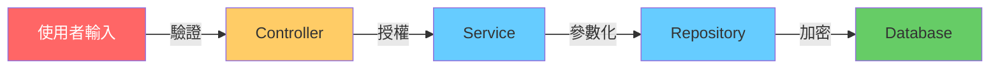

# 06 安全開發實踐

> **版本**：Java 17+ / Spring Boot 3.x / OWASP Top 10（2021 版）— 涵蓋安全編碼原則、常見漏洞防護、Secrets 管理

## 1、安全開發的基本心態

安全不是「加上 Spring Security 就完成了」。Spring Security 解決的是**認證與授權**，但大多數漏洞來自**程式碼本身**：未驗證的輸入、錯誤的 SQL 拼接、敏感資料外洩。

> **核心原則**：永遠不要信任外部輸入（Never trust user input）。



每一層都有安全責任，不能只靠單一防線。

**安全 vs 開發體驗的取捨**：

安全措施必然增加開發摩擦（更多驗證、更嚴格的流程、更複雜的部署）。實務上需要根據系統的暴露程度來調整力道：

- **對外公開系統**（客戶入口、API）：所有措施都必須到位，不可妥協
- **內部管理工具**（僅限公司網路、少數使用者）：可適度簡化——例如 CSRF 防護在純內部 JWT API 中優先級較低，Swagger UI 在內網開發環境可以保留
- **開發 / 測試環境**：安全設定可以放寬，但**密碼和 Secrets 管理的規範不分環境**

> **原則**：寧可在上線前多做一道檢查，也不要在資安事件後花十倍成本修補。但對純內部工具過度防護（例如強制雙因素認證 + IP 白名單 + WAF），反而會拖慢開發節奏，需務實評估。

---

## 2、OWASP Top 10 與 Java 防護

### 2.1 A03：注入攻擊（Injection）

**最常見也最危險**的漏洞。包括 SQL Injection、NoSQL Injection、OS Command Injection。

```java
// 錯誤：字串拼接 SQL — SQL 注入漏洞
public User findUser(String username) {
    String sql = "SELECT * FROM users WHERE username = '" + username + "'";
    return jdbcTemplate.queryForObject(sql, userRowMapper);
    // 輸入 ' OR '1'='1 就能繞過
}

// 正確：參數化查詢
public User findUser(String username) {
    String sql = "SELECT * FROM users WHERE username = ?";
    return jdbcTemplate.queryForObject(sql, userRowMapper, username);
}
```

**Spring Data JPA 天然防護**：

```java
// JPA 的 JPQL 參數綁定自動防注入
@Query("SELECT u FROM User u WHERE u.username = :username")
Optional<User> findByUsername(@Param("username") String username);

// 危險：動態拼接 JPQL（避免！）
@Query("SELECT u FROM User u WHERE u.role = '" + role + "'")  // 不要這樣做
```

**MyBatis 注意事項**：

```xml
<!-- 安全：用 #{} 參數綁定 -->
<select id="findUser" resultType="User">
    SELECT * FROM users WHERE username = #{username}
</select>

<!-- 危險：用 ${} 字串替換 — 有注入風險 -->
<select id="findUser" resultType="User">
    SELECT * FROM users WHERE username = '${username}'
</select>
```

> **規則**：MyBatis 永遠用 `#{}`，只有 ORDER BY 動態欄位名才用 `${}` 並搭配白名單驗證。

### 2.2 A01：存取控制失效（Broken Access Control）

```java
// 錯誤：只檢查是否登入，沒檢查是否有權限存取該資源
@GetMapping("/orders/{orderId}")
public OrderResponse getOrder(@PathVariable Long orderId) {
    return orderService.findById(orderId);  // 任何登入使用者都能看所有訂單
}

// 正確：檢查資源歸屬
@GetMapping("/orders/{orderId}")
public OrderResponse getOrder(@PathVariable Long orderId,
                               @AuthenticationPrincipal UserDetails user) {
    Order order = orderService.findById(orderId);
    if (!order.getUserId().equals(user.getUserId())) {
        throw new AccessDeniedException("無權存取此訂單");
    }
    return OrderResponse.from(order);
}
```

**常見錯誤**：

| 錯誤類型 | 說明 | 防護 |
|---------|------|------|
| IDOR | 直接透過 ID 存取他人資源 | 驗證資源歸屬 |
| 缺少方法層級授權 | Controller 有 `@PreAuthorize` 但 Service 沒有 | 在 Service 層也加上檢查 |
| 前端隱藏 = 安全 | 只隱藏按鈕，後端沒攔截 | 後端永遠要檢查 |

### 2.3 A02：加密機制失效（Cryptographic Failures）

```java
// 錯誤：密碼明文儲存
user.setPassword(rawPassword);

// 錯誤：用 MD5（已不安全）
user.setPassword(DigestUtils.md5Hex(rawPassword));

// 正確：用 BCrypt
@Bean
public PasswordEncoder passwordEncoder() {
    return new BCryptPasswordEncoder();
}

user.setPassword(passwordEncoder.encode(rawPassword));
```

**敏感資料保護原則**：

- 密碼：BCrypt（Spring Security 預設）
- API Key / Token：不記錄在日誌中
- 個資（身分證、電話）：加密儲存、脫敏顯示
- 傳輸：全面 HTTPS

### 2.4 A07：跨站腳本（XSS）

```java
// 錯誤：直接將使用者輸入渲染到 HTML
@GetMapping("/greet")
public String greet(@RequestParam String name) {
    return "<h1>Hello, " + name + "</h1>";
    // 輸入 <script>alert('XSS')</script> 就會執行
}

// 正確：使用模板引擎（自動跳脫）或手動跳脫
import org.springframework.web.util.HtmlUtils;

@GetMapping("/greet")
public String greet(@RequestParam String name) {
    return "<h1>Hello, " + HtmlUtils.htmlEscape(name) + "</h1>";
}
```

**前後分離架構**：Vue / React 預設會跳脫 HTML，但仍需注意：
- 不要用 `v-html` 或 `dangerouslySetInnerHTML` 渲染使用者輸入
- API 回應的 Content-Type 設為 `application/json`

### 2.5 A05：安全設定缺陷（Security Misconfiguration）

### 2.6 其他 OWASP Top 10 項目

以上章節詳細介紹了 A01、A02、A03、A05、A07，以下簡要列出其餘項目：

- **A04 不安全設計（Insecure Design）**：缺乏威脅建模與安全設計審查。防護方式：在需求階段就納入安全考量，使用 Abuse Case 分析潛在攻擊情境
- **A06 易受攻擊和過時的元件（Vulnerable and Outdated Components）**：使用已知有漏洞的函式庫。防護方式：定期執行 `mvn dependency-check:check`（OWASP Dependency-Check）或使用 Snyk / Dependabot 自動掃描
- **A08 軟體和資料完整性失效（Software and Data Integrity Failures）**：未驗證軟體更新、CI/CD pipeline 被竄改、不安全的反序列化。防護方式：驗證依賴來源簽章、鎖定 CI/CD 權限、避免 Java 原生反序列化（改用 JSON）
- **A09 安全日誌與監控失效（Security Logging and Monitoring Failures）**：登入失敗、權限拒絕等安全事件未記錄或未告警。防護方式：參考 [05 日誌、監控與可觀測性](05%20日誌、監控與可觀測性.md) 建立安全事件日誌
- **A10 伺服器端請求偽造（SSRF）**：應用程式被利用向內部網路發送請求。防護方式：限制出站 URL 白名單、禁止存取內部 IP 範圍（`10.x`、`172.16-31.x`、`192.168.x`）

```yaml
# 生產環境必須關閉的項目
spring:
  devtools:
    restart:
      enabled: false  # 關閉熱重載

# Actuator 不要暴露所有端點
management:
  endpoints:
    web:
      exposure:
        include: health,info,prometheus  # 只開必要的
  endpoint:
    health:
      show-details: never  # 不暴露內部細節

# Swagger UI 生產環境關閉
springdoc:
  api-docs:
    enabled: false
  swagger-ui:
    enabled: false
```

---

## 3、輸入驗證策略

### 3.1 分層驗證

```java
// 第一層：Bean Validation（格式驗證）
public record CreateUserRequest(
    @NotBlank @Size(max = 50) String name,
    @Email String email,
    @Pattern(regexp = "^09\\d{8}$", message = "手機格式錯誤") String phone,
    @Min(0) @Max(150) Integer age
) {}

// 第二層：業務驗證（Service 層）
@Service
public class UserService {
    public User create(CreateUserRequest request) {
        // 檢查 email 是否已存在
        if (userRepository.existsByEmail(request.email())) {
            throw new BusinessException("EMAIL_DUPLICATE", "此信箱已被註冊");
        }
        // 檢查黑名單
        if (blacklistService.isBlocked(request.phone())) {
            throw new BusinessException("BLOCKED_USER", "此號碼已被封鎖");
        }
        return userRepository.save(User.from(request));
    }
}
```

### 3.2 白名單優於黑名單

```java
// 錯誤：黑名單思維（擋已知的壞東西）
if (input.contains("<script>") || input.contains("DROP TABLE")) {
    throw new BadRequestException("非法輸入");
}
// 攻擊者有無數種繞過方式

// 正確：白名單思維（只允許已知的好東西）
private static final Pattern SAFE_NAME = Pattern.compile("^[\\p{L}\\p{N}\\s]{1,50}$");

if (!SAFE_NAME.matcher(input).matches()) {
    throw new BadRequestException("名稱只能包含文字、數字和空格");
}
```

---

## 4、CSRF 防護

```java
// Spring Security 6.x 預設啟用 CSRF
@Bean
public SecurityFilterChain filterChain(HttpSecurity http) throws Exception {
    return http
        .csrf(csrf -> csrf
            // 前後分離的 SPA：可以停用 CSRF（改用 JWT）
            .ignoringRequestMatchers("/api/**")
            // 或使用 Cookie-based CSRF Token
            .csrfTokenRepository(CookieCsrfTokenRepository.withHttpOnlyFalse())
        )
        .build();
}
```

| 架構類型 | CSRF 策略 |
|---------|----------|
| 傳統 MVC（Thymeleaf） | 啟用 CSRF Token |
| 前後分離 + JWT（Bearer Token） | 可停用 CSRF（Token 本身已防 CSRF） |
| 前後分離 + Cookie Session | 必須啟用 CSRF |

---

## 5、Secrets 管理

```java
// 錯誤：密碼寫在程式碼中
@Value("${spring.datasource.password}")
private String dbPassword = "myP@ssw0rd";  // 不要這樣做

// 錯誤：密碼提交到 Git
// application.yml
spring:
  datasource:
    password: myP@ssw0rd  // 會被 commit 到版本控制
```

**正確做法**：

```bash
# 方法 1：環境變數
export DB_PASSWORD=myP@ssw0rd

# application.yml
spring:
  datasource:
    password: ${DB_PASSWORD}
```

```bash
# 方法 2：.env 檔案（加入 .gitignore）
DB_PASSWORD=myP@ssw0rd
JWT_SECRET=my-256-bit-secret
```

```gitignore
# .gitignore — 必須排除
.env
.env.local
application-local.yml
*-secret.yml
```

**正式環境的 Secrets 管理方案**：

環境變數和 `.env` 檔案適合開發與小型部署，但正式環境（尤其是多服務、多環境）建議使用專門的 Secrets 管理工具：

| 方案 | 適用場景 | 特點 |
|------|---------|------|
| HashiCorp Vault | 自建基礎設施、多雲環境 | 動態 Secrets（自動輪換 DB 密碼）、細粒度存取控制、稽核日誌 |
| AWS Secrets Manager | AWS 生態系 | 與 RDS / Lambda 等深度整合，自動輪換 |
| Azure Key Vault | Azure 生態系 | 與 Azure AD 整合，支援憑證管理 |
| GCP Secret Manager | GCP 生態系 | IAM 整合、版本管理 |
| Spring Cloud Config + 加密 | Spring 生態系 | 集中配置管理，搭配對稱 / 非對稱加密 |

> **選型建議**：單一雲端環境直接用該雲的 Secrets Manager（設定簡單、整合好）；多雲或自建機房選 HashiCorp Vault；小型專案用環境變數 + `.env` 即可，但務必確保 `.gitignore` 設定正確。

---

## 6、安全 HTTP Headers

```java
@Bean
public SecurityFilterChain filterChain(HttpSecurity http) throws Exception {
    return http
        .headers(headers -> headers
            .contentTypeOptions(Customizer.withDefaults())     // X-Content-Type-Options: nosniff
            .frameOptions(frame -> frame.deny())                // X-Frame-Options: DENY
            .httpStrictTransportSecurity(hsts -> hsts
                .maxAgeInSeconds(31536000)
                .includeSubDomains(true))                       // HSTS
        )
        .build();
}
```

---

## 7、小結

| 威脅 | 防護措施 | Spring Boot 對應 |
|------|---------|-----------------|
| SQL 注入 | 參數化查詢 | JPA @Query / MyBatis #{} |
| XSS | 輸出跳脫 | 模板引擎自動跳脫 / HtmlUtils |
| CSRF | Token 或 JWT | CsrfTokenRepository |
| 存取控制 | 資源歸屬檢查 | @PreAuthorize + 手動驗證 |
| 密碼外洩 | BCrypt + 環境變數 | PasswordEncoder + ${ENV} |
| 設定缺陷 | 生產環境鎖定 | application-prod.yml |

> **延伸閱讀**：
> - [04 API 設計最佳實踐](04%20API%20設計最佳實踐.md) — API 安全與冪等性
> - [05 日誌、監控與可觀測性](05%20日誌、監控與可觀測性.md) — 安全事件的日誌記錄
> - [14 Spring Security 與 JWT](../02-Spring-Ecosystem/14%20Spring%20Security%20與%20JWT.md) — 認證與授權框架
