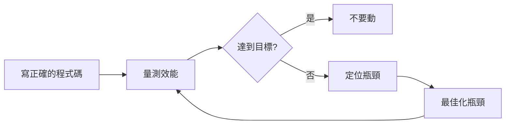
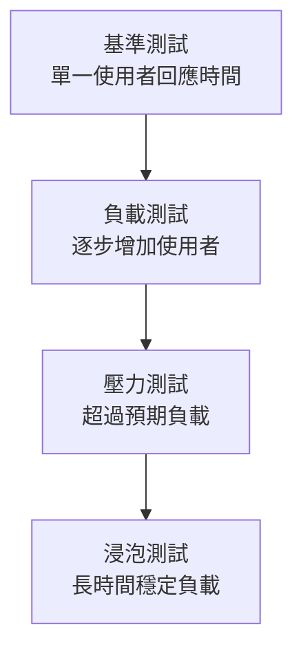

# 07 效能調校與壓力測試

> **版本**：Java 17+ / Spring Boot 3.x / HikariCP 5.x — 涵蓋 JVM 調校、連線池、壓力測試、效能反模式

## 1、效能工程的正確態度

> **Donald Knuth**：「過早最佳化是萬惡之源」（Premature optimization is the root of all evil）。
>
> 但這不代表可以忽略效能。正確的做法是：**先讓程式正確，再量測，最後針對瓶頸最佳化**。



---

## 2、JVM 調校

### 2.1 常用 JVM 參數

```bash
java -jar app.jar \
  -Xms512m \             # 初始堆記憶體
  -Xmx2g \               # 最大堆記憶體
  -XX:+UseG1GC \         # 使用 G1 垃圾回收器（Java 17 預設）
  -XX:MaxGCPauseMillis=200 \  # 目標 GC 停頓時間
  -XX:+HeapDumpOnOutOfMemoryError \  # OOM 時自動 dump
  -XX:HeapDumpPath=/var/log/heap-dump.hprof
```

### 2.2 垃圾回收器選擇

| GC | 適用場景 | 特點 |
|----|---------|------|
| G1 GC | **通用推薦**（Java 17 預設） | 平衡吞吐量和延遲 |
| ZGC | 低延遲需求（< 10ms 停頓） | 大堆記憶體友好，Java 21 正式版 |
| Parallel GC | 批次處理、高吞吐量 | 停頓時間長但吞吐量最高 |

```bash
# ZGC（適合微服務、對延遲敏感的系統）
java -XX:+UseZGC -Xmx4g -jar app.jar

# 查看 GC 日誌
java -Xlog:gc*:file=gc.log:time,uptime,level,tags -jar app.jar
```

### 2.3 記憶體問題排查

```bash
# 查看 JVM 記憶體使用
jmap -heap <PID>

# 生成 heap dump
jmap -dump:format=b,file=heap.hprof <PID>

# 用 jstat 即時監控 GC
jstat -gcutil <PID> 1000  # 每秒輸出一次
```

**常見記憶體洩漏原因**：
- `static` 集合不斷增長
- 未關閉的資料庫連線 / Stream
- ThreadLocal 未清理
- 快取沒有設上限和淘汰策略

---

## 3、連線池調校（HikariCP）

Spring Boot 預設使用 HikariCP，是目前最快的 JDBC 連線池。

### 3.1 關鍵參數

```yaml
spring:
  datasource:
    hikari:
      maximum-pool-size: 20        # 最大連線數
      minimum-idle: 5              # 最小空閒連線
      connection-timeout: 30000    # 取得連線的最大等待時間（ms）
      idle-timeout: 600000         # 空閒連線存活時間（10 分鐘）
      max-lifetime: 1800000        # 連線最大存活時間（30 分鐘）
      leak-detection-threshold: 60000  # 連線洩漏偵測（60 秒未歸還）
```

### 3.2 池大小計算

> **HikariCP 作者建議公式**：`connections = (core_count * 2) + effective_spindle_count`

| 伺服器 CPU | SSD | 建議連線數 |
|-----------|-----|----------|
| 4 核 | 是 | 10 ~ 15 |
| 8 核 | 是 | 20 ~ 25 |
| 16 核 | 是 | 35 ~ 40 |

**反直覺**：連線池不是越大越好。過大的連線池反而會因為 Context Switch 和鎖競爭導致效能下降。

### 3.3 連線洩漏排查

```java
// 錯誤：手動取得連線後忘記關閉
Connection conn = dataSource.getConnection();
PreparedStatement ps = conn.prepareStatement(sql);
ResultSet rs = ps.executeQuery();
// 忘記 conn.close()  → 連線洩漏

// 正確：try-with-resources 自動關閉
try (Connection conn = dataSource.getConnection();
     PreparedStatement ps = conn.prepareStatement(sql);
     ResultSet rs = ps.executeQuery()) {
    // 處理結果
}  // 自動關閉
```

---

## 4、常見效能反模式

### 4.1 N+1 查詢

```java
// 反模式：N+1 查詢（1 次查訂單 + N 次查使用者）
List<Order> orders = orderRepository.findAll();  // 1 次 SQL
for (Order order : orders) {
    User user = userRepository.findById(order.getUserId());  // N 次 SQL
}

// 正確：JOIN 一次查完
@Query("SELECT o FROM Order o JOIN FETCH o.user")
List<Order> findAllWithUser();

// 或用 @EntityGraph
@EntityGraph(attributePaths = {"user"})
List<Order> findAll();

// MyBatis 解法：用 association + 嵌套查詢或嵌套結果集
```

### 4.2 在迴圈中呼叫遠端服務

```java
// 反模式：迴圈呼叫 API
for (Long userId : userIds) {
    UserResponse user = userClient.getUser(userId);  // N 次 HTTP 呼叫
}

// 正確：批次查詢
List<UserResponse> users = userClient.getUsersByIds(userIds);  // 1 次 HTTP
```

### 4.3 不當使用 String 拼接

```java
// 反模式：大量字串拼接
String result = "";
for (int i = 0; i < 10000; i++) {
    result += "item" + i;  // 每次產生新 String 物件
}

// 正確：用 StringBuilder
StringBuilder sb = new StringBuilder();
for (int i = 0; i < 10000; i++) {
    sb.append("item").append(i);
}
String result = sb.toString();
```

### 4.4 全表掃描

```java
// 反模式：沒有索引的查詢
@Query("SELECT u FROM User u WHERE u.email = :email")
Optional<User> findByEmail(String email);
// 如果 email 欄位沒有索引 → 全表掃描

// 正確：確保查詢欄位有索引
// CREATE INDEX idx_user_email ON users(email);
```

---

## 5、壓力測試

### 5.1 壓力測試工具比較

| 面向 | JMeter | Gatling | k6 | wrk |
|------|--------|---------|-----|-----|
| 腳本語言 | XML / GUI 操作 | Scala / Java DSL | JavaScript（ES6） | Lua（簡易） |
| 資源消耗 | 高（GUI 模式佔用大量記憶體） | 中（基於 Akka 非同步架構） | 低（Go 實作，單行程高效） | 極低（C 實作，適合極簡測試） |
| CI/CD 整合 | 可用 CLI 模式，但設定檔為 XML 不易維護 | Maven / Gradle 插件，報表自動產出 | 原生 CLI，腳本即程式碼，與 CI 整合最佳 | CLI 直接使用，但缺乏進階報表 |
| 學習曲線 | 低（GUI 友善） | 中（需熟悉 Scala DSL） | 低（JavaScript 開發者友善） | 極低（幾乎零設定） |
| 適用情境 | 複雜協定（SOAP、JMS、JDBC）、傳統 QA 團隊 | 高併發 HTTP 測試、需要精美報表 | 現代 API 測試、CI/CD Pipeline 內嵌 | 快速基準測試、單一端點吞吐量驗證 |

> **選擇建議**：CI/CD 優先選 k6；需要 GUI 或多協定支援選 JMeter；追求高效能模擬選 Gatling。

### 5.2 JMeter 基本使用

> 此為教學簡化範例

```
Thread Group（模擬使用者）
├── HTTP Request（API 呼叫）
├── Assertion（驗證回應）
└── Listener（收集結果）
```

**關鍵指標**：

| 指標 | 說明 | 健康值（參考） |
|------|------|-------------|
| TPS（Transactions Per Second） | 每秒處理請求數 | 依業務目標 |
| P95 回應時間 | 95% 的請求在此時間內完成 | < 500ms |
| P99 回應時間 | 99% 的請求在此時間內完成 | < 1000ms |
| 錯誤率 | 失敗請求比例 | < 0.1% |

### 5.3 壓測策略



| 測試類型 | 目的 | 做法 |
|---------|------|------|
| 基準測試 | 建立效能基線 | 1 使用者 × 100 次請求 |
| 負載測試 | 找出系統容量 | 逐步增加到預期 2 倍使用者 |
| 壓力測試 | 找出崩潰點 | 持續增加直到系統錯誤率飆升 |
| 浸泡測試 | 找出記憶體洩漏 | 正常負載持續 4-24 小時 |

### 5.4 Spring Boot 效能監控端點

```yaml
management:
  endpoints:
    web:
      exposure:
        include: health,metrics,prometheus
  metrics:
    tags:
      application: ${spring.application.name}
```

```bash
# 查看 HTTP 請求統計
curl http://localhost:8080/actuator/metrics/http.server.requests

# 查看 JVM 記憶體
curl http://localhost:8080/actuator/metrics/jvm.memory.used

# 查看 HikariCP 連線池
curl http://localhost:8080/actuator/metrics/hikaricp.connections.active
```

---

## 6、Profiling 工具

| 工具 | 用途 | 特點 |
|------|------|------|
| VisualVM | JVM 即時監控 | 免費，自 JDK 9 起需從 [visualvm.github.io](https://visualvm.github.io/) 另外下載 |
| JProfiler | 深度效能分析 | 商用，功能最全面 |
| async-profiler | CPU / 記憶體分析 | 開源，低開銷，生產可用 |
| Arthas | 線上診斷 | 阿里開源，不需重啟 JVM |

```bash
# async-profiler 範例：生成 CPU 火焰圖
profiler.sh -d 30 -f flamegraph.html <PID>
```

---

## 7、小結

| 領域 | 關鍵指標 | 常見陷阱 |
|------|---------|---------|
| JVM | Heap 使用率 < 80%、Full GC 次數 | Xmx 設太小 / 記憶體洩漏 |
| 連線池 | Active / Total、等待時間 | 池太大反而慢、連線洩漏 |
| SQL | 慢查詢（> 1s）、N+1 | 缺索引、JOIN FETCH 未用 |
| API | P95 < 500ms、錯誤率 < 0.1% | 迴圈呼叫遠端服務 |

> **延伸閱讀**：
> - [05 日誌、監控與可觀測性](05%20日誌、監控與可觀測性.md) — Micrometer 指標收集
> - [02 索引原理與 SQL 優化](../05-Database/02%20索引原理與%20SQL%20優化.md) — 資料庫效能最佳化
> - [05 JVM 記憶體與垃圾回收](../07-CS-Fundamentals/05%20JVM%20記憶體與垃圾回收.md) — GC 原理詳解
