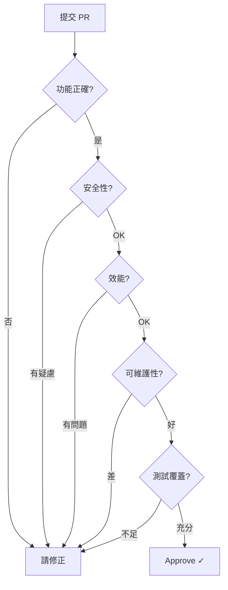
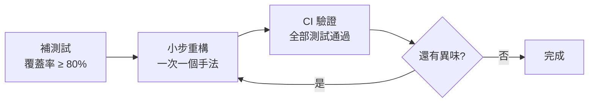
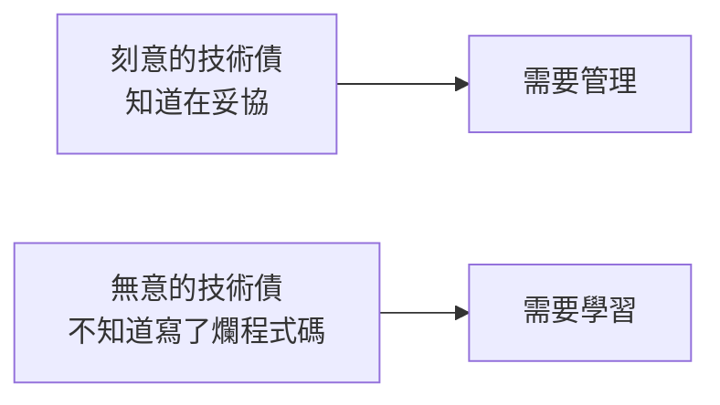

# 08 程式碼審查與重構

> **版本**：Java 17+ / Spring Boot 3.x — 涵蓋 Code Review 流程、Martin Fowler 重構手法、程式碼異味、技術債管理

## 1、程式碼審查（Code Review）

### 1.1 為什麼要做 Code Review

Code Review 不只是「找 Bug」。根據 Google 工程實踐，Code Review 的主要目的是：

1. **知識分享** — 團隊成員了解彼此的程式碼
2. **維護程式碼品質** — 確保一致的風格和架構
3. **提早發現問題** — Bug 在 Review 階段修復成本最低
4. **培養資淺工程師** — 從 Review 意見中學習

### 1.2 Review Checklist



**具體檢查項目**：

| 層面 | 檢查內容 |
|------|---------|
| 功能 | 邏輯正確、邊界條件處理、錯誤處理 |
| 安全 | 輸入驗證、SQL 注入、敏感資料處理 |
| 效能 | N+1 查詢、不必要的迴圈、大物件 |
| 可讀 | 命名清晰、函式不超過 30 行、無魔術數字 |
| 測試 | 有對應的單元測試 / 整合測試 |
| 規範 | 符合團隊 Coding Standard |

### 1.3 給出好的 Review 意見

```
// 不好的 Review 意見
❌ "這段程式碼不好"
❌ "為什麼要這樣寫？"

// 好的 Review 意見
✅ "這裡用 Optional.map() 可以避免巢狀 if-null 檢查，例如：..."
✅ "建議把這段邏輯抽到 OrderValidator，因為 OrderService 已經超過 300 行，
    符合 SRP 的話可以更好維護"
```

**原則**：
- 對事不對人
- 給出具體建議和範例
- 區分「必須修改」和「建議修改」
- 肯定好的設計

### 1.4 靜態分析工具輔助

手動 Code Review 容易遺漏格式、潛在 Bug 和安全漏洞，建議搭配自動化靜態分析工具作為補充：

| 工具 | 用途 | 整合方式 |
|------|------|---------|
| SonarQube | 程式碼品質綜合分析（Bug、漏洞、異味、覆蓋率） | CI/CD Pipeline 或 IDE 插件（SonarLint） |
| Checkstyle | Java 程式碼風格檢查（命名、格式、Javadoc） | Maven / Gradle 插件，PR 自動檢查 |
| SpotBugs | 靜態 Bug 偵測（空指標、資源洩漏、並發問題） | Maven / Gradle 插件，支援 CI 整合 |

> **建議**：在 CI Pipeline 中設定 SonarQube Quality Gate，未通過時阻擋合併。手動 Review 則專注在業務邏輯、架構設計等工具難以判斷的面向。

---

## 2、程式碼異味（Code Smells）

Martin Fowler 在《Refactoring》中定義了常見的程式碼異味：

### 2.1 過長函式（Long Method）

```java
// 異味：一個方法做太多事
public OrderResponse createOrder(CreateOrderRequest request) {
    // 驗證使用者（20 行）
    // 檢查庫存（15 行）
    // 計算價格（25 行）
    // 套用折扣（20 行）
    // 建立訂單（10 行）
    // 扣減庫存（10 行）
    // 發送通知（15 行）
    // 記錄日誌（10 行）
    // 共 125 行...
}

// 重構後：每個步驟獨立方法
public OrderResponse createOrder(CreateOrderRequest request) {
    User user = validateUser(request.userId());
    validateStock(request.items());
    Money totalPrice = calculatePrice(request.items());
    Money finalPrice = applyDiscount(totalPrice, request.couponCode());
    Order order = buildOrder(user, request.items(), finalPrice);
    deductStock(request.items());
    notifyUser(user, order);
    return OrderResponse.from(order);
}
```

### 2.2 過大的類別（Large Class）

```java
// 異味：一個 Service 管所有事（God Class）
public class OrderService {
    public Order create(...) { }
    public void cancel(...) { }
    public void refund(...) { }
    public void sendEmail(...) { }     // 不該在這裡
    public byte[] exportExcel(...) { } // 不該在這裡
    public void syncToERP(...) { }     // 不該在這裡
}

// 重構後：職責拆分
public class OrderService { create(), cancel(), refund() }
public class OrderNotificationService { sendEmail(), sendSMS() }
public class OrderExportService { exportExcel(), exportPDF() }
public class OrderSyncService { syncToERP() }
```

### 2.3 Feature Envy（功能依戀）

```java
// 異味：方法大量使用另一個類別的資料
public class OrderService {
    public Money calculateShipping(Address address) {
        if (address.getCity().equals("台北") &&
            address.getDistrict().equals("信義區") &&
            address.getZipCode().startsWith("110")) {
            return Money.of(0);  // 免運
        }
        return Money.of(100);
    }
}

// 重構後：邏輯移到資料所在的類別
public class Address {
    public boolean isInFreeShippingZone() {
        return "台北".equals(city) &&
               "信義區".equals(district) &&
               zipCode.startsWith("110");
    }
}

public class OrderService {
    public Money calculateShipping(Address address) {
        return address.isInFreeShippingZone() ? Money.of(0) : Money.of(100);
    }
}
```

### 2.4 常見異味速查表

| 異味 | 症狀 | 重構手法 |
|------|------|---------|
| Long Method | 函式超過 30 行 | Extract Method |
| Large Class | 類別超過 500 行 | Extract Class |
| Feature Envy | 大量存取別的類別的欄位 | Move Method |
| Data Clumps | 同一組參數到處出現 | Extract Class / Record |
| Primitive Obsession | 用 String 表示 Email、Money | 封裝為 Value Object |
| Switch Statements | 多處相同的 switch/if-else | Strategy Pattern / Polymorphism |
| Duplicated Code | 複製貼上的程式碼 | Extract Method / Template Method |

---

## 3、重構手法

### 3.1 Extract Method（提取方法）

最常用的重構手法。把一段有意義的程式碼提取為獨立方法。

```java
// 重構前
public void processPayment(Order order) {
    // 計算稅金
    BigDecimal taxRate = new BigDecimal("0.05");
    BigDecimal tax = order.getSubtotal().multiply(taxRate);
    BigDecimal total = order.getSubtotal().add(tax);
    order.setTotalAmount(total);

    // 記錄日誌
    log.info("Order {} total: {}", order.getId(), total);
}

// 重構後
public void processPayment(Order order) {
    BigDecimal total = calculateTotalWithTax(order.getSubtotal());
    order.setTotalAmount(total);
    logOrderTotal(order.getId(), total);
}

private BigDecimal calculateTotalWithTax(BigDecimal subtotal) {
    BigDecimal taxRate = new BigDecimal("0.05");
    return subtotal.add(subtotal.multiply(taxRate));
}
```

### 3.2 Replace Conditional with Polymorphism

```java
// 重構前：switch 地獄
public BigDecimal calculateDiscount(Order order) {
    switch (order.getCustomerType()) {
        case "VIP": return order.getTotal().multiply(new BigDecimal("0.8"));
        case "GOLD": return order.getTotal().multiply(new BigDecimal("0.9"));
        case "NORMAL": return order.getTotal();
        default: throw new IllegalArgumentException("Unknown type");
    }
}

// 重構後：多型 + Spring 注入
public interface DiscountStrategy {
    BigDecimal apply(BigDecimal total);
    String getType();

    static DiscountStrategy identity() {
        return new DiscountStrategy() {
            public BigDecimal apply(BigDecimal total) { return total; }
            public String getType() { return "NONE"; }
        };
    }
}

@Component
public class VipDiscount implements DiscountStrategy {
    public BigDecimal apply(BigDecimal total) {
        return total.multiply(new BigDecimal("0.8"));
    }
    public String getType() { return "VIP"; }
}

@Service
public class DiscountService {
    private final Map<String, DiscountStrategy> strategies;

    public DiscountService(List<DiscountStrategy> strategyList) {
        this.strategies = strategyList.stream()
            .collect(Collectors.toMap(DiscountStrategy::getType, Function.identity()));
    }

    public BigDecimal calculate(String type, BigDecimal total) {
        return strategies.getOrDefault(type, DiscountStrategy.identity()).apply(total);
    }
}
```

### 3.3 什麼時候不該重構

重構不是萬靈丹，以下情境應暫緩或避免重構：

| 情境 | 原因 | 建議做法 |
|------|------|---------|
| 緊迫的交付期限且缺乏測試覆蓋 | 沒有測試保護的重構容易引入 Bug，趕工期間風險加倍 | 先交付，事後補測試再重構 |
| 運作正常且極少修改的遺留程式碼 | 投入重構的成本遠大於維護收益 | 遵循「不碰不改」原則，僅在需要新增功能時順帶改善 |
| 程式碼問題已嚴重到需要重寫 | 架構根本性錯誤，小步重構無法解決 | 評估「重構 vs 重寫」：若重構成本超過重寫的 70%，考慮重寫 |
| 對業務邏輯理解不足 | 錯誤的重構比不重構更危險 | 先釐清需求和業務規則，再動手 |

### 3.4 重構的風險控制

重構的核心原則是 **不改變外部行為**。為了確保安全，需要嚴格的防護措施：

1. **最低測試覆蓋率門檻** — 重構目標區域的測試覆蓋率至少 80%，若不足，先補測試再重構
2. **小步重構 + CI 驗證** — 每次只做一個重構手法（Extract Method、Move Class 等），提交後由 CI 自動跑測試確認無破壞
3. **行為不變原則** — 重構過程中不同時新增功能或修改邏輯，兩者分開在不同的 commit
4. **可逆操作** — 使用版本控制，確保每一步都能 revert；大規模重構前先建立分支



---

## 4、技術債管理

### 4.1 什麼是技術債

Ward Cunningham 提出的比喻：為了快速交付而做的妥協，像借了一筆「債」，需要日後「還」（重構）。



### 4.2 技術債的分類與處理

| 類型 | 範例 | 處理策略 |
|------|------|---------|
| 設計債 | 缺乏抽象、God Class | 定期重構 Sprint |
| 程式碼債 | 重複程式碼、魔術數字 | Code Review 時修正 |
| 測試債 | 沒有測試或測試品質差 | 新功能必須帶測試 |
| 依賴債 | 過時的 library、安全漏洞 | 定期更新 + Dependabot |
| 文件債 | 缺少 API 文件 / README | 每個 PR 必須更新相關文件 |

### 4.3 管理技術債的實踐

1. **Boy Scout Rule**：「離開時比來時更乾淨」— 每次修改順手改善周邊程式碼
2. **技術債登記**：用 Issue Tracker 記錄，標記為 `tech-debt`
3. **每個 Sprint 分配 20% 時間**處理技術債
4. **程式碼度量**：定期檢查類別大小、方法複雜度、重複率

---

## 5、小結

| 實踐 | 核心原則 | 頻率 |
|------|---------|------|
| Code Review | 每個 PR 必須至少 1 人 Review | 每次提交 |
| 重構 | 小步重構，每次只改一個異味 | 持續進行 |
| 技術債管理 | 登記、排序、定期償還 | 每個 Sprint |
| 異味偵測 | 函式 > 30 行、類別 > 500 行就要警覺 | 持續進行 |

> **延伸閱讀**：
> - [01 SOLID 原則與 Clean Code](01%20SOLID%20原則與%20Clean%20Code.md) — 設計原則指導重構方向
> - [02 設計模式實戰應用](02%20設計模式實戰應用.md) — 用模式解決程式碼異味
> - [07 Git 與 GitHub 版本控制](../08-DevOps/07%20Git%20與%20GitHub%20版本控制.md) — PR 工作流程

---
審查狀態：APPROVED — 2026-Q1
- [x] 技術正確性
- [x] 架構與方法論
- [x] 生產實戰
- [x] 內容結構
- [x] 術語與一致性
- [x] 讀者路徑
- [x] 時效性
