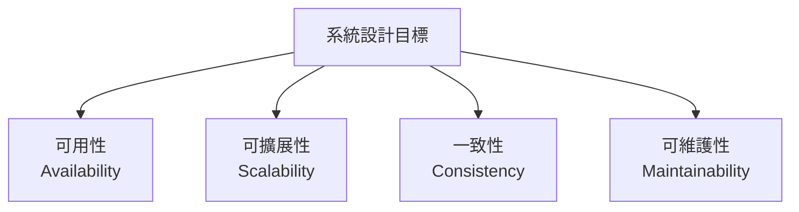
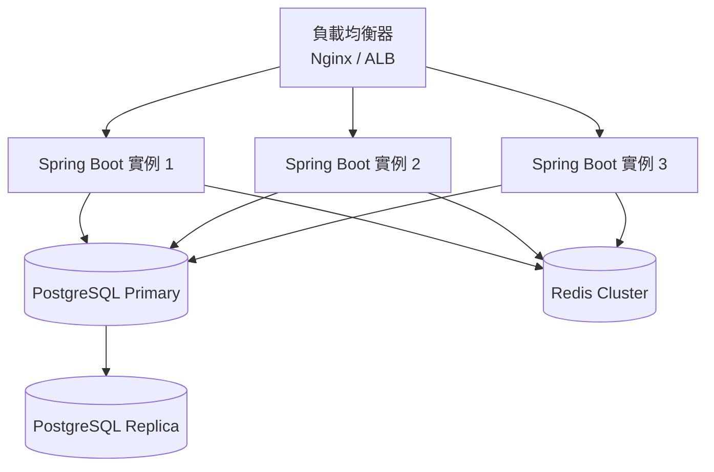

# 09 系統設計入門

> **版本**：Java 17+ / Spring Boot 3.x — 涵蓋高可用、水平擴展、CAP 定理、訊息佇列、Twelve-Factor App

## 1、系統設計的核心目標

系統設計不是畫漂亮的架構圖，而是回答一個問題：**當流量增長 10 倍，系統還能正常運作嗎？**



---

## 2、高可用設計

### 2.1 可用性指標

| 等級 | 可用性 | 年停機時間 |
|------|-------|----------|
| 兩個 9 | 99% | 3.65 天 |
| 三個 9 | 99.9% | 8.77 小時 |
| 四個 9 | 99.99% | 52.6 分鐘 |
| 五個 9 | 99.999% | 5.26 分鐘 |

> 大多數企業應用目標是 **三個 9**（99.9%），電商/金融需要四個 9。

### 2.2 消除單點故障



**關鍵原則**：每一層都不能只有一個節點。

| 層級 | 單點 | 解法 |
|------|------|------|
| 應用層 | 只有 1 台伺服器 | 多實例 + 負載均衡 |
| 資料庫 | 只有 1 台 DB | Primary-Replica 複製 |
| 快取 | 只有 1 台 Redis | Redis Cluster / Sentinel |
| 負載均衡 | 只有 1 台 LB | 雲端 ALB（自動高可用） |

### 2.3 健康檢查與自動恢復

```yaml
# Spring Boot Actuator 健康檢查
management:
  endpoint:
    health:
      show-details: always
  health:
    db:
      enabled: true
    redis:
      enabled: true
```

```java
// 自訂健康檢查
@Component
public class PaymentGatewayHealthIndicator implements HealthIndicator {
    @Override
    public Health health() {
        boolean reachable = checkPaymentGateway();
        return reachable
            ? Health.up().withDetail("gateway", "reachable").build()
            : Health.down().withDetail("gateway", "unreachable").build();
    }
}
```

---

## 3、水平擴展 vs 垂直擴展

| 策略 | 做法 | 優點 | 限制 |
|------|------|------|------|
| 垂直擴展（Scale Up） | 加 CPU / 記憶體 | 簡單，不改程式碼 | 有硬體上限 |
| 水平擴展（Scale Out） | 加更多機器 | 理論上無上限 | 需要無狀態設計 |

### 3.1 無狀態設計（Stateless）

水平擴展的前提是**每台伺服器都一樣**，不依賴本地狀態。

```java
// 錯誤：狀態存在記憶體中（無法水平擴展）
@Component
public class CartService {
    private final Map<Long, Cart> carts = new ConcurrentHashMap<>();  // 本地記憶體
}

// 正確：狀態存在外部儲存（Redis）
@Service
public class CartService {
    private final RedisTemplate<String, Cart> redisTemplate;

    public Cart getCart(Long userId) {
        return redisTemplate.opsForValue().get("cart:" + userId);
    }
}
```

**需要外部化的狀態**：
- Session → Redis / JWT
- 快取 → Redis
- 檔案上傳 → S3 / MinIO
- 排程任務 → 分散式排程（Quartz Cluster / Spring Scheduler + Redis Lock）

---

## 4、CAP 定理

分散式系統不可能同時滿足三者，只能三選二：

| 特性 | 說明 |
|------|------|
| **C**onsistency（一致性） | 所有節點同一時間看到相同資料 |
| **A**vailability（可用性） | 每個請求都能收到回應 |
| **P**artition Tolerance（分區容忍） | 網路分區時系統仍能運作 |

> **現實中**：P 是必須的（網路一定會出問題），所以實際選擇是 **CP** 或 **AP**。

| 選擇 | 場景 | 範例 |
|------|------|------|
| CP | 資料正確性優先 | 銀行轉帳、庫存扣減 |
| AP | 可用性優先 | 社群媒體動態、推薦系統 |

**實務折衷 — 最終一致性（Eventual Consistency）**：

大多數系統不需要強一致性，而是選擇「最終一致性」。例如：下單後庫存可能短暫不一致，但幾秒後會一致。

---

## 5、訊息佇列

### 5.1 為什麼需要訊息佇列

```mermaid
flowchart LR
    subgraph 同步（緊耦合）
        A1[下單] --> B1[扣庫存]
        B1 --> C1[扣款]
        C1 --> D1[寄信]
        D1 --> E1[回應使用者]
    end
```

問題：任一步驟失敗，整個流程失敗；回應時間是所有步驟的總和。

```mermaid
flowchart LR
    subgraph 非同步（鬆耦合）
        A2[下單] --> MQ[(訊息佇列)]
        MQ --> B2[扣庫存]
        MQ --> C2[扣款]
        MQ --> D2[寄信]
        A2 --> E2[立即回應使用者]
    end
```

### 5.2 常見訊息佇列比較

| 特性 | RabbitMQ | Kafka | Redis Stream |
|------|----------|-------|-------------|
| 吞吐量 | 中等 | 極高 | 高 |
| 延遲 | 低（ms 級） | 中等 | 低 |
| 持久化 | 支援 | 天然持久化 | 支援 |
| 適用場景 | 任務佇列、通知 | 事件流、日誌收集 | 輕量級訊息 |
| 學習曲線 | 低 | 高 | 最低 |

### 5.3 Spring Boot 整合

```java
// RabbitMQ 範例
@Component
public class OrderEventPublisher {
    private final RabbitTemplate rabbitTemplate;

    public void publishOrderCreated(Order order) {
        rabbitTemplate.convertAndSend("order.exchange", "order.created",
            new OrderCreatedEvent(order.getId(), order.getUserId()));
    }
}

@Component
public class InventoryEventListener {
    @RabbitListener(queues = "inventory.queue")
    public void handleOrderCreated(OrderCreatedEvent event) {
        inventoryService.deduct(event.orderId());
    }
}
```

---

## 6、微服務拆分依據

### 6.1 何時該拆微服務

| 信號 | 說明 |
|------|------|
| 團隊超過 8 人 | 單體專案的 merge conflict 頻繁 |
| 部署頻率不同 | 部分模組每天部署，部分一個月一次 |
| 擴展需求不同 | 訂單服務需要 10 台，使用者服務只需 2 台 |
| 技術棧不同 | 部分功能用 Python 更適合（如 ML） |

### 6.2 何時不該拆

> **Martin Fowler**：先做好單體架構（Monolith First），再考慮拆分。

| 反信號 | 說明 |
|--------|------|
| 團隊 < 5 人 | 微服務的維運成本高於開發效率增益 |
| 業務邊界不清 | 拆錯了比不拆更痛苦 |
| 沒有 CI/CD | 手動部署 10 個服務是惡夢 |

---

## 7、Twelve-Factor App

Heroku 提出的雲原生應用 12 條原則（節錄最重要的）：

| # | 原則 | Spring Boot 對應 |
|---|------|-----------------|
| III | Config — 設定存在環境變數 | `application.yml` + `${ENV}` |
| IV | Backing Services — 外部服務當作附加資源 | DataSource / Redis 配置 |
| VI | Processes — 無狀態 | Session 存 Redis |
| VII | Port Binding — 自帶 Port | 嵌入式 Tomcat |
| VIII | Concurrency — 水平擴展 | 多實例部署 |
| XI | Logs — 日誌當作事件流 | 輸出到 stdout，由平台收集 |

---

## 8、小結

| 概念 | 核心原則 | 取捨 |
|------|---------|------|
| 高可用 | 消除單點故障 | 成本增加 |
| 水平擴展 | 無狀態設計 | 狀態外部化的複雜度 |
| CAP | 三選二（通常選 AP + 最終一致） | 一致性 vs 可用性 |
| 訊息佇列 | 非同步解耦 | 引入最終一致性問題 |
| 微服務 | 獨立部署、獨立擴展 | 維運成本和分散式複雜度 |

> **延伸閱讀**：
> - [03 軟體架構模式](03%20軟體架構模式.md) — DDD、CQRS、事件驅動詳解
> - [01 Spring Cloud 概述與微服務架構](../03-Microservices/01%20Spring%20Cloud%20概述與微服務架構.md) — 微服務框架
> - [04 Redis 快取實戰](../05-Database/04%20Redis%20快取實戰.md) — 分散式快取與鎖
