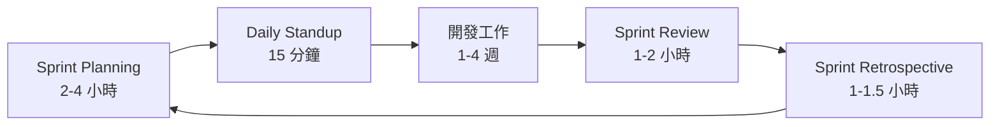

# 10 敏捷開發與團隊協作

> **版本**：Scrum Guide 2020 — 涵蓋 Scrum 框架、Sprint 實踐、估算、ADR、技術文件撰寫

## 1、敏捷宣言

2001 年 17 位軟體開發者共同簽署的《敏捷軟體開發宣言》：

| 更重視 | 勝過 |
|--------|------|
| **個人與互動** | 流程與工具 |
| **可用的軟體** | 詳盡的文件 |
| **客戶協作** | 合約談判 |
| **回應變化** | 遵循計畫 |

> 「右邊的項目不是沒有價值，而是左邊的更有價值。」

**常見誤解**：

| 誤解 | 事實 |
|------|------|
| 敏捷 = 不寫文件 | 寫**必要的**文件，不寫**沒人看的**文件 |
| 敏捷 = 沒有計畫 | 有計畫，但計畫是**滾動調整**的 |
| 敏捷 = 快速交付 | 核心是**持續交付價值**，不是趕工 |

---

## 2、Scrum 框架

### 2.1 角色

| 角色 | 職責 | 常見問題 |
|------|------|---------|
| Product Owner（PO） | 管理 Product Backlog、決定優先級 | PO 不做決定，團隊空轉 |
| Scrum Master（SM） | 排除障礙、確保流程執行 | SM 變成專案經理（不該指派工作） |
| Development Team | 自組織、交付 Increment | 團隊人數過多（建議 3-9 人） |

### 2.2 事件



| 事件 | 時間盒 | 目的 |
|------|--------|------|
| Sprint Planning | Sprint 長度 / 24（如 2 週 Sprint → 4 小時） | 決定本次 Sprint 做什麼、怎麼做 |
| Daily Standup | 15 分鐘（嚴格） | 同步進度、識別障礙 |
| Sprint Review | 1-2 小時 | 展示成果、收集回饋 |
| Sprint Retrospective | 1-1.5 小時 | 團隊反思、持續改善 |

### 2.3 工件

| 工件 | 說明 |
|------|------|
| Product Backlog | 所有待辦事項，由 PO 排優先級 |
| Sprint Backlog | 本次 Sprint 承諾完成的項目 |
| Increment | 每個 Sprint 結束時的「可用產品」 |

---

## 3、User Story 與估算

### 3.1 User Story 格式

```
As a <角色>,
I want <功能>,
So that <價值>.
```

**範例**：

```
As a 門市店員,
I want 在交班時自動計算當日營業額,
So that 我不需要手動加總，減少出錯。

驗收標準（Acceptance Criteria）：
- [ ] 交班頁面顯示當日現金/刷卡/轉帳各自小計
- [ ] 總計金額與發票系統的金額一致
- [ ] 可列印交班報表
```

### 3.2 Story Point 估算

Story Point 不是時間，而是**相對複雜度**。

| 點數 | 複雜度 | 參考 |
|------|--------|------|
| 1 | 改一個設定 | 修改 application.yml |
| 2 | 簡單 CRUD | 新增一個查詢 API |
| 3 | 標準功能 | 新增含驗證的表單 |
| 5 | 中等複雜 | 新增含權限控制的模組 |
| 8 | 複雜 | 串接外部 API + 異步處理 |
| 13 | 非常複雜 | 需要拆分成多個 Story |

**Planning Poker**：團隊成員各自出牌，差異大時討論，取共識。

> **規則**：如果估出 13 以上，代表這個 Story 太大，必須拆分。

### 3.3 速度（Velocity）

```
Sprint 1: 完成 21 點
Sprint 2: 完成 18 點
Sprint 3: 完成 24 點
平均 Velocity = (21 + 18 + 24) / 3 = 21 點/Sprint
```

用 Velocity 預測：如果 Backlog 還有 84 點，大約需要 4 個 Sprint。

---

## 4、看板（Kanban）

適合維運型、持續交付的團隊（不適合用 Sprint 的場景）。

```
| To Do | In Progress (WIP: 3) | Review | Done |
|-------|----------------------|--------|------|
| Task5 | Task1                | Task3  | TaskA|
| Task6 | Task2                |        | TaskB|
|       | Task4                |        | TaskC|
```

**核心原則**：
1. **限制 WIP（Work In Progress）** — 同時進行的工作不超過 N 件
2. **視覺化工作流** — 看板讓所有人看到全局
3. **持續交付** — 完成一個再拉新的，不批次處理

| Scrum | Kanban |
|-------|--------|
| 固定 Sprint 週期 | 持續流動 |
| 計畫性承諾 | 按需拉取 |
| 角色明確（PO/SM/Team） | 角色靈活 |
| 適合產品開發 | 適合維運/支援 |

---

## 5、架構決策紀錄（ADR）

Architecture Decision Record — 記錄「為什麼這樣設計」的輕量級文件。

### 5.1 格式

```markdown
# ADR-001: 使用 PostgreSQL 作為主要資料庫

## 狀態
已接受（2026-03-15）

## 背景
系統需要關聯式資料庫，支援 JSON 查詢和全文搜尋。

## 決策
選擇 PostgreSQL 15+。

## 理由
- JSONB 支援比 MySQL 更成熟
- 全文搜尋內建（不需額外安裝 Elasticsearch）
- 團隊成員熟悉度高

## 被拒絕的方案
- MySQL 8：JSONB 功能較弱
- MongoDB：不需要 NoSQL 的彈性，且增加維運成本

## 後果
- 需要熟悉 PostgreSQL 特有語法（如 JSONB 運算子）
- Docker Compose 需要包含 PostgreSQL image
```

### 5.2 何時該寫 ADR

| 該寫 | 不需要 |
|------|--------|
| 選擇框架/資料庫 | 命名風格 |
| 架構模式（分層 vs 六角） | CSS 框架 |
| 認證方式（JWT vs Session） | 特定函式的實作方式 |
| API 版本策略 | 單一 Bug Fix |

---

## 6、技術文件撰寫

### 6.1 必要的文件

| 文件 | 讀者 | 內容 |
|------|------|------|
| README.md | 新加入的工程師 | 專案概述、如何啟動、技術棧 |
| API 文件 | 前端/合作方 | SpringDoc OpenAPI 自動產生 |
| ADR | 團隊工程師 | 架構決策紀錄 |
| 維運手冊 | DevOps / 值班人員 | 如何部署、如何排錯、聯絡人 |

### 6.2 文件即程式碼（Docs as Code）

- 用 **Markdown** 撰寫，放在 Git 倉庫
- 用 **PR** 審查文件變更
- 用 **CI** 檢查連結是否損壞
- **API 文件由程式碼產生**（SpringDoc），不要手寫

---

## 7、Sprint 回顧會議的實用技巧

### 7.1 回顧格式

```
做得好的（Keep）：
- CI/CD 管線穩定，部署零失敗
- Code Review 回應速度快

需要改進的（Problem）：
- Sprint 後期需求變更太多
- 測試環境不穩定

嘗試改善（Try）：
- PO 在 Sprint Planning 後凍結需求
- 建立測試環境自動重建機制
```

### 7.2 回顧反模式

| 反模式 | 問題 | 解法 |
|--------|------|------|
| 只有抱怨沒有行動 | 每次講一樣的問題 | 每個 Problem 必須有 Action Item + 負責人 |
| 只有主管發言 | 團隊不敢說真話 | 匿名投票 + SM 引導 |
| 跳過回顧 | 「太忙了沒時間」 | 回顧是改善的唯一機會，不能跳 |

---

## 8、小結

| 概念 | 核心原則 |
|------|---------|
| Scrum | 固定節奏 + 自組織 + 持續改善 |
| User Story | 以使用者價值為中心，附帶驗收標準 |
| 估算 | 相對複雜度（Story Point），不是時間 |
| 看板 | 限制 WIP + 視覺化 + 持續流動 |
| ADR | 記錄「為什麼」，不只是「是什麼」 |
| 文件 | 必要且活的文件，Docs as Code |

> **延伸閱讀**：
> - [08 程式碼審查與重構](08%20程式碼審查與重構.md) — Code Review 流程與技巧
> - [06 CI/CD 流程（GitHub Actions）](../08-DevOps/06%20CI／CD%20流程（GitHub%20Actions）.md) — 持續整合支撐敏捷交付
> - [07 Git 與 GitHub 版本控制](../08-DevOps/07%20Git%20與%20GitHub%20版本控制.md) — PR 與分支策略
