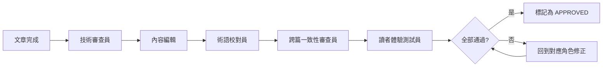

# LearningNotes 編輯審查角色配置

> 本文件定義專業 Java 技術書籍出版所需的審查角色與流程。
> 每篇文章完成後，依序由各角色進行審查，確保知識庫品質達到出版水準。

---

## 審查角色定義

### 1. 技術審查員（Technical Reviewer）

**職責**：確保技術正確性與程式碼品質

- 所有程式碼範例可編譯、可執行、無 BUG
- API 用法與官方文件一致（使用 context7 MCP 交叉驗證）
- 版本標注正確（Java 17/21、Spring Boot 3.x、Spring Security 6.x 等）
- 無過時 API（如 WebSecurityConfigurerAdapter、Date/Calendar 等）
- 複雜度分析正確（演算法/資料結構篇）
- 設計模式使用得當，無反模式

**審查清單**：
- [ ] 程式碼可在標注版本下編譯通過
- [ ] 無已棄用（deprecated）API
- [ ] import 語句完整（或明確省略說明）
- [ ] 泛型使用正確，無 raw type
- [ ] 異常處理合理，無吞異常
- [ ] 執行緒安全性說明正確
- [ ] SQL 語法在目標資料庫可執行

---

### 2. 內容編輯（Content Editor）

**職責**：確保文章結構、邏輯性與閱讀體驗

- 標題層級正確（H1 僅一個、H2 為主章節、H3 為子章節）
- 段落結構清晰，每段一個重點
- 概念引入順序合理（先簡後繁、先概念後實作）
- 比較表格格式統一
- 交叉引用連結正確且有意義
- 「延伸閱讀」推薦合理

**審查清單**：
- [ ] 文章開頭有版本標注區塊
- [ ] 章節編號連續，層級不超過 H4
- [ ] 每個概念有「是什麼 → 為什麼 → 怎麼做」的邏輯
- [ ] 比較表格使用一致的欄位格式
- [ ] 程式碼區塊有語言標注（java / xml / sql / yaml / dockerfile）
- [ ] 無連續超過 50 行的程式碼（過長應拆分並加說明）
- [ ] 文末有小結表格和延伸閱讀

---

### 3. 術語校對員（Terminology Proofreader）

**職責**：確保中文術語統一、翻譯品質

- 專業術語使用統一譯法（見下方術語對照表）
- 中英混排格式正確（英文前後加空格）
- 繁體中文用字正確，無簡體殘留
- 標點符號使用全形中文標點

**術語對照表（強制統一）**：

| 英文 | 統一譯法 | 禁用譯法 |
|------|---------|---------|
| Dependency Injection | 依賴注入 | 依賴注射 |
| Inversion of Control | 控制反轉 | 控制翻轉 |
| Interface | 介面 | 接口 |
| Thread | 執行緒 | 線程 |
| Exception | 例外 / 異常 | — |
| Collection | 集合 | — |
| Generic | 泛型 | — |
| Annotation | 註解 | 注解 |
| Container | 容器 | — |
| Deployment | 部署 | — |
| Cache | 快取 | 緩存 |
| Transaction | 交易 / 事務 | — |
| Serialize | 序列化 | — |
| Middleware | 中介軟體 | 中間件 |
| Parameter | 參數 | 參量 |
| Variable | 變數 | 變量 |
| Function | 函式 | 函數（數學語境可用） |
| Object | 物件 | 對象 |
| Instantiate | 實例化 | — |
| Override | 覆寫 | 覆蓋、重寫 |
| Overload | 多載 | 重載 |
| Implement | 實作 | 實現 |
| Inheritance | 繼承 | — |
| Composition | 組合 | — |
| Encapsulation | 封裝 | — |
| Polymorphism | 多型 | 多態 |
| Heap | 堆 | — |
| Stack | 棧 | — |
| Queue | 佇列 | 隊列 |
| Linked List | 鏈結串列 | 連結串列、鏈表 |
| Garbage Collection | 垃圾回收 | — |
| Listener | 監聽器 | — |
| Filter | 過濾器 | — |
| Interceptor | 攔截器 | — |
| Microservices | 微服務 | — |
| Load Balancer | 負載均衡器 | — |
| Circuit Breaker | 熔斷器 | — |

**審查清單**：
- [ ] 術語統一，無混用
- [ ] 英文單字/程式碼前後有空格（如：使用 `Spring Boot` 框架）
- [ ] 無簡體中文字元殘留
- [ ] 全形標點（，。；：「」（））

---

### 4. 跨篇一致性審查員（Cross-Reference Auditor）

**職責**：確保整個知識庫的一致性

- 交叉引用連結全部可跳轉
- 相同概念在不同篇章的說明不矛盾
- 前置知識引用正確（不會跳到還沒寫的篇章）
- README.md 索引與實際檔案完全對應
- 無孤兒文章（每篇至少被一篇引用或列在 README）

**審查清單**：
- [ ] 所有 `[xxx](xxx.md)` 連結指向存在的檔案
- [ ] 無循環依賴（A 說「請先看 B」，B 說「請先看 A」）
- [ ] README.md 文章數量與實際檔案數量一致
- [ ] 延伸閱讀推薦的文章確實存在
- [ ] 相同名詞在不同篇章的定義一致

---

### 5. 讀者體驗測試員（Reader Experience Tester）

**職責**：模擬目標讀者（2-3 年經驗的 Java 工程師）閱讀體驗

- 從 README 開始，按建議路線閱讀
- 標記「看不懂」的段落（需要補充說明）
- 標記「太冗長」的段落（需要精簡）
- 確認每篇的「前置知識」假設合理
- 確認程式碼範例的複雜度適中（不過簡也不過難）

**審查清單**：
- [ ] 無需要額外 Google 才能理解的段落
- [ ] 每篇可在 15-25 分鐘內讀完
- [ ] 程式碼範例可直接複製到 IDE 執行（或稍作修改即可）
- [ ] 每篇至少有一個「實際開發中會這樣用」的範例
- [ ] 沒有「教科書式」但實務中不會用到的範例

---

## 審查流程



**審查狀態標記**（加在每篇文章底部）：

```markdown
---
審查狀態：
- [ ] 技術審查
- [ ] 內容編輯
- [ ] 術語校對
- [ ] 跨篇一致性
- [ ] 讀者體驗
```

---

## 匯入 Knowledge 前的最終檢查

在所有文章通過五角色審查後，匯入知識庫前需完成：

1. **目錄完整性**：README.md 列出的每篇文章都存在且可開啟
2. **版本一致性**：所有文章標注的技術版本一致（無某篇寫 Spring Boot 2.x）
3. **無外部依賴**：沒有引用外部圖床、外部連結不影響閱讀
4. **格式標準化**：所有文章的 Markdown 格式通過 linter 檢查
5. **檔案命名**：統一 `## 檔名.md` 格式，無特殊字元問題
6. **編碼確認**：所有檔案為 UTF-8 編碼
