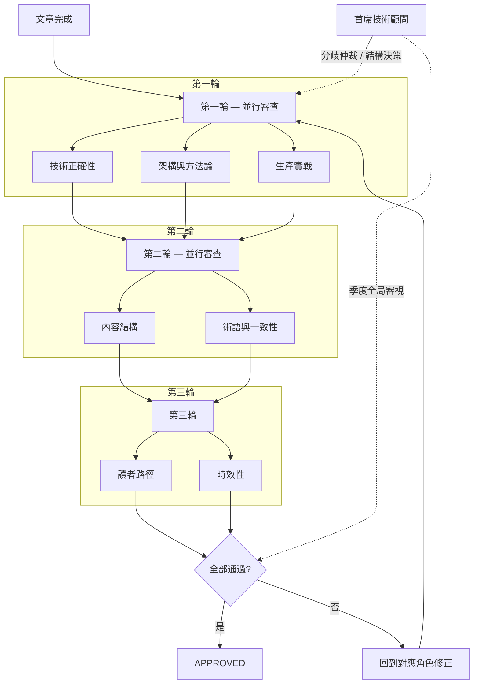

# LearningNotes 編輯審查角色配置

> 本文件定義知識庫的審查角色與流程。
> 每篇文章完成後，由各角色進行審查，確保品質達到專業出版水準。

---

## 審查角色定義

### 1. 技術正確性審查員（Technical Correctness Reviewer）

**職責**：確保程式碼可執行、API 用法正確、版本標注無誤

**覆蓋範圍**：全域（71 篇）

- 所有程式碼範例可在標注版本下編譯、執行、無 BUG
- API 用法與官方文件一致（使用 context7 MCP 交叉驗證）
- 版本標注正確（Java 17/21、Spring Boot 3.x、Spring Security 6.x 等）
- 無過時 API（如 WebSecurityConfigurerAdapter、Date/Calendar 等）
- 複雜度分析正確（演算法/資料結構篇）

**審查清單**：
- [ ] 程式碼可在標注版本下編譯通過
- [ ] 無已棄用（deprecated）API
- [ ] import 語句完整（或明確省略說明）
- [ ] 泛型使用正確，無 raw type
- [ ] 異常處理合理，無吞異常
- [ ] 執行緒安全性說明正確
- [ ] SQL 語法在目標資料庫可執行

---

### 2. 架構與方法論審查員（Architecture & Methodology Reviewer）

**職責**：確保設計原則、架構模式、安全/效能建議的正確性與實務可行性

**覆蓋範圍**：全域 — 任何涉及架構決策、設計原則、方法論的文章皆需審查

> 不僅限於 09-Software-Engineering，03-Microservices 的元件選型、02-Spring-Ecosystem 的分層設計、05-Database 的索引策略等皆屬審查範圍。

- 設計原則（SOLID/DRY/KISS）的解釋是否符合原始定義
- 架構模式（Hexagonal/DDD/CQRS/Event Sourcing）描述是否與業界共識一致
- 安全建議是否符合 OWASP 最新版
- 效能建議是否基於實測數據而非臆測
- 可觀測性方案是否符合 OpenTelemetry 規範
- 每個方案是否包含取捨分析（Trade-off）
- 方法論建議對目標讀者（2-3 年 Java 工程師）是否可操作

**權威來源對照**：

| 主題 | 對照標準 |
|------|---------|
| SOLID 原則 | Robert C. Martin《Clean Architecture》 |
| 重構 | Martin Fowler《Refactoring》 |
| DDD | Eric Evans《Domain-Driven Design》 |
| 設計模式 | GoF《Design Patterns》 |
| 安全 | OWASP Top 10（2025 版） |
| 可觀測性 | OpenTelemetry Specification |
| 效能 | 實測數據 + JVM 官方文件 |
| 微服務 | Sam Newman《Building Microservices》 |
| 分散式系統 | Martin Kleppmann《Designing Data-Intensive Applications》 |

**審查清單**：
- [ ] 每個原則/模式有「解決什麼問題」和「不用會怎樣」的說明
- [ ] 每篇至少 1 個反面教材（錯誤示範 → 正確示範）
- [ ] 每個架構決策有取捨分析（何時適用、何時不適用）
- [ ] 程式碼範例可在 Spring Boot 3.x 專案中直接使用
- [ ] 引述的原則定義與原始出處一致（非二手詮釋）
- [ ] 安全/效能數據有明確來源
- [ ] 至少 1 個真實業務場景的應用說明

---

### 3. 生產實戰審查員（Production Reality Reviewer）

**職責**：驗證文章建議在真實生產環境中的可行性、業界採用度、替代方案覆蓋

**覆蓋範圍**：全域 — 特別關注 03-Microservices、05-Database、08-DevOps、09-Software-Engineering

> 知識庫不能只教「怎麼配」，必須回答「生產環境真的這樣用嗎」「業界是否已有更好的替代方案」。

- 元件/框架的業界採用趨勢（是否進入維護模式、是否有更主流的替代方案）
- 生產環境的注意事項（連線池配置、GC 調校、安全 Header 等是否符合實務）
- 是否遺漏關鍵的生產場景（例如教了 Eureka 但沒提 Nacos/Consul 替代方案）
- 程式碼範例是否為「玩具程式碼」還是「生產級程式碼」
- 監控、告警、日誌等可維運性是否被提及

**審查清單**：
- [ ] 每個元件/框架有業界採用狀態說明（活躍/維護模式/已棄用）
- [ ] 有替代方案比較（至少提及 1 個主流替代）
- [ ] 生產環境注意事項不遺漏（安全、效能、維運）
- [ ] 無「只在 localhost 能跑」的範例（或明確標注為教學用途）
- [ ] 微服務篇有分散式事務、服務間通訊失敗的處理建議

---

### 4. 內容結構編輯（Content Structure Editor）

**職責**：確保文章結構、邏輯性與閱讀體驗

**覆蓋範圍**：全域

- 標題層級正確（H1 僅一個、H2 為主章節、H3 為子章節）
- 段落結構清晰，每段一個重點
- 概念引入順序合理（先簡後繁、先概念後實作）
- 比較表格格式統一
- 交叉引用連結正確且有意義
- 「延伸閱讀」推薦合理

**審查清單**：
- [ ] 文章開頭有版本標注區塊
- [ ] 章節編號連續，層級不超過 H4
- [ ] 每個概念有「是什麼 → 為什麼 → 怎麼做」的邏輯
- [ ] 比較表格使用一致的欄位格式
- [ ] 程式碼區塊有語言標注（java / xml / sql / yaml / dockerfile）
- [ ] 無連續超過 50 行的程式碼（過長應拆分並加說明）
- [ ] 文末有小結表格和延伸閱讀
- [ ] 無 ASCII art 圖表（一律使用 mermaid）

---

### 5. 術語與一致性審查員（Terminology & Consistency Auditor）

**職責**：確保中文術語統一、跨篇一致、交叉引用正確

**覆蓋範圍**：全域

> 合併原「術語校對員」與「跨篇一致性審查員」— 術語不統一和跨篇矛盾本質上是同一類問題。

**術語審查**：
- 專業術語使用統一譯法（見下方術語對照表）
- 中英混排格式正確（英文前後加空格）
- 繁體中文用字正確，無簡體殘留
- 標點符號使用全形中文標點

**跨篇一致性**：
- 交叉引用連結全部可跳轉
- 相同概念在不同篇章的說明不矛盾
- 前置知識引用正確（不會跳到還沒寫的篇章）
- README.md 索引與實際檔案完全對應
- 無孤兒文章（每篇至少被一篇引用或列在 README）
- 跨目錄引用雙向覆蓋（A → B 且 B → A）

**術語對照表（強制統一）**：

| 英文 | 統一譯法 | 禁用譯法 |
|------|---------|---------|
| Dependency Injection | 依賴注入 | 依賴注射 |
| Inversion of Control | 控制反轉 | 控制翻轉 |
| Interface | 介面 | 接口 |
| Thread | 執行緒 | 線程 |
| Exception | 例外 / 異常 | — |
| Collection | 集合 | — |
| Generic | 泛型 | — |
| Annotation | 註解 | 注解 |
| Container | 容器 | — |
| Deployment | 部署 | — |
| Cache | 快取 | 緩存 |
| Transaction | 交易 / 事務 | — |
| Serialize | 序列化 | — |
| Middleware | 中介軟體 | 中間件 |
| Parameter | 參數 | 參量 |
| Variable | 變數 | 變量 |
| Function | 函式 | 函數（數學語境可用） |
| Object | 物件 | 對象 |
| Instantiate | 實例化 | — |
| Override | 覆寫 | 覆蓋、重寫 |
| Overload | 多載 | 重載 |
| Implement | 實作 | 實現 |
| Inheritance | 繼承 | — |
| Composition | 組合 | — |
| Encapsulation | 封裝 | — |
| Polymorphism | 多型 | 多態 |
| Heap | 堆 | — |
| Stack | 棧 | — |
| Queue | 佇列 | 隊列 |
| Linked List | 鏈結串列 | 連結串列、鏈表 |
| Garbage Collection | 垃圾回收 | — |
| Listener | 監聽器 | — |
| Filter | 過濾器 | — |
| Interceptor | 攔截器 | — |
| Microservices | 微服務 | — |
| Load Balancer | 負載均衡器 | — |
| Circuit Breaker | 熔斷器 | — |
| Refactoring | 重構 | — |
| Technical Debt | 技術債 | 技術債務 |
| Code Smell | 程式碼異味 | 代碼壞味道 |
| Sprint | Sprint（不翻譯） | 衝刺 |
| User Story | 使用者故事 | 用戶故事 |
| Domain-Driven Design | 領域驅動設計 | — |
| Bounded Context | 界限上下文 | 限界上下文 |
| Aggregate | 聚合 | 聚合根（指 Aggregate Root 時） |
| Observability | 可觀測性 | 可觀察性 |
| Structured Logging | 結構化日誌 | — |
| Distributed Tracing | 分散式追蹤 | 分佈式追蹤 |
| Idempotency | 冪等性 | 幂等性 |
| Saga Pattern | Saga 模式 | — |
| Dead Letter Queue | 死信佇列 | 死信隊列 |
| Connection Pool | 連線池 | 連接池 |
| Profiling | 效能剖析 | — |
| Trade-off | 取捨 | — |
| Anti-pattern | 反模式 | 反面模式 |
| Service Mesh | 服務網格 | — |
| Event Sourcing | 事件溯源 | — |
| Eventual Consistency | 最終一致性 | — |
| Backpressure | 背壓 | 反壓 |
| Sidecar | Sidecar（不翻譯） | 邊車 |

**審查清單**：
- [ ] 術語統一，無混用
- [ ] 英文單字/程式碼前後有空格（如：使用 `Spring Boot` 框架）
- [ ] 無簡體中文字元殘留
- [ ] 全形標點（，。；：「」（））
- [ ] 所有 `[xxx](xxx.md)` 連結指向存在的檔案
- [ ] 無循環依賴（A 說「請先看 B」，B 說「請先看 A」）
- [ ] README.md 文章數量與實際檔案數量一致
- [ ] 相同名詞在不同篇章的定義一致

---

### 6. 讀者路徑審查員（Reader Path Reviewer）

**職責**：驗證閱讀路線的完整性、前置知識假設、難度梯度

**覆蓋範圍**：全域

> 不是主觀的「看不懂」判斷，而是系統性驗證知識圖譜的連貫性。

- 按 README 建議路線閱讀，驗證每篇的前置知識是否在路線中已覆蓋
- 同一目錄內文章的難度是否遞增
- 跨目錄的閱讀順序是否合理（不會要求讀者先讀後面的內容）
- 每篇的目標讀者假設是否一致（2-3 年 Java 工程師）
- 閱讀路線是否覆蓋所有 71 篇（無遺漏的孤島文章）

**審查清單**：
- [ ] 每條閱讀路線可完整走通，無斷點
- [ ] 每篇假設的前置知識在路線前序中已覆蓋
- [ ] 同目錄內文章難度遞增
- [ ] 程式碼範例可直接複製到 IDE 執行（或稍作修改即可）
- [ ] 每篇至少有一個「實際開發中會這樣用」的範例
- [ ] 沒有「教科書式」但實務中不會用到的範例
- [ ] 每篇可在 15-25 分鐘內讀完

---

### 7. 時效性審查員（Currency & Freshness Reviewer）

**職責**：定期驗證文章內容是否跟上框架演進，識別需要更新的內容

**覆蓋範圍**：全域 — 特別關注快速迭代的領域（Spring AI、Spring Cloud、前端）

> 知識庫最大的敵人不是錯誤，而是過時。一篇教 Ribbon 的文章即使技術上完美，在 2026 年也是有害的。

- 框架版本是否為當前穩定版（不要求最新，但不能落後 2 個主要版本）
- 元件是否已進入維護模式或被取代（如 Eureka → Nacos/Consul、Sleuth → Micrometer Tracing）
- API 是否已被標記為 @Deprecated
- 安全建議是否符合最新 OWASP 版本
- 前端框架版本是否跟上（React 19、Vue 3.4+、Vite 5+）

**審查清單**：
- [ ] 所有文章標注的框架版本為當前穩定版或前一版
- [ ] 無已進入維護模式的元件被推薦為首選方案（需標注替代方案）
- [ ] 無 @Deprecated API 被當作正規用法教學
- [ ] Spring AI 相關文章與最新 API 一致（@Tool 取代 @FunctionCallbackWrapper）
- [ ] 前端篇版本標注與最新穩定版差距 ≤ 1 個主要版本

---

### 0. 首席技術顧問（Chief Technical Advisor）

**職責**：以全局視角審視知識庫的完整性、深度、業界對齊度，對重大決策提供最終裁定

**覆蓋範圍**：全域 — 不逐篇審查，而是從知識庫整體結構的高度進行審視

> 角色設定：具備軟體工程博士學位、20 年以上 Java 企業系統經驗、曾任職多家大型科技公司的資深架構師。以顧問身份參與，不介入日常審查流程，而是在關鍵節點提供方向性指導。

**介入時機**：
- 新增或刪除整個主題目錄時（如新增 09-Software-Engineering）
- 審查角色之間對某篇文章的建議產生分歧時
- 知識庫結構性調整（目錄重組、閱讀路線重設計）
- 定期（每季）對知識庫進行全局健康度評估

**審視維度**：

| 維度 | 審視內容 |
|------|---------|
| 知識圖譜完整性 | 9 大主題是否涵蓋企業 Java 工程師的核心能力模型，有無結構性盲點 |
| 深度均衡性 | 各目錄的文章深度是否匹配該主題的重要性（如微服務 vs AI 的篇幅比例） |
| 業界對齊度 | 技術選型是否反映 2025-2026 年業界主流實踐，而非學術偏好 |
| 職涯成長性 | 知識庫是否能支撐讀者從 Junior → Mid → Senior 的成長路徑 |
| 可維護性 | 知識庫的結構是否便於長期維護和迭代更新 |

**決策權限**：
- 可否決任何角色的審查結論（需提供書面理由）
- 可提議新增/移除整個主題或文章
- 對 Phase B/C 補強計畫有最終優先級排序權

---

## 審查流程



> **流程設計**：3 輪並行審查 + 顧問制。7 位審查員分 3 輪並行執行，首席技術顧問不介入日常流程，僅在分歧仲裁、結構調整、季度審視時介入（虛線）。

**審查狀態標記**（加在每篇文章底部）：

```markdown
---
審查狀態：
- [ ] 技術正確性
- [ ] 架構與方法論
- [ ] 生產實戰
- [ ] 內容結構
- [ ] 術語與一致性
- [ ] 讀者路徑
- [ ] 時效性
```

---

## 匯入 Knowledge 前的最終檢查

在所有文章通過七角色審查、經首席技術顧問確認無結構性問題後，匯入知識庫前需完成：

1. **目錄完整性**：README.md 列出的每篇文章都存在且可開啟
2. **版本一致性**：所有文章標注的技術版本一致（無某篇寫 Spring Boot 2.x）
3. **無外部依賴**：沒有引用外部圖床、外部連結不影響閱讀
4. **格式標準化**：所有文章的 Markdown 格式通過 linter 檢查
5. **檔案命名**：統一 `## 檔名.md` 格式，無特殊字元問題
6. **編碼確認**：所有檔案為 UTF-8 編碼
