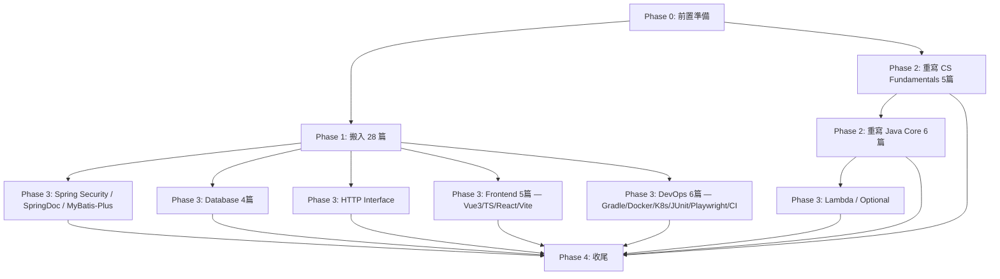

# LearningNotes 重建計畫

> 目標：以 2025 年 Java 全端工程師為讀者，圍繞主流技術棧重新組織，淘汰過時內容，補齊關鍵缺漏。
> 基準日期：2026-03-29
> 預計產出：61 篇（搬入 28 + 重寫 11 + 新寫 22）

---

## 一、核心原則

1. **Java 17/21 為語言基準** — 不再維護 Java 7 以前的寫法
2. **Spring Boot 3.x 為框架基準** — XML 配置僅在歷史對照時出現
3. **每篇必備版本標注** — 開頭標明基於什麼版本，過時篇章連結到現代替代
4. **程式碼必須可執行** — 無 BUG、無損壞圖片、無過時 API
5. **舊文歸檔不刪除** — 移至 `_archive/`，保留 git 歷史

---

## 二、新目錄結構

```
LearningNotes/
├── 01-Java-Core/
├── 02-Spring-Ecosystem/
├── 03-Microservices/
├── 04-Spring-AI/
├── 05-Database/
├── 06-Frontend/
├── 07-CS-Fundamentals/
├── 08-DevOps/
├── _archive/
├── README.md
├── RESTRUCTURE_PLAN.md
└── REVIEW_CHECKLIST.md
```

### 技術棧覆蓋對照

| 層級 | 主流技術 | 對應目錄 |
|------|---------|---------|
| 語言 | Java 17/21 | 01-Java-Core |
| 後端 | Spring Boot 3.x | 02-Spring-Ecosystem |
| Web | Spring MVC (REST) | 02-Spring-Ecosystem |
| ORM | Spring Data JPA / MyBatis-Plus | 02-Spring-Ecosystem |
| 資料庫 | PostgreSQL / MySQL 8 | 05-Database |
| 快取 | Redis | 05-Database |
| 認證 | Spring Security + JWT | 02-Spring-Ecosystem |
| 微服務 | Spring Cloud | 03-Microservices |
| AI | Spring AI | 04-Spring-AI |
| 前端 | Vue 3 / React 19 + TypeScript | 06-Frontend |
| 建置 | Vite / Gradle | 06-Frontend + 08-DevOps |
| 容器 | Docker / K8s | 08-DevOps |
| 測試 | JUnit 5 / Playwright | 08-DevOps |

---

## 三、執行階段

### Phase 0：前置準備

| # | 任務 | 狀態 |
|---|------|------|
| 0.1 | 建立新目錄結構（8 個資料夾 + `_archive/`） | `[x]` |
| 0.2 | 將所有舊目錄整批移入 `_archive/`（Algorithm, Data Structure, Java Basis, JavaWeb, JVM, Struts2, Hibernate, Spring, Spring MVC, Mybatis, Spring Boot, Spring Cloud, Spring AI, React, Maven, MySQL, nguSeckill, Spider, Interview, js, _posts, Appendix） | `[x]` |
| 0.3 | 更新 README.md 為新目錄結構的索引 | `[x]` |
| 0.4 | Git commit：`refactor: Phase 0 — 建立新結構，舊文歸檔` | `[x]` |

---

### Phase 1：直接搬入（成本最低、效果最快）

將審查中標記「品質優良」的文章搬入新目錄，僅做格式微調（統一標題層級、修正交叉引用路徑）。

#### 02-Spring-Ecosystem/

| # | 新檔名 | 來源 | 微調項目 | 狀態 |
|---|--------|------|---------|------|
| 1.1 | 01 Spring Core — DI 與 IoC.md | Spring/02 | 更新交叉引用路徑 | `[x]` |
| 1.2 | 02 Spring AOP 註解式開發.md | Spring/07 | 更新交叉引用路徑 | `[x]` |
| 1.3 | 03 Spring Java 配置與註解驅動.md | Spring/06 | 更新交叉引用路徑 | `[x]` |
| 1.4 | 04 Spring Boot 自動配置與 Starters.md | Spring Boot/02 | 無 | `[x]` |
| 1.5 | 05 Spring Boot 配置檔案與 Profiles.md | Spring Boot/03 | 無 | `[x]` |
| 1.6 | 06 Spring Boot RESTful API 開發.md | Spring Boot/04 | 無 | `[x]` |
| 1.7 | 07 Spring MVC 註解驅動與 RESTful.md | Spring MVC/02 | 無 | `[x]` |
| 1.8 | 08 Spring MVC 例外處理與驗證.md | Spring MVC/03 | 無 | `[x]` |
| 1.9 | 09 Spring MVC 攔截器與跨域.md | Spring MVC/04 | 無 | `[x]` |
| 1.10 | 10 Spring Data JPA.md | Hibernate/02 | 無 | `[x]` |
| 1.11 | 11 MyBatis 與 Spring Boot 整合.md | Mybatis/03 | 無 | `[x]` |
| 1.12 | 12 Spring Boot Actuator 監控.md | Spring Boot/05 | 無 | `[x]` |
| 1.28 | 13 Spring 事務管理.md | _posts/Spring事務 + Spring/05 | 合併：加入 @Transactional 實際範例；建構子注入推薦 | `[x]` |

#### 03-Microservices/

| # | 新檔名 | 來源 | 微調項目 | 狀態 |
|---|--------|------|---------|------|
| 1.13 | 01 Spring Cloud 概述與微服務架構.md | Spring Cloud/01 | 無 | `[x]` |
| 1.14 | 02 服務註冊與發現（Eureka）.md | Spring Cloud/02 | 補充 Eureka 維護模式一句話 | `[x]` |
| 1.15 | 03 配置中心（Spring Cloud Config）.md | Spring Cloud/03 | 無 | `[x]` |
| 1.16 | 04 API 閘道（Spring Cloud Gateway）.md | Spring Cloud/04 | 無 | `[x]` |
| 1.17 | 05 熔斷與限流（Resilience4j）.md | Spring Cloud/05 | 無 | `[x]` |
| 1.18 | 06 負載均衡（Spring Cloud LoadBalancer）.md | Spring Cloud/06 | 無 | `[x]` |
| 1.19 | 07 宣告式 HTTP 用戶端（OpenFeign）.md | Spring Cloud/07 | 無 | `[x]` |

#### 04-Spring-AI/

| # | 新檔名 | 來源 | 微調項目 | 狀態 |
|---|--------|------|---------|------|
| 1.20 | 01 Spring AI 概述與快速開始.md | Spring AI/01 | 無 | `[x]` |
| 1.21 | 02 ChatClient API 與對話模型.md | Spring AI/02 | 無 | `[x]` |
| 1.22 | 03 結構化輸出.md | Spring AI/03 | 無 | `[x]` |
| 1.23 | 04 Embedding 與向量資料庫.md | Spring AI/04 | 無 | `[x]` |
| 1.24 | 05 RAG 檢索增強生成.md | Spring AI/05 | 修正 filterExpression 注入風險 | `[x]` |
| 1.25 | 06 Function Calling 工具呼叫.md | Spring AI/06 | **更新為 @Tool 註解** | `[x]` |
| 1.26 | 07 Advisors API 與對話記憶.md | Spring AI/07 | 無 | `[x]` |

#### 06-Frontend/

| # | 新檔名 | 來源 | 微調項目 | 狀態 |
|---|--------|------|---------|------|
| 1.27 | 01 React 函式元件與 Hooks.md | React/06 | 無 | `[x]` |

**Phase 1 小計：28 篇搬入**

**Phase 1 驗收 Checklist：**

- `[ ]` 每篇開頭有版本標注
- `[ ]` 每篇內的交叉引用路徑指向新目錄
- `[ ]` 每篇程式碼語法無誤（無全形分號、無損壞連結）
- `[ ]` README.md 索引對應新檔案路徑
- `[ ]` Git commit：`refactor: Phase 1 — 搬入 27 篇品質優良文章`

---

### Phase 2：重寫過時文章（概念保留，程式碼全新）

保留原文的教學思路與知識框架，但以現代技術重寫程式碼和說明。

#### 07-CS-Fundamentals/

| # | 新檔名 | 基於 | 重寫重點 | 狀態 |
|---|--------|------|---------|------|
| 2.1 | 01 排序演算法總覽.md | Algorithm 01-04 | 合併為一篇；修正歸併 BUG；加入時間/空間複雜度 + 穩定性比較表 | `[x]` |
| 2.2 | 02 查詢演算法總覽.md | Algorithm 05-09 | 合併為一篇；補齊複雜度分析 | `[x]` |
| 2.3 | 03 基礎資料結構.md | DS 01-06 | 合併：複雜度 + 順序表 + 連結串列 + 棧 + 佇列（含循環佇列、Deque）；連結 Java Collections | `[x]` |
| 2.4 | 04 樹與圖.md | DS 07-10 | 合併：二叉樹（含迭代遍歷）+ 哈夫曼樹（修 compareTo BUG）+ 圖（補程式碼） | `[x]` |
| 2.5 | 05 JVM 記憶體與垃圾回收.md | JVM 01-03 | 合併為一篇；加入 Metaspace/G1/ZGC；移除損壞圖片改用文字說明或 mermaid | `[x]` |

#### 01-Java-Core/

| # | 新檔名 | 基於 | 重寫重點 | 狀態 |
|---|--------|------|---------|------|
| 2.6 | 01 Java 資料型別與變數.md | JB 001 | Java 17 基準；加入 var、record | `[x]` |
| 2.7 | 02 字串與集合框架.md | JB 002-004, 010 | String/StringBuilder + ArrayList/LinkedList/HashMap/TreeMap；加入 List.of()、SequencedMap | `[x]` |
| 2.8 | 03 物件導向進階.md | JB 005, 011, 012 | 例項化順序（含程式碼）+ 介面 default 方法 + 組合優於繼承 | `[x]` |
| 2.9 | 04 並行程式設計基礎.md | JB 006, 013 | ConcurrentHashMap（Java 8+ CAS）+ NIO Channel/Buffer/Selector + 執行緒池 | `[x]` |
| 2.10 | 05 反射與代理.md | JB 014-017 | 合併反射 + 3 種代理；加入比較表 + Spring 選擇策略 + Module System 限制 | `[x]` |
| 2.11 | 06 常用關鍵字與設計模式.md | JB 007, 018, 019 | 值傳遞 + final（含 effectively final）+ 單例（加入攻擊防護 + 比較表） | `[x]` |

**Phase 2 小計：11 篇重寫**（事務管理已移至 Phase 1 合併搬入）

**Phase 2 驗收 Checklist（每篇）：**

- `[x]` 版本標注（Java 17/21、Spring Boot 3.x、React 19 等）
- `[x]` 所有程式碼可在對應版本下編譯/執行
- `[x]` 無外部圖片依賴（改用 mermaid 或文字說明）
- `[x]` 有交叉引用連結到相關篇章
- `[x]` 複雜度分析完整（演算法/資料結構篇）
- `[x]` 與官方文件核對無重大落差
- `[x]` Git commit：每完成一個子目錄提交一次

---

### Phase 3：新寫缺漏主題（補齊關鍵空白）

按學習價值和實用性排序。覆蓋完整技術棧。

#### 01-Java-Core/

| # | 新檔名 | 內容規劃 | 狀態 |
|---|--------|---------|------|
| 3.1 | 07 Lambda 與 Stream API.md | Function/Consumer/Predicate/Supplier + Stream 操作鏈 + Collectors + 平行流 | `[x]` |
| 3.2 | 08 Optional 與現代錯誤處理.md | Optional 用法 + Exception 體系 + try-with-resources | `[x]` |

#### 02-Spring-Ecosystem/

| # | 新檔名 | 內容規劃 | 狀態 |
|---|--------|---------|------|
| 3.3 | 14 Spring Security 與 JWT.md | SecurityFilterChain + JWT 認證/刷新 + 角色權限 + CORS 安全 | `[x]` |
| 3.4 | 15 API 文件（SpringDoc OpenAPI）.md | springdoc-openapi + Swagger UI + @Operation/@Schema 註解 | `[x]` |
| 3.5 | 16 MyBatis-Plus 快速開發.md | BaseMapper / ServiceImpl / LambdaQueryWrapper / 程式碼產生器 / 分頁外掛 / 多租戶 | `[x]` |

#### 03-Microservices/

| # | 新檔名 | 內容規劃 | 狀態 |
|---|--------|---------|------|
| 3.6 | 08 Spring 6 HTTP Interface.md | 宣告式 HTTP 用戶端（取代 OpenFeign）/ @HttpExchange / RestClient | `[x]` |

#### 05-Database/

| # | 新檔名 | 內容規劃 | 狀態 |
|---|--------|---------|------|
| 3.7 | 01 PostgreSQL 與 MySQL 基礎.md | 資料型別比較 + DDL/DML + JSON 支援 + 時區處理 | `[x]` |
| 3.8 | 02 索引原理與 SQL 優化.md | B+ 樹 / 覆蓋索引 / 索引失效 / EXPLAIN 分析 | `[x]` |
| 3.9 | 03 交易與鎖機制.md | ACID / 隔離級別 / InnoDB 行鎖 / MVCC / 死鎖排查 | `[x]` |
| 3.10 | 04 Redis 快取實戰.md | 資料型別 / Spring Cache 整合 / 快取穿透/擊穿/雪崩 / 分散式鎖 | `[x]` |

#### 06-Frontend/

| # | 新檔名 | 內容規劃 | 狀態 |
|---|--------|---------|------|
| 3.11 | 02 TypeScript 基礎.md | 型別系統 / 介面 / 泛型 / 實用工具型別（Partial/Pick/Omit） | `[x]` |
| 3.12 | 03 Vue 3 Composition API.md | ref/reactive / computed/watch / defineProps/defineEmits / Pinia 狀態管理 | `[x]` |
| 3.13 | 04 Vue 3 元件開發實戰.md | SFC 結構 / Element Plus 整合 / 路由（Vue Router 4）/ Axios 封裝 | `[x]` |
| 3.14 | 05 React 進階與狀態管理.md | useContext / useReducer / 自定義 Hook / React Router v6 / Zustand | `[x]` |
| 3.15 | 06 前端建置工具（Vite）.md | Vite 配置 / 環境變數 / 代理設定 / 打包最佳化 / 與 Spring Boot 整合部署 | `[x]` |

#### 08-DevOps/

| # | 新檔名 | 內容規劃 | 狀態 |
|---|--------|---------|------|
| 3.16 | 01 Gradle 建置工具.md | build.gradle.kts / 依賴管理 / 多模組專案 / 與 Maven 比較 / Spring Boot Plugin | `[x]` |
| 3.17 | 02 Docker 容器化部署.md | Dockerfile 撰寫 / 多階段建置 / Docker Compose / Spring Boot 容器化最佳實踐 | `[x]` |
| 3.18 | 03 Kubernetes 入門.md | Pod/Service/Deployment / ConfigMap/Secret / Ingress / Spring Cloud Kubernetes | `[x]` |
| 3.19 | 04 JUnit 5 測試實戰.md | @Test/Nested/ParameterizedTest / MockMvc / @SpringBootTest / @DataJpaTest / Testcontainers | `[x]` |
| 3.20 | 05 Playwright 前端自動化測試.md | 安裝設定 / 選擇器策略 / Page Object Model / CI 整合 / 截圖與錄影 | `[x]` |
| 3.21 | 06 CI/CD 流程（GitHub Actions）.md | 工作流程語法 / Build+Test+Deploy 管線 / Docker 映像推送 / 環境變數與 Secrets | `[x]` |

**Phase 3 小計：21 篇新寫**

**Phase 3 驗收 Checklist（每篇）：**

- `[x]` 版本標注
- `[x]` 完整可執行的程式碼範例
- `[x]` 與官方文件核對（使用 context7 MCP 查詢最新文件）
- `[x]` 有「延伸閱讀」連結到相關篇章
- `[x]` 適當的圖解（mermaid 語法）
- `[x]` Git commit：每完成一個子目錄提交一次

---

### Phase 4：收尾與品質保證

| # | 任務 | 狀態 |
|---|------|------|
| 4.1 | 更新 README.md — 新目錄完整索引 + 閱讀路線建議（含 Git 章節，共 61 篇） | `[x]` |
| 4.2 | 全局交叉引用檢查 — 確認所有篇章間連結正確 | `[x]` |
| 4.3 | 版本標注檢查 — 確認每篇文章開頭有正確版本資訊 | `[x]` |
| 4.4 | 刪除 `_archive/` 中的重複檔案（`_posts/` 95 個重複檔已清理，剩 27 篇獨立內容） | `[x]` |
| 4.5 | 最終 Git commit：`docs: LearningNotes v2 restructure complete` | `[x]` |

**Phase 4 驗收 Checklist：**

- `[x]` README.md 列出所有 71 篇文章，無損壞連結
- `[x]` 從 README.md 點擊任意連結，MarkdownReader 可正確開啟
- `[x]` `_archive/` 已於 Phase 5 清理完畢（舊文已全部重構為新文章）
- `[x]` 無任何文章依賴 `_archive/` 內的檔案
- `[x]` 新文章無外部圖片依賴（GitHub FigureBed 等）

---

## 四、執行順序與依賴關係



**可並行的工作：**
- Phase 1（搬入）和 Phase 2 CS Fundamentals 可同時進行
- Phase 3 的 7 個子群組彼此獨立，可全部並行：
  - Spring 擴充（Security / SpringDoc / MyBatis-Plus）
  - Database（4 篇）
  - Microservices 擴充（HTTP Interface）
  - Frontend（Vue 3 / TS / React 進階 / Vite）
  - DevOps（Gradle / Docker / K8s / JUnit / Playwright / CI）
  - Java 擴充（Lambda / Optional）— 依賴 Phase 2 Java Core
- Phase 2 Java Core 依賴 CS Fundamentals 完成（避免重複內容）

---

## 五、篇幅與品質標準

| 指標 | 標準 |
|------|------|
| 每篇字數 | 1,500 ~ 4,000 字（含程式碼） |
| 程式碼比例 | 30% ~ 50%（以可執行為優先） |
| 版本標注 | 開頭第一段必須包含版本資訊 |
| 交叉引用 | 每篇底部「延伸閱讀」至少連結 2 篇相關文章 |
| 圖解 | 複雜流程使用 mermaid；禁止 ASCII art；禁止外部圖床 |
| 程式碼驗證 | 演算法/資料結構篇提供輸入輸出範例；Spring 篇提供 pom.xml 依賴 |

### Phase 5：Software Engineering 方法論（10 篇新寫）

| # | 任務 | 狀態 |
|---|------|------|
| 5.1 | 01 SOLID 原則與 Clean Code | `[x]` |
| 5.2 | 02 設計模式實戰應用 | `[x]` |
| 5.3 | 03 軟體架構模式 | `[x]` |
| 5.4 | 04 API 設計最佳實踐 | `[x]` |
| 5.5 | 05 日誌、監控與可觀測性 | `[x]` |
| 5.6 | 06 安全開發實踐 | `[x]` |
| 5.7 | 07 效能調校與壓力測試 | `[x]` |
| 5.8 | 08 程式碼審查與重構 | `[x]` |
| 5.9 | 09 系統設計入門 | `[x]` |
| 5.10 | 10 敏捷開發與團隊協作 | `[x]` |
| 5.11 | 更新 EDITORIAL_ROLES.md — 新增審閱角色 #6 + 19 術語 | `[x]` |
| 5.12 | 更新 README.md — 71 篇 / 9 主題 | `[x]` |
| 5.13 | 更新 CONTENT_CHECKLIST.md — 新增 58 子項目 | `[x]` |
| 5.14 | 清理 `_archive/` 舊文 + Jekyll 遺留檔案 | `[x]` |

---

## 六、進度追蹤

| Phase | 篇數 | 完成數 | 進度 |
|-------|------|--------|------|
| Phase 0 | 4 項 | 4 | 100% |
| Phase 1 | 28 篇 | 28 | 100% |
| Phase 2 | 11 篇 | 11 | 100% |
| Phase 3 | 21 篇 | 21 | 100% |
| Phase 4 | 5 項 | 5 | 100% |
| Phase 5 | 10 篇 | 10 | 100% |
| **合計** | **71 篇 + 9 項** | **80** | **100%** |

---

## 七、風險與應對

| 風險 | 影響 | 應對 |
|------|------|------|
| Spring AI 快速迭代，文章寫完就過時 | 04-Spring-AI 需頻繁更新 | 搬入時標注具體版本號；Phase 3 不寫 Spring AI 新文（等穩定） |
| 重寫 Java Core 範圍膨脹 | Phase 2 超時 | 嚴格限制每篇 4,000 字；複雜主題拆多篇而非一篇寫到底 |
| 舊文歸檔後 README 連結損壞 | 讀者找不到舊文 | Phase 0 就更新 README；`_archive/` 內保留獨立 README 索引 |
| 新寫 Database 篇需要實際 DB 環境驗證 | 程式碼可能有誤 | 用 Docker Compose 建立測試環境；SQL 先在本地跑過 |
| Vue 3 篇與 TireMaster 實務落差 | 寫太理論、不實用 | 以 TireMaster 前端為實際範例，確保學用一致 |
| K8s 篇過於龐大 | 範圍失控 | 限定「Spring Boot 部署到 K8s」場景，不寫 K8s 運維 |
| Playwright 篇與 TireMasterQA 重複 | 維護兩份文件 | Playwright 篇寫通用知識；TireMasterQA 寫業務腳本，互相引用 |
| Phase 3 篇數多（21 篇），優先級不清 | 寫不完 | 依下方優先級分批，先完成第一批再評估 |

### Phase 3 優先級分批

| 批次 | 篇數 | 包含 | 理由 |
|------|------|------|------|
| 3A（最優先） | 8 | Spring Security、MyBatis-Plus、Database 4 篇、Docker、JUnit 5 | 後端開發日常必備 |
| 3B（次優先） | 7 | Vue 3 兩篇、TypeScript、Vite、Gradle、Lambda/Optional | 前端+建置工具補齊 |
| 3C（可延後） | 6 | React 進階、K8s、Playwright、CI/CD、SpringDoc、HTTP Interface | 進階主題，急迫性較低 |
